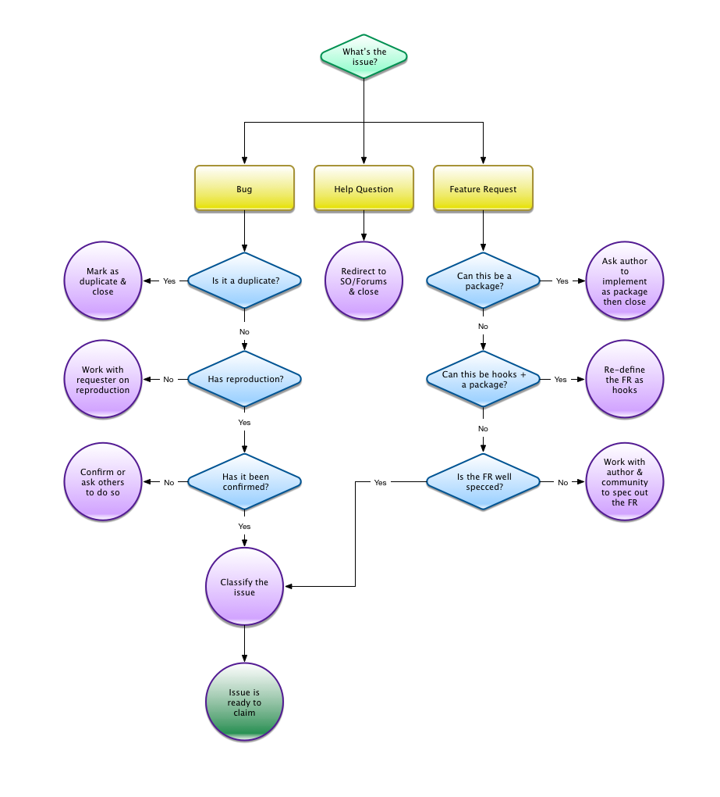

# Issue Triage

This document describes the process Meteor contributors use to organize issues. We use Github [issues](https://github.com/meteor/meteor/issues) to track bugs and feature requests. Our goal is to maintain a list of issues that are relevant and well defined such that a contributor can immediately begin working on the code for a fix or feature request. Contributors who want to dive in and write code aren't likely to prioritize working issues that are ambiguous and have low impact.

We would love to have more contributors who are willing to help out with triaging issues. You can begin by helping issue requesters create good reproductions and by confirming those reproductions on your own machine. It won't be long before the core maintainers notice your work and ask whether you'd like to be promoted to an issue maintainer.

## Issue lifecycle

All issues follow the flow outlined below. Your job as an issue maintainer is to work with the requester and others within the community towards the goal of having an issue either become 'claimable' or closed. Read on for more details on the process.

The first step is in determining whether the issue is a bug, help question or feature request. Read on for more details.

### Bugs

1. Duplicates should be closed and marked as such.
2. Bugs should have a high quality reproduction as described [here](Contributing.md#reporting-bug). You may need to help the reporter reduce their bug to a minimal reproduction.
3. A reproduction should be confirmed by at least one person other than the original reporter. Run the reproduction and validate that the bug exists, make a note of your findings on the issue.
4. Finally, [classify](#classification) the issue.

### Help questions

[Stack Overflow](http://stackoverflow.com/questions/tagged/meteor) and our [forums](https://forums.meteor.com/c/help) are the place to ask for help on using the framework. Close issues that are help requests and politely refer the author to the above locations.

### Feature requests

1. For reasons described [here](Contributing.md#feature-requests), we would prefer features to be built as separate packages. If the feature can clearly be built as a package, explain this to the requester and close the issue.
2. If it's not possible to build the feature as a package, explore whether creating hooks in core would make it possible to do so. If the answer is yes, redefine the issue as such.
3. Work with the requester and others in the community to build a clear specification for the feature and update the issue description accordingly.

<h2 id="classification">Classification</h2>

We assign a classification (e.g via GH labels) that enables the community to determine which issues are worth working on. The classification is based on *Severity x Impact x Effort*

#### Severity

- Is there a workaround?
- Does it impact production apps or only development?

#### Impact

- What % of the community does this benefit? (ballpark)
- Is the issue highly voted?

#### Effort (MDG internal)

- How much work is it to implement?

* Update title/description ?
* Add labels - which?

XXX!
