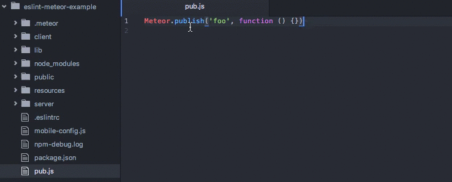

# ESLint-plugin-Meteor

[![Build Status][travis-image]][travis-url]
[![Coverage Status][coverage-image]][coverage-url]
[![Code Climate][climate-image]][climate-url]
[![Dependency Status][deps-image]][deps-url]

[![Join the chat at https://gitter.im/dferber90/eslint-plugin-meteor][gitter-image]][gitter-url]
[![Maintenance Status][status-image]][status-url]
[![semantic-release][semantic-release-image]][semantic-release]
[![Commitizen friendly][commitizen-image]][commitizen]

[![NPM version][npm-image]][npm-url]
[![NPM downloads][npm-downloads-image]][npm-url]


Meteor specific linting rules for ESLint


*This gif shows integration of ESLint-plugin-Meteor into Atom with [linter](https://atom.io/packages/linter) and [linter-eslint](https://atom.io/packages/linter-eslint). Find out more in the [setup guide](docs/SETUP_DEVELOPMENT.md).*


# Installation

Install [ESLint](https://www.github.com/eslint/eslint) either locally or globally.

```sh
$ npm install eslint
```

If you installed `ESLint` globally, you have to install Meteor plugin globally too. Otherwise, install it locally.

```sh
$ npm install eslint-plugin-meteor
```

# Configuration

Add `plugins` section and specify ESLint-plugin-Meteor as a plugin.

```js
{
  "plugins": [
    "meteor"
  ]
}
```


Finally, enable all of the rules that you would like to use.

```js
{
  "rules": {

    // Core API
    "meteor/globals": 2,
    "meteor/core": 2,
    "meteor/pubsub": 2,
    "meteor/methods": 2,
    "meteor/check": 2,
    "meteor/connections": 2,
    "meteor/collections": 2,

    // Best Practices
    "meteor/audit-argument-checks": 2,
    "meteor/no-session": 2,
    "meteor/no-blaze-lifecycle-assignment": 2,
    "meteor/no-zero-timeout": 2,
    "meteor/blaze-consistent-eventmap-params": 2,
  }
}
```

For a more thorough introduction, read [setting up a Meteor project](docs/SETUP_DEVELOPMENT.md).
A complete example of how to set up ESLint-plugin-Meteor in a Meteor project can be found [here](https://github.com/wekan/wekan/pull/370).

# List of supported rules

## Core API
* [globals](docs/rules/globals.md): Definitions for global Meteor variables based on environment
* [core](docs/rules/core.md): Meteor Core API
* [pubsub](docs/rules/pubsub.md): Prevent misusage of Publish and Subscribe
* [methods](docs/rules/methods.md): Prevent misusage of methods
* [check](docs/rules/check.md): Core API for check and Match
* [connections](docs/rules/connections.md): Core API for connections
* [collections](docs/rules/collections.md): Core API for collections
* [session](docs/rules/session.md): Core API for Session

## Best Practices
* [audit-argument-checks](docs/rules/audit-argument-checks.md): Enforce check on all arguments passed to methods and publish functions
* [no-session](docs/rules/no-session.md): Prevent usage of Session
* [no-blaze-lifecycle-assignment](docs/rules/no-blaze-lifecycle-assignment.md): Prevent deprecated template lifecycle callback assignments
* [no-zero-timeout](docs/rules/no-zero-timeout.md): Prevent usage of Meteor.setTimeout with zero delay
* [blaze-consistent-eventmap-params](docs/rules/blaze-consistent-eventmap-params.md): Force consistent event handler parameters in event maps

## To Do

* Implement basic rules for Meteor API

[Any rule idea is welcome !](https://github.com/dferber90/eslint-plugin-meteor/issues)

## Limitations

### Executor checks
Executors (client, browser, server, cordova) are detected by looking at the location of the linted file relative to the Meteor project root. Locus checks such as `if (Meteor.isClient) {..}` are respected as well. They may be any logical expression as long as all expressions consist purely of `Meteor.isClient`, `Meteor.isServer` and `Meteor.isCordova`. So, this would work

```js
if ((Meteor.isClient || Meteor.isCordova) && !Meteor.isServer) { .. }
```

If a test in a locus check is paired with any other expression that specific locus check will be ignored.

### Package files

ESLint-plugin-Meteor is not able to detect where files in inlined packages are going to be executed. It needs hints to work around this. See [this guide](docs/SETUP_METEOR_PROJECT.md#packages) for details.

# Contributing

Read about [set up of the development environment](docs/SETUP_DEVELOPMENT.md).

# Thanks

This plugin is inspired by [eslint-plugin-react](https://github.com/yannickcr/eslint-plugin-react).

# License

ESLint-plugin-Meteor is licensed under the [MIT License](http://www.opensource.org/licenses/mit-license.php).


[gitter-image]: https://img.shields.io/badge/gitter-chat-e10079.svg?style=flat-square
[gitter-url]: https://gitter.im/dferber90/eslint-plugin-meteor?utm_source=badge&utm_medium=badge&utm_campaign=pr-badge&utm_content=badge

[npm-url]: https://npmjs.org/package/eslint-plugin-meteor
[npm-image]: http://img.shields.io/npm/v/eslint-plugin-meteor.svg?style=flat-square
[npm-downloads-image]: https://img.shields.io/npm/dt/eslint-plugin-meteor.svg?style=flat-square

[travis-url]: https://travis-ci.org/dferber90/eslint-plugin-meteor
[travis-image]: http://img.shields.io/travis/dferber90/eslint-plugin-meteor/master.svg?style=flat-square

[deps-url]: https://david-dm.org/dferber90/eslint-plugin-meteor
[deps-image]: https://img.shields.io/david/dev/dferber90/eslint-plugin-meteor.svg?style=flat-square

[coverage-url]: https://coveralls.io/github/dferber90/eslint-plugin-meteor?branch=master
[coverage-image]: http://img.shields.io/coveralls/dferber90/eslint-plugin-meteor/master.svg?style=flat-square

[climate-url]: https://codeclimate.com/github/dferber90/eslint-plugin-meteor
[climate-image]: http://img.shields.io/codeclimate/github/dferber90/eslint-plugin-meteor.svg?style=flat-square

[status-url]: https://github.com/dferber90/eslint-plugin-meteor/pulse
[status-image]: http://img.shields.io/badge/status-maintained-e10079.svg?style=flat-square

[semantic-release-image]: https://img.shields.io/badge/%20%20%F0%9F%93%A6%F0%9F%9A%80-semantic--release-e10079.svg?style=flat-square
[semantic-release]: https://github.com/semantic-release/semantic-release

[commitizen-image]: https://img.shields.io/badge/commitizen-friendly-e10079.svg?style=flat-square
[commitizen]: http://commitizen.github.io/cz-cli/
