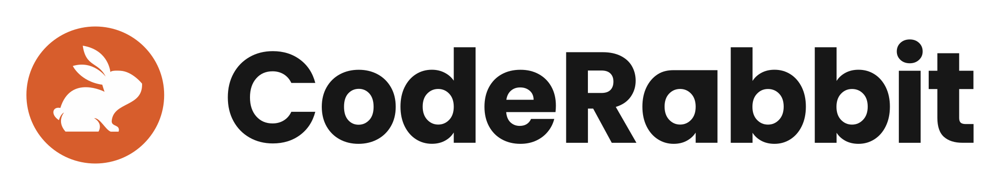

<div align="center">
  <a href="https://www.meteor.com" target="_blank">
    <picture>
      <source media="(prefers-color-scheme: dark)" srcset="https://dmtgy0px4zdqn.cloudfront.net/images/meteor-logo.webp">
      <source media="(prefers-color-scheme: light)" srcset="https://github.com/user-attachments/assets/0467afb6-4f36-4cad-9d78-237150d5d881">
      
    </picture>
  </a>
</div>

<div align="center">

[](https://meteor.com)
[](https://nodejs.org/en/download)
[](https://discord.com/invite/hZkTCaVjmT)
[](https://x.com/meteorjs)

</div>

<hr>

Meteor is an **ultra-simple** environment for building **modern** web applications.

<hr>

- [Official Website](https://www.meteor.com)
- [Installation](https://docs.meteor.com/about/install.html)
- [Documentation](https://docs.meteor.com/#/full/)

<hr>

### 📚 **Create your applications using modern JavaScript**

Benefit from the latest technology updates to rapidly prototype and develop your applications.

<hr>

### ✨ **Integrate technologies you already use**

Use popular frameworks and tools right out-of-the-box. Focus on building features instead of configuring disparate components yourself.

<hr>

### 💻 **Build apps for any device**

Use the same code whether you’re developing for web, iOS, Android, or desktop for a seamless update experience for your users.

<hr>

# 🔥 Getting Started

How about trying a tutorial to get started with your favorite technology?

| [ React](https://docs.meteor.com/tutorials/react/) |
| - |
| [ Blaze](https://docs.meteor.com/tutorials/blaze/) |
| [ Vue](https://docs.meteor.com/tutorials/vue/meteorjs3-vue3.html) |
| [  Svelte](https://docs.meteor.com/tutorials/svelte/) |
| [ Solid](https://docs.meteor.com/tutorials/solid/) |

# 🚀 Quick Start

On your platform, use this line:

```shell
> npx meteor
```

🚀 To create a project:

```shell
> meteor create
```

☄️ Run it:

```shell
cd my-app
meteor
```

# 💖 Sponsors

Meteor is made possible by our amazing sponsors. Support the project and get your logo here by visiting our [Sponsorship page](https://www.meteor.com/sponsorship).

### 🌟 Supernova Sponsors

<table>
  <tr>
    <td align="center" valign="middle" width="50%">
      <a href="https://galaxycloud.app/" target="_blank">
        
      </a>
    </td>
    <td align="center" valign="middle" width="50%">
      <a href="https://inputlogic.com/" target="_blank">
        
      </a>
    </td>
  </tr>
</table>

### 🌌 Nebula Sponsors

<table>
  <tr>
    <td align="center" valign="middle" width="50%">
      <a href="https://www.coderabbit.ai/" target="_blank">
        
      </a>
    </td>
  </tr>
</table>

<hr>

# 🧱 Developer Resources

**Building an application with Meteor?**

* Build with AI coding assistants using [Meteor Agent Skills](https://docs.meteor.com/ai/agent-skills)
* Deploy on [Galaxy](https://galaxycloud.app)
* Find packages on [Atmosphere](https://atmospherejs.com/)
* Discuss on [Forums](https://forums.meteor.com/)
* Join the [Meteor Discord](https://discord.gg/hZkTCaVjmT)


Interested in helping or contributing to Meteor?  These resources will help:

* [Core development guide](DEVELOPMENT.md)
* [Contribution guidelines](CONTRIBUTING.md)
* [Feature requests](https://github.com/meteor/meteor/discussions/)
* [Issue tracker](https://github.com/meteor/meteor/issues)


## 🌐 Web Resources & Interactive Index
- [IDLE LEGEND](https://thelearnquesters.pages.dev/idle-legend.html)
- [REAL IMPOSSIBLE SKY TRACKS CAR DRIVING](https://enskillcrafts.pages.dev/real-impossible-sky-tracks-car-driving.html)
- [CANDY JEWELS](https://themindzone.pages.dev/candy-jewels.html)
- [CATEGORY DEFENSE](https://quizverses.github.io/category-defense.html)
- [MR LONG LEGS](https://studyplaying.github.io/mr-long-legs.html)
- [SOLITAIRE EMPEROR SECRETS OF FATE](https://learnquester.pages.dev/solitaire-emperor-secrets-of-fate.html)
- [PULL THE THREAD PUZZLE](https://studyplaying.github.io/pull-the-thread-puzzle.html)
- [CATEGORY 3D1 371](https://thelearnquester.web.app/category-3d1-371.html)
- [BESTIES CHINESE NEW YEAR CELEBRATION](https://themindzone.pages.dev/besties-chinese-new-year-celebration.html)
- [CATEGORY AIRPLANE](https://thequizzone.pages.dev/category-airplane.html)
- [SCARY BABY YELLOW GAME](https://quizverses.pages.dev/scary-baby-yellow-game.html)
- [PRIVACY](https://studyplaying.github.io/privacy.html)
- [MINETAP](https://quizverses.github.io/minetap.html)
- [IDLE BARBER SHOP](https://studyquesthub.web.app/idle-barber-shop.html)
- [STACK N SORT](https://thelearnquester.web.app/stack-n-sort.html)
- [CATEGORY SPACE](https://studyplaying.github.io/category-space.html)
- [RED STICKMAN VS CRAFTMANS](https://studyplaying.github.io/red-stickman-vs-craftmans.html)
- [CATEGORY SHOOTER](https://themindzone.pages.dev/category-shooter.html)
- [EMOJI SORT FUN PUZZLE GAME](https://thelearnquesters.pages.dev/emoji-sort-fun-puzzle-game.html)
- [BRICKS BREAKER](https://studyquesthub.web.app/bricks-breaker.html)
- [BUBBLE SHOOTER VINTAGE](https://studyquesthub.web.app/bubble-shooter-vintage.html)
- [INDEX24](https://themindzone.pages.dev/index24.html)
- [SOCCER EURO CUP 2025](https://theskillquest.pages.dev/soccer-euro-cup-2025.html)
- [BUBBLE GAME 3D](https://thelearnquesters.pages.dev/bubble-game-3d.html)
- [ZUMBA QUEST](https://studyquesthub.web.app/zumba-quest.html)
- [CRAZY AXE](https://studyquesthub.web.app/crazy-axe.html)
- [HYPER WAVE CHALLENGE](https://thelearnquesters.pages.dev/hyper-wave-challenge.html)
- [SORCERER MAHJONG MARVELS](https://thelearnquesters.pages.dev/sorcerer-mahjong-marvels.html)
- [JUST DICE RANDOM TOWER DEFENCE](https://studyquesthub.web.app/just-dice-random-tower-defence.html)
- [ROOM SORT FLOOR PLAN](https://studyquesthub.web.app/room-sort-floor-plan.html)
- [CATEGORY POOL 2](https://quizverses.github.io/category-pool-2.html)
- [CATEGORY DRAWING34](https://thelearnquester.web.app/category-drawing34.html)
- [POPPY PLAYER PUZZLE](https://thelearnquester.web.app/poppy-player-puzzle.html)
- [CRAFTMART](https://theskillquest.pages.dev/craftmart.html)
- [CHOO CHOO SPIDER MONSTER TRAIN](https://themindzone.pages.dev/choo-choo-spider-monster-train.html)
- [CATEGORY SANDBOX](https://iskillquest.pages.dev/category-sandbox.html)
- [CATEGORY FLASH](https://thequizzone.pages.dev/category-flash.html)
- [CATEGORY CARE](https://learnquester.pages.dev/category-care.html)
- [KNIFE MADNESS](https://studyplaying.github.io/knife-madness.html)
- [SLIME FARM](https://quizverses-9d2f2.web.app/slime-farm.html)
- [CATEGORY ESCAPE](https://quizverses.pages.dev/category-escape.html)
- [CATEGORY 3D1 383](https://quizverses-9d2f2.web.app/category-3d1-383.html)
- [RUSSIAN TREASURE HUNTER](https://thelearnquester.web.app/russian-treasure-hunter.html)
- [STRANGE PACKAGES](https://thequizzone.pages.dev/strange-packages.html)
- [BACK TO SCHOOL UNIFORMS EDITION](https://thequizzone.pages.dev/back-to-school-uniforms-edition.html)
- [GT CHAMPIONSHIP ARCADE](https://quizverses.github.io/gt-championship-arcade.html)
- [PIN MASTER SCREW PUZZLE QUEST BRAIN GAMES](https://thequizzone.pages.dev/pin-master-screw-puzzle-quest-brain-games.html)
- [POPS QUEST](https://theskillquest.pages.dev/pops-quest.html)
- [TAYLOR DRESS STUDIO PREPPY WILD WEST GLAM](https://studyplaying.github.io/taylor-dress-studio-preppy-wild-west-glam.html)
- [PIPE PUZZLE CONNECT FLOW](https://thequizzone.pages.dev/pipe-puzzle-connect-flow.html)
- [CATEGORY CASUAL 11](https://iskillquest.pages.dev/category-casual-11.html)
- [ART PUZZLE MASTER](https://studyquesthub.web.app/art-puzzle-master.html)
- [APPLE WORM](https://themindzone.pages.dev/apple-worm.html)
- [PARK FEVER](https://quizverses-9d2f2.web.app/park-fever.html)
- [OBBY CARDS THE LEGEND HUNT](https://studyplaying.github.io/obby-cards-the-legend-hunt.html)
- [KITCHEN SORTING](https://studyplaying.github.io/kitchen-sorting.html)
- [CANNONS BLAST 3D](https://studyquesthub.web.app/cannons-blast-3d.html)
- [TAILOR STYLIST FASHION DIARY](https://thequizzone.pages.dev/tailor-stylist-fashion-diary.html)
- [COLOR STRINGS](https://themindzone.pages.dev/color-strings.html)
- [PIZZA PUZZLE](https://thelearnquesters.pages.dev/pizza-puzzle.html)
- [LIGHT ACADEMIA FASHION](https://theskillquest.pages.dev/light-academia-fashion.html)
- [CATEGORY BYPASS](https://thequizzone.pages.dev/category-bypass.html)
- [ANIMAL MERGE ZOO PARK](https://thelearnquester.web.app/animal-merge-zoo-park.html)
- [BRICK BREAKER](https://thelearnquester.web.app/brick-breaker.html)
- [BELL MADNESS](https://studyplaying.github.io/bell-madness.html)
- [INFINITE CRAFT](https://studyquesthub.web.app/infinite-craft.html)
- [DIG OUT OF PRISON](https://thequizzone.pages.dev/dig-out-of-prison.html)
- [TSUNAMI RACE](https://studyquesthub.web.app/tsunami-race.html)
- [MAHJONG CONNECT FISH WORLD](https://studyplaying.github.io/mahjong-connect-fish-world.html)
- [IDLE MONEY FACTORY](https://studyplaying.github.io/idle-money-factory.html)
- [HARBOR OPERATOR](https://studyplaying.github.io/harbor-operator.html)
- [CHILL CLICKER](https://themindzone.pages.dev/chill-clicker.html)
- [CATEGORY PROXY](https://thequizzone.pages.dev/category-proxy.html)
- [CATEGORY TOWER DEFENSE 2](https://studyquesthub.web.app/category-tower-defense-2.html)
- [MERGE TOWN](https://quizverses-9d2f2.web.app/merge-town.html)
- [ZUMBLE STORY](https://thequizzone.pages.dev/zumble-story.html)
- [2048 BLOCK FUSION](https://theskillquest.pages.dev/2048-block-fusion.html)
- [CATEGORY FLASH 3](https://thequizzone.pages.dev/category-flash-3.html)
- [TOWER DEFENSE](https://themindzone.pages.dev/tower-defense.html)
- [ANIMAL MERGE ZOO PARK](https://studyplayings.pages.dev/animal-merge-zoo-park.html)
- [FISH KINGDOM](https://studyplayings.pages.dev/fish-kingdom.html)
- [SNIPER WARS FIND THE CRIMINAL](https://studyplaying.github.io/sniper-wars-find-the-criminal.html)
- [GMOD BOMBS](https://studyplaying.github.io/gmod-bombs.html)
- [CATEGORY PREMIUM PERKS71](https://themindzone.pages.dev/category-premium-perks71.html)
- [HAPPY GLASS GAME](https://studyquesthub.web.app/happy-glass-game.html)
- [NOOB SAVING FRIENDS](https://thelearnquesters.pages.dev/noob-saving-friends.html)
- [CATEGORY UNBLOCKEDGAMES](https://theskillquest.pages.dev/category-unblockedgames.html)
- [PUSH THE FROG](https://studyquesthub.web.app/push-the-frog.html)
- [INDEX22](https://theskillquest.pages.dev/index22.html)
- [FISHING THE RUSSIAN WAY](https://studyquesthub.web.app/fishing-the-russian-way.html)
- [CATEGORY CARDS](https://thequizzone.pages.dev/category-cards.html)
- [COSMOS 404](https://thequizzone.pages.dev/cosmos-404.html)
- [CATEGORY ADVENTURE 2](https://iskillquest.pages.dev/category-adventure-2.html)
- [ICE FISHING 3D](https://thelearnquester.web.app/ice-fishing-3d.html)
- [STUMBLE GUYS](https://quizverses-9d2f2.web.app/stumble-guys.html)
- [NUGGET MAN SURVIVAL PUZZLE](https://themindzone.pages.dev/nugget-man-survival-puzzle.html)
- [DINO SLIDE](https://quizverses.github.io/dino-slide.html)
- [BREAK BEAT](https://thelearnquester.web.app/break-beat.html)
- [CATEGORY TURN BASED30](https://studyquesthub.web.app/category-turn-based30.html)
- [MY DINOSAUR LAND](https://studyplayings.pages.dev/my-dinosaur-land.html)
- [WAR OF GUN](https://studyplaying.github.io/war-of-gun.html)
- [INDEX40](https://thequizzone.pages.dev/index40.html)
- [MERGE PIXEL](https://theskillquest.pages.dev/merge-pixel.html)
- [PARKING DRIVER](https://studyplayings.web.app/parking-driver.html)
- [VEHICLE FUN RACE](https://studyplaying.github.io/vehicle-fun-race.html)
- [CHICKZ STACK](https://themindplay.pages.dev/chickz-stack.html)
- [BUBBLE SHOOTER WONDERS OF EGYPT](https://themindzone.pages.dev/bubble-shooter-wonders-of-egypt.html)
- [SKRIBBLIO](https://themindplay.github.io/skribblio.html)
- [DRAGON EGG MASTER](https://quizverses-9d2f2.web.app/dragon-egg-master.html)
- [MEN VS GORILLAS](https://thelearnquester.web.app/men-vs-gorillas.html)
- [CATEGORY AGILITY 2](https://quizverses.github.io/category-agility-2.html)
- [BUTTERFLY SORT PUZZLE](https://studyplaying.github.io/butterfly-sort-puzzle.html)
- [HEIST DEFENDER](https://studyquesthub.web.app/heist-defender.html)
- [BUBBLE PLOPPER](https://themindzone.pages.dev/bubble-plopper.html)
- [MINETAP MERGE CLICKER](https://theskillquest.pages.dev/minetap-merge-clicker.html)
- [SUDOKU GARDEN](https://themindzone.pages.dev/sudoku-garden.html)
- [FOOTBALL HEADS 2026](https://thequizzone.pages.dev/football-heads-2026.html)
- [BUSY BEE HIVE](https://quizverses.github.io/busy-bee-hive.html)
- [GODS MIXER](https://thelearnquester.web.app/gods-mixer.html)
- [SNAKE KING](https://quizverses-9d2f2.web.app/snake-king.html)
- [MERGE HEROES TITANS](https://thelearnquesters.pages.dev/merge-heroes-titans.html)
- [MY ARCADE CENTER](https://studyplayings.pages.dev/my-arcade-center.html)
- [CATEGORY INTERSTELLAR](https://thequizzone.pages.dev/category-interstellar.html)
- [MEMORY WARS](https://thelearnquester.web.app/memory-wars.html)
- [MY FARM LIFE](https://learnquester.github.io/my-farm-life.html)
- [OBBY DRAW TO ESCAPE](https://themindplay.pages.dev/obby-draw-to-escape.html)
- [ULTIMATE TOWER DEFENSE](https://themindzone.pages.dev/ultimate-tower-defense.html)
- [CATEGORY TOWER DEFENSE 2](https://thelearnquester.web.app/category-tower-defense-2.html)
- [MONEY MAN 3D](https://studyplaying.github.io/money-man-3d.html)
- [PYRAMIDZ](https://thequizzone.pages.dev/pyramidz.html)
