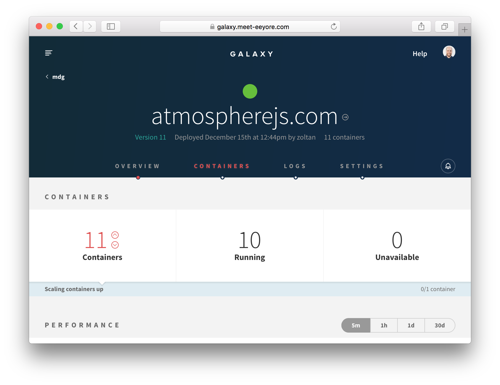
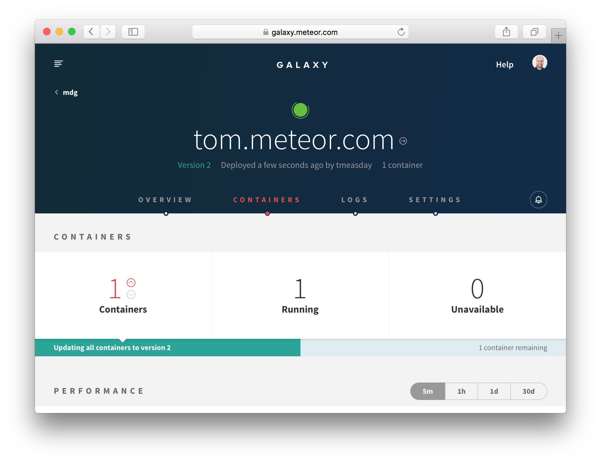
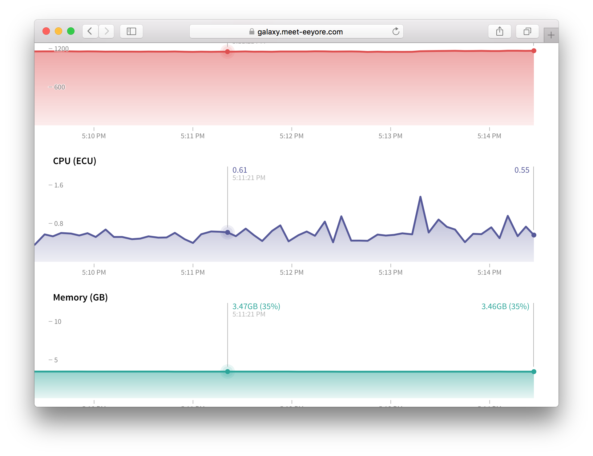
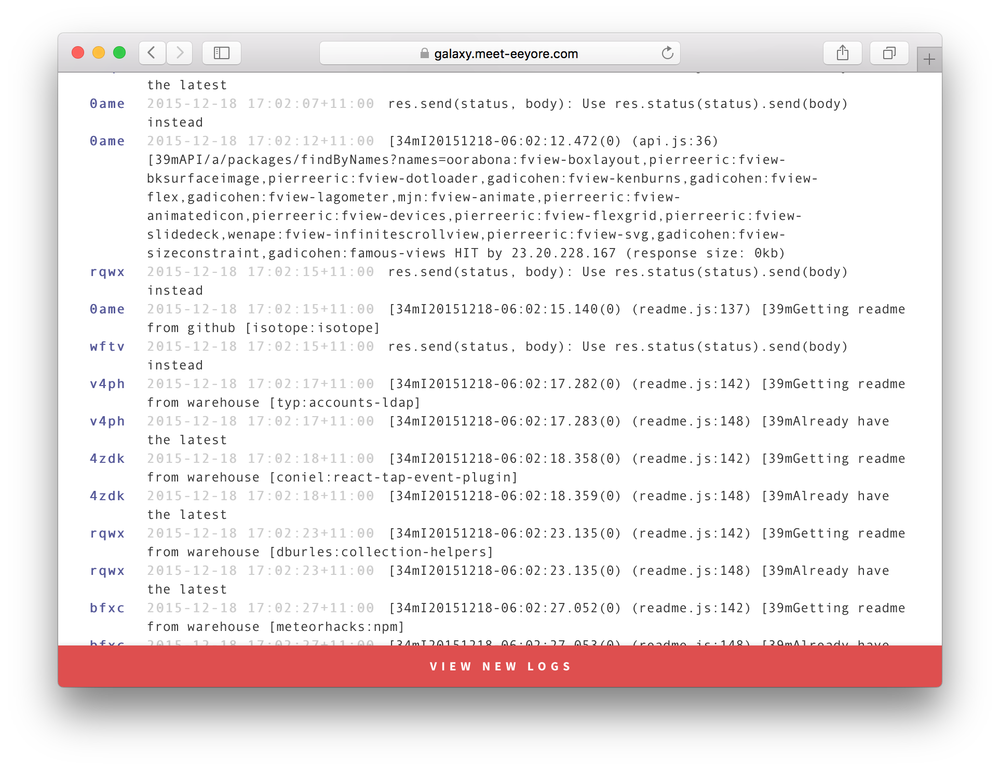
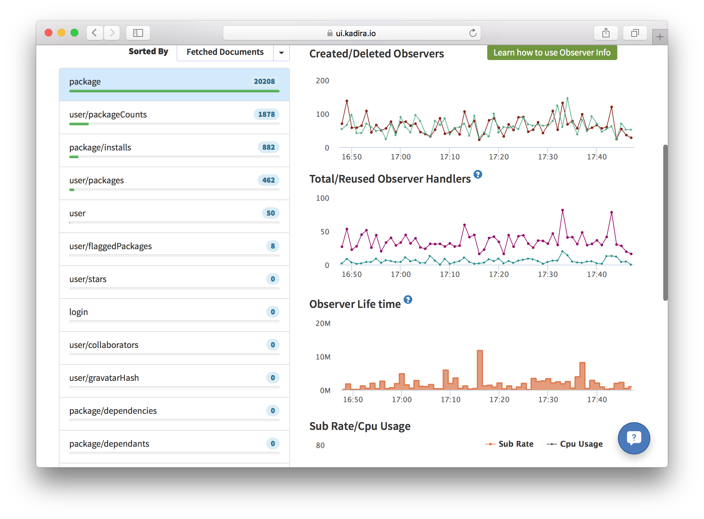

After reading this guide, you'll know:

1. What to consider before you deploy a Meteor application.
2. How to deploy to some common Meteor hosting environments.
3. How to design a deployment process to make sure your application's quality is maintained.
4. How to monitor user behavior with analytics tools.
5. How to monitor your application with Kadira.
6. How to make sure your site is discoverable by search engines.

<h2 id="deploying">Deploying Meteor Applications</h2>

Once you've built and tested your Meteor application, you need to put it online to show it to the world. Deploying a Meteor application is similar to deploying any other websocket-based Node.js app, but is different in some of the specifics.

Deploying a web application is fundamentally different to releasing most other kinds of software, in that you can deploy as often as you'd like to. You don't need to wait for users to do something to get the new version of your software because the server will push it right at them.

However, it's still important to test your changes throughly with a good process of Quality Assurance (QA). Although it's easy to push out fixes to bugs, those bugs can still cause major problems to users and even potentially data corruption!

<h3 id="environments">Deployment environments</h3>

In web application deployment it's common to refer to three runtime environments:

1. **Development.** This refers to your machine where you develop new features and run local tests.
2. **Staging.** An intermediate environment that is similar to production, but not visible to users of the application. Can be used for testing and QA.
3. **Production.** The real deployment of your app that your customers are currently using.

The idea of the staging environment is to provide a non-user-visible test environment that is as close as possible to production in terms of infrastructure. It's common for issues to appear with new code on the production infrastructure that just don't happen in a development environment. A very simple example is issues that involve latency between the client and server---connecting to a local development server with tiny latencies, you just may never see such an issue.

For this reason, developers tend to try and get staging as close as possible to production. This means that all the steps we outline below about production deployment, should, if possible, also be followed for your staging server.

<h3 id="environment">Environment variables and settings</h3>

There are two main ways to configure your application outside of the code of the app itself:

1. **Environment variables.** This is the set of `ENV_VARS` that are set on the running process.
2. **Settings.** These are in a JSON object set via either the `--settings` Meteor command-line flag or stringified into the `METEOR_SETTINGS` environment variable.

Settings should be used to set environment (i.e. staging vs production) specific things, like the access token and secret used to connect to Google. These settings will not change between any given process running your application in the given environment.

Environment variables are used to set process specific things, which could conceivably change for different instances of your application's processes. For instance, you can set a different `KADIRA_OPTIONS_HOSTNAME` for each process to ensure that [kadira](#kadira) logs timings with useful hostnames.

A final note on storing these settings: It's not a good idea to store settings the same repository where you keep your app code. Read about good places to put your settings in the [Security article](security.html#api-keys).

<h2 id="other-considerations">Other considerations</h2>

There are some other considerations that you should make before you deploy your application to a production host. Remember that you should if possible do these steps for both your production *and* staging environments.

<h3 id="domain-name">Domain name</h3>

What URL will users use to access your site? You'll probably need to register a domain name with a domain registrar, and setup DNS entries to point to the site (this will depend on how you deploy, see below). If you deploy to the free Meteor servers, you can use a `x.meteor.com` domain while you are testing the app.

<h3 id="ssl">SSL Certificate</h3>

It's always a good idea to use SSL for Meteor applications (see the [Security Article](security.html#ssl) to find out why). Once you have a registered domain name, you'll need to generate an SSL certificate with a certificate authority for your domain.

<h3 id="cdn">CDN</h3>

It's not strictly required, but often a good idea to setup a Content Delivery Network (CDN) for your site. A CDN is a proxy that sits in front of the static assets of your site (such as JavaScript, CSS files, and some images) and caches copies of those files in locations that are closer to the location of the user. For example, if the actual web server for your application is on the east coast of the USA, if a user is in Australia, a CDN could host a copy of the JavaScript of the site within Australia or even in the city the user is in. This has huge benefits for the initial loading time for your site.

You want to put your CDN in front of the static assets that Meteor knows about. You can use `WebAppInternals.setBundledJsCssPrefix(DNS_HOSTNAME)` to set a prefix that applies to all of the bundled JS and CSS assets that the Meteor app serves. In particular, this means if you have relative image URLs inside your CSS files, they will also be served from the CDN.

If you are following the above approach, you may also want to manually add the CDN's hostname whenever you put an image/other asset URL in your application's code. To do this throughout your app, you can write a generic helper like `imageUrl()`.

<h2 id="deployment-options">Deployment options</h2>

Meteor is an open source platform, and you can run the apps that you make with Meteor anywhere just like regular Node.js applications. But operating Meteor apps *correctly*, so that your apps work for everyone, can be tricky if you are managing your infrastructure manually. This is why we recommend running production Meteor apps on Galaxy.

<h3 id="galaxy">Galaxy (recommended)</h3>

The easiest way to operate your app with confidence is to use Galaxy, the service built by Meteor Development Group specifically to run Meteor apps.

Galaxy is a distributed system that runs on Amazon AWS. If you understand what it takes to run Meteor apps correctly and just how Galaxy works, you’ll come to appreciate Galaxy’s value, and that it will save you a lot of time and trouble. Most large Meteor apps run on Galaxy today, and many of them have switched from custom solutions they used prior to Galaxy’s launch.

In order to deploy to Galaxy, you'll need to sign up for an account [here](https://www.meteor.com/why-meteor/pricing), and separately provision a MongoDB database (see below).

Once you've done that, you can [deploy to Galaxy](https://galaxy.meteor.com/help/deploying-to-galaxy) almost as easily as you can to Meteor's free servers. You just need to [add some environment variables to your settings file](https://galaxy.meteor.com/help/setting-environment-variables) to point it at your MongoDB, and you can deploy with:

```bash
DEPLOY_HOSTNAME=galaxy.meteor.com meteor deploy your-app.com --settings production-settings.json
```

In order for Galaxy to work with your custom domain (`your-app.com` in this case), you need to [set up your DNS to point at Galaxy](https://galaxy.meteor.com/help/configuring-dns). Once you've done this, you should be able to reach your site from a browser.

You can also log into the Galaxy UI at https://galaxy.meteor.com. Once there you can manage your applications, monitor the number of connections and resource usage, view logs, and change settings.


If you are following [our advice](security.html#ssl), you'll probably want to [set up SSL](https://galaxy.meteor.com/help/using-ssl) on your Galaxy application with the certificate and key for your domain. The key things here are to add the `force-ssl` package and to use the Galaxy UI to add your SSL certificate.

Once you are setup with Galaxy, deployment is simple (just re-run the `meteor deploy` command above), and scaling is even easier---simply log into galaxy.meteor.com, and scale instantly from there.



<h4 id="galaxy-mongo">MongoDB hosting services to use with Galaxy</h4>

If you are using Galaxy (or need a production quality, managed MongoDB for one of the other options listed here), it's usually a good idea to use a [MongoDB hosting provider](https://galaxy.meteor.com/help/configuring-mongodb). There are a variety of options out there, but a good choice is [Compose](https://compose.io). The main things to look for are support for oplog tailing, and a presence in the us-east-1 AWS region.

<h3 id="mup">Meteor Up</h3>

[Meteor Up](https://github.com/arunoda/meteor-up), often referred to as "mup", is an open source tool that can be used to deploy Meteor application to any online server over SSH. Mup handles some of the essential deployment requirements, but you will still need to do a lot of work to get your load balancing and version updates working smoothly - it's essentially a way to automate the manual steps of using `meteor build` and putting that bundle on your server.

You can obtain a server running Ubuntu or Debian from many generic hosting providers. Mup can SSH into your server with the keys you provide in the config. You can also [watch this video](https://www.youtube.com/watch?v=WLGdXtZMmiI) for a more complete walkthrough on how to do it.

<h3 id="free-hosting">Basic meteor.com hosting</h3>

If you are in the process of developing your application and want to see how it behaves online, or share it with a small group without needing a full production setup, you can get started quickly on the free hosting available at `meteor.com`. We do **not** recommend hosting critical apps on a subdomain of meteor.com. Each app runs in a single process, and this free service is not capable of scaling to support production workloads.

Deploying is simple, just type:

```bash
meteor deploy your-app.meteor.com
```

This will bundle your application from the current directory, upload it, and serve it from https://your-app.meteor.com. Along the way it'll provision you with a MongoDB database and mail setup and configure (via the ENV) your app to run.

To enable SSL for your free-hosted app, simply add the `force-ssl` package to your app:

```bash
meteor add force-ssl
```

We provide this as a free service so you can try Meteor. It is also helpful for quickly putting up internal betas, demos, and so on. It is not intended to deploy production applications. Also note that if your application does not receive any traffic for six months it will be deleted.

<h4 id="managing-free-hosting">Managing your meteor.com app</h4>

There are few handy tips for managing your deployed application. To deploy with a `settings.json` file, use:

```bash
meteor deploy your-app.meteor.com --settings settings.json
```

To delete the app, you can type:

```bash
meteor deploy --delete your-app.meteor.com
```

To allow others to deploy the app, you can add them to the authorized user list with:

```bash
meteor authorized your-app.meteor.com --add <user-or-organization>
```

You can view the latest logs with

```bash
meteor logs your-app.meteor.com
```

Finally, if you want to access the mongo database for your app directly, you can use

```bash
meteor mongo your-app.meteor.com
```

You can read more details about how to use these commands by using the help command:

```bash
meteor help deploy
```

<h3 id="custom-deployment">Custom deployment</h3>

If you want to figure out your hosting solution completely from scratch, the Meteor tool has a command `meteor build` that creates a deployment bundle that contains a plain Node.js application. You can host this application wherever you like and there are many options in terms of how you set it up and configure it.

To run this application, you need to provide Node.js 0.10.x and a MongoDB server. The current release of Meteor has been tested with Node 0.10.41. You can then run the application by invoking `node`, specifying the HTTP port for the application to listen on, and the MongoDB endpoint.

```bash
cd my_directory
(cd programs/server && npm install)
env PORT=3000 MONGO_URL=mongodb://localhost:27017/myapp node main.js
```

However, unless you have a specific need to roll your own hosting environment, the other options here are definitely easier, and probably make for a better setup than doing everything from scratch. Operating a Meteor app in a way that it works correctly for everyone can be complex, and [Galaxy](#galaxy) handles a lot of the specifics like routing clients to the right containers and handling coordinated version updates for you.

<h2 id="process">Deployment process</h2>

Although it's much easier to deploy a web application than release most other types of software, that doesn't mean you should be cavalier with your deployment. It's important to properly QA and test your releases before you push them live, to ensure that users don't have a bad experience, or even worse, data get corrupted.

It's a good idea to have a release process that you follow in releasing your application. Typically that process looks something like:

1. Deploy the new version of the application to your staging server.
2. QA the application on the staging server.
3. Fix any bugs found in step 2. and repeat.
4. Once you are satisfied with the staging release, release the *exact same* version to production.
5. Run final QA on production.

Steps 2. and 5. can be quite time-consuming, especially if you are aiming to maintain a high level of quality in your application. That's why it's a great idea to develop a suite of acceptance tests (see our [Testing Article](XXX) for more on this). To take things even further, you could run a load/stress test against your staging server on every release.

<h3 id="continuous-deployment">Continuous deployment</h3>

Continuous deployment refers to the process of deploying an application via a continuous integration tool, usually when some condition is reached (such as a git push to the `master` branch). You can use CD to deploy to Galaxy or Meteor's free hosting, as Nate Strauser explains in a [blog post on the subject](https://medium.com/@natestrauser/migrating-meteor-apps-from-modulus-to-galaxy-with-continuous-deployment-from-codeship-aed2044cabd9#.lvio4sh4a).

<h3 id="rolling-updates-and-data">Rolling deployments and data versions</h3>

It's important to understand what happens during a deployment, especially if your deployment involves changes in data format (and potentially data migrations, see the [Collections Article](collections.html#migrations)).

When you are running your app on multiple servers or containers, it's not a good idea to shut down all of the servers at once and then start them all back up again. This will result in more downtime than necessary, and will cause a huge spike in CPU usage when all of your clients reconnect again at the same time. To alleviate this, Galaxy stops and re-starts containers one by one during deployment. There will be a time period during which some containers are running the old version and some the new version, as users are migrated incrementally to the new version of your app.



If the new version involves different data formats in the database, then you need to be a little more careful about how you step through versions to ensure that all the versions that are running simultaneously can work together. You can read more about how to do this in the [collections article](collections.html#migrations).

<h2 id="analytics">Monitoring users via analytics</h2>

It's common to want to know which pages of your app are most commonly visited, and where users are coming from. Here's a simple setup that will get you URL tracking using Google Analytics. We'll be using the [`okgrow:analytics`](https://atmospherejs.com/okgrow/analytics) package.

```
meteor add okgrow:analytics
```
Now, we need to configure the package with our Google Analytics key (the package also supports a large variety of other providers, check out the [documentation on Atmosphere](https://atmospherejs.com/okgrow/analytics)). Pass it in as part of [_Meteor settings_](#environment):

```js
{
  "public": {
    "analyticsSettings": {
      // Add your analytics tracking id's here
      "Google Analytics" : {"trackingId": "Your tracking ID"}
    }
  }
}
```

The analytics package hooks into Flow Router (see the [routing article](routing.html) for more) and records all of the page events for you.

You may want to track non-page change related events (for instance publication subscription, or method calls) also. To do so you can use the custom event tracking functionality:

```js
Todos.methods.updateText = new ValidatedMethod({
  ...
  run({ todoId, newText }) {
    // We use `isClient` here because we only want to track
    // attempted method calls from the client, not server to
    // server method calls
    if (Meteor.isClient) {
      analytics.track('Todos.methods.updateText', { todoId, newText });
    }

    // ...
  }
});
```

To achieve a similar abstraction for subscriptions/publications, you may want to write a simple wrapper for `Meteor.subscribe()`.

<h2 id="apm">Monitoring your application</h2>

When you are running an app in production, it's vitally important that you keep tabs on the performance of your application and ensure it is running smoothly.

<h3 id="meteor-performance">Understanding Meteor performance</h3>

Although a host of tools exist to monitor the performance of HTTP, request-response based applications, the insights they give aren't necessarily useful for a connected client system like a Meteor application. Although it's true that slow HTTP response times would be a problem for your app, and so using a tool like [Pingdom](https://www.pingdom.com) can serve a purpose, there are many kinds of issues with your app that won't be surfaced by such tools.

<h3 id="galaxy-apm">Monitoring with Galaxy</h3>

[Galaxy](#galaxy) offers turnkey Meteor hosting and provides tools that are useful to debug the current and past state of your application. CPU and Memory load graphs in combination with connected user counts can be vital to determining if your setup is handling the current load (or if you need more containers), or if there's some specific user action that's causing disproportionate load (if they don't seem to be correlated):



Galaxy's UI provides a detailed logging system, which can be invaluable to determine which action it is causing that extra load, or to generally debug other application issues:



<h3 id="kadira">Kadira</h3>

If you really want to understand the ins and outs of running your Meteor application, you should give [Kadira](https://kadira.io) a try. Kadira is a full featured Application Performance Monitoring (APM) solution that's built from the ground up for Meteor. Kadira operates by taking regular client and server side observations of your application's performance as it conducts various activities and reporting them back to a master server.

When you visit the Kadira application, you can view current and past behavior of your application over various useful metrics. Kadira's [documentation](https://kadira.io/platform/kadira-apm/overview) is extensive and invaluable, but we'll discuss a few key areas here.

<h4 id="kadira-method-pub">Method and Publication Latency</h4>

Rather than monitoring HTTP response times, in a Meteor app it makes far more sense to consider DDP response times. The two actions your client will wait for in terms of DDP are *method calls* and *publication subscriptions*. Kadira includes tools to help you discover which of your methods and publications are slow and resource intensive.


In the above screenshot you can see the response time breakdown of the various methods commonly called by the Atmosphere application. The median time of 56ms and 99th percentile time of 200ms seems pretty reasonable, and doesn't seem like too much of a concern

You can also use the "traces" section to discover particular cases of the method call that are particular slow:


In the above screenshot we're looking at a slower example of a method call (which takes 214ms), which, when we drill in further we see is mostly taken up waiting on other actions on the user's connection (principally waiting on the `searches/top` and `counts` publications). So we could consider looking to speed up the initial time of those subscriptions as they are slowing down searches a little in some cases.


<h4 id="kadira-livequery">Livequery Monitoring</h4>

A key performance characteristic of Meteor is driven by the behavior of livequery, the key technology that allows your publications to push changing data automatically in realtime. In order to achieve this, livequery needs to monitor your MongoDB instance for changes (by tailing the oplog) and decide if a given change is relevant for the given publication.

If the publication is used by a lot of users, or there are a lot of changes to be compared, then these livequery observers can do a lot of work. So it's immensely useful that Kadira can tell you some statistics about your livequery usage:



In this screenshot we can see that observers are fairly steadily created and destroyed, with a pretty low amount of reuse over time, although in general they don't survive for all that long. This would be consistent with the fact that we are looking at the `package` publication of Atmosphere which is started everytime a user visits a particular package's page. The behavior is more or less what we would expect so we probably wouldn't be too concerned by this information.

<h2 id="seo">Enabling SEO</h2>

If your application contains a lot of publicly accessible content, then you probably want it to rank well in Google and other search engines' indexes. As most webcrawlers do not support client-side rendering (or if they do, have spotty support for websockets), it's better to render the site on the server and deliver it as HTML in this special case.

To do so, we can use the [Prerender.io](https://prerender.io) service, thanks to the [`dfischer:prerenderio`](https://atmospherejs.com/dfischer/prerenderio) package. It's a simple as `meteor add`-ing it, and optionally setting your prerender token if you have a premium prerender account and would like to enable more frequent cache changes.

If you’re using a Galaxy Team, Business, or Pro account to host your meteor apps, you can also take advantage of built-in automatic [Prerender.io](https://prerender.io) integration. Simply add [`mdg:seo`](https://atmospherejs.com/mdg/seo) to your app and Galaxy will take care of the rest.

Chances are you also want to set `<title>` tags and other `<head>` content to make your site appear nicer in search results. The best way to do so is to use the [`kadira:dochead`](https://atmospherejs.com/kadira/dochead) package. The sensible place to call out to `DocHead` is from the `onCreated` callbacks of your page-level components.
