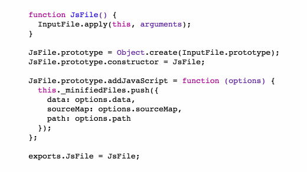
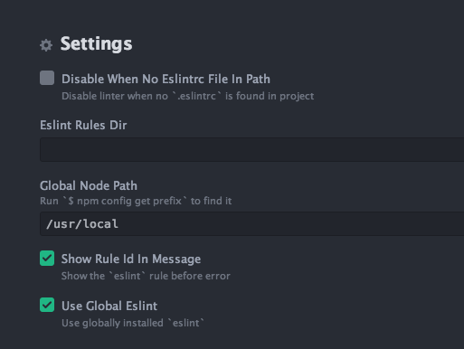

# Application structure and code style

After reading this article, you'll know:

1. How a Meteor application compares to other types of applications in terms of file structure.
2. How to organize your application both for small and larger applications.
3. How to format your code and name the parts of your application in consistent and maintainable ways.

<h2 id="meteor-structure">Meteor Application Structure</h2>

Meteor is a *full-stack* framework for building applications; this means Meteor applications differ from most applications in that they include code that both runs on the client, code that runs on the server, and code that runs in *both places*. Meteor applications enable you to run JavaScript code easily and consistenly in both client and server environments, and some conventions on application structure makes it easier to understand what code runs where.

<h3 id="es2015-modules">ES2015 Modules</h3>

As of version 1.3, Meteor ships with full support for [ES2015 modules](https://developer.mozilla.org/en/docs/web/javascript/reference/statements/import). ES2015 modules are a standardized alternative to [CommonJS](http://requirejs.org/docs/commonjs.html) and [AMD](https://github.com/amdjs/amdjs-api) which are JavaScript module format and loading systems.

ES2015 modules allow you to `import` the symbols exported by a file in your project from another file (we can call such files "modules"). In the source file you declare the local variables within the file that you'd like to export with the `export` keyword.


In particular it is simple and straightforward to include NPM package code in either environment (client or server), and access the package's exported sybmols as you would any other module's. It helps you write your code in a modular way, avoiding the introduction of global symbols and "action at a distance". 

However, this is a new feature in Meteor so you will find a lot of code online that uses and older, more centralized system built around packages and app declaring global symbols to be consumed within the app. Also, for backwards compatibility reasons, "pure" modular code must be placed in the `imports/` directory in your application. We expect this to change in an future release.

You can read about the module system in detail in the [README](https://github.com/meteor/meteor/tree/release-1.3/packages/modules) for the `modules` package (used automatically if you use the `ecmascript` package).

<h2 id="javascript-structure">JavaScript file structure</h2>

To harness the module system and ensure that our code only runs when we specify that it should, all code for libraries, components and APIs should be placed in the `imports/` directory. This will mean that the Meteor build system will only bundle and include that code if it is `import`-ed from another file.

Meteor will eagerly load any files outside of `imports/` in the application, but to be explicit, it's best to create simple a `client/main.js` and `server/main.js` folder to define explicit entry points for the running code of your application. Meteor ensures that any file in a directory entitled `client/` will only be available on the client (and likewise for the server).

From these `main.js` files, typically you'd include some _startup_ code which will run immediately on the client and server when the app begins (this includes configuration of whichever packages you are using in your app).

In the Todos example app, the `imports/startup/client/useraccounts-configuration.js` file configures the useraccounts configuration (see the [Accounts](accounts.html) article), and the `imports/startup/client/routes.js` indirectly file imports *all* other code that is required on the client, and forms the single entry point for the client application:

```js
import { FlowRouter } from 'meteor/kadira:flow-router';
import { BlazeLayout } from 'meteor/kadira:blaze-layout';
import { AccountsTemplates } from 'meteor/useraccounts:core';

// Import to load these templates
import '../../ui/layouts/app-body.js';
import '../../ui/pages/root-redirector.js';
import '../../ui/pages/lists-show-page.js';
import '../../ui/pages/app-not-found.js';

// Import to override accounts templates
import '../../ui/accounts/accounts-templates.js';

// Below here are the route definitions
```

On the server, we import various modules in our `server/main.js` to acheive the behaviour we want:

```js
// This defines a starting set of data to be loaded if the app is loaded with an empty db.
import '../imports/startup/server/fixtures.js';

// This file configures the Accounts package to define the UI of the reset password email.
import '../imports/startup/server/reset-password-email.js';

// Set up some rate limiting and other important security settings.
import '../imports/startup/server/security.js';

// This defines all the collections, publications and methods that the application provides
// as an API to the client.
import '../imports/api/api.js';
```

<h3 id="structuring-imports"</h3>

Once you've placed all files in the `imports/` directory, it makes sense to start thinking about how best to organize it. We've seen that it makes sense to put all "startup" code in a `imports/startup` directory. Another good idea is splitting data / business logic related code from rendering code. We suggest an `imports/api` and `imports/ui` as a logical split. 

Within the `imports/api` directory, it's sensible to split the code into the logical domain that the code is providing an API for --- typically this corresponds to the collections you've defined in your app. For instance in the Todos example app, this is the `imports/api/lists` and `imports/api/todos` domains. Inside each we define the collections, publications and methods that are relevant to those domains.

Note: in a larger application, given that the todos themselves are a part of a list, it might make sense to group both of these domains into a single larger "list" module. The Todos example is small enough that separating them makes sense however.

Within the `imports/ui` directory it typically makes sense to group files into directories based on the type of UI side code they define---top level `pages`, wrapping `layouts`, or reusable `components`.

For each module defined above, it makes sense to co-locate the various auxiliary files with the the base JavaScript file. For instance, a Blaze JavaScript component should be co-located with it's template HTML and CSS definition. A library file should be co-located with any unit tests defined for the file.

<h3 id="example-app-structure">Example Application Structure</h3>

Combining what's discussed above, we can consider the application structure of the Todos example application. The folders of interest are:

```
imports/
  startup/
    client/
      routes.js - respond to all routes in the app
    server/
      fixtures.js - pre-fill the database if loaded empty
  api/
    lists/ - as an example
      server/
        publications.js -- all list-related publications
        publications.tests.js -- tests for the list publications
      lists.js -- the definition of the Lists collection and behavior
      lists.tests.js -- tests for that behavior
      methods.js -- methods on lists
      methods.tests.js -- tests for those methods
  ui/
    components/ -- all reusable components in the application (we can break this down by area if it gets long)
    layouts/ -- wrapper components for behaviour and visuals
    pages/ -- entry points for the render tree -- where the router points us
client/
  main.js -- client entry point
server/
  main.js -- server entry point
```

<h2 id="splitting-your-app">Splitting your code into multiple apps</h2>

If you are writing a sufficiently complex system, there can come a point where it starts to make sense to split your code up into multiple applications. For example you may want to create a separate application for the administration UI (rather than checking permissions all through the admin part of your site, you can check once), or separating the code for the mobile and desktop versions of your app.

Another very common use case is splitting a worker process away from your main application so that expensive jobs do not impact on user experience of your visitors by locking up a single web server.

There are some advantages of splitting your application in this way:

 - Your client JavaScript bundle can be significantly smaller if you separate out code that a specific user type will never use.

 - You can deploy the different applications at different scales and secure them differently (for instance you might restrict access to your admin application to users behind a firewall).

 - You can allow different teams at your organization to work on the different applications independently.

However there are some challenges to splitting your code in this way that should be considered before jumping in.

<h3 id="sharing-code">Sharing Code</h3>

The primary challenge is sharing code between the different applications you are building. The simplest approach to deal with this issue is to simply deploy the *same* application on different web servers, controlling the behavior via different [settings](deployment.md#environment). This approach allows you to easily deploy different versions with different scaling behavior but doesn't enjoy most of the other advantages stated above.

Alternatively if you want to create totally different Meteor applications, you are best sharing the code via the package system---either Meteor's package system or NPM's. A simple way to do this is to factor code that you'd like to share out into a Meteor package, installed directly into the project by placing it in the application's local `packages/` directory.

Then you have two approaches to share this package between applications:

 1. If you put both applications in a single repository (say at `app1/` and `app2/`), you can also include a directory of common packages (`packages/`) and create a symbolic link from `app1/packages/x` and `app2/packages/x` to `packages/x`.

 2. If you'd prefer to put the applications in different repositories, you can use a [git submodule](https://git-scm.com/docs/git-submodule) to include the package (which would live in its own repository) in each app's `packages/` directory.

You can also share module code (like `imports/some-module`) in a similar fashion.

<h3 id="sharing-data">Sharing Data</h3>

Another important consideration is how you'll share the data between your different applications. 

The simplest approach is to point both applications at the same `MONGO_URL` and allow both applications to read and write from the database directly. This can work well thanks to Meteor's from-the-ground-up support for reactivity and realtime changes in the database (when one app changes the some data, a user of the other will see the changes quickly thanks to the oplog driver).

However, in some cases it's better to allow one application to be the master, and control access to the data for other applications via an API. This can help if for instance you want to deploy the different applications on different schedules and want to be conservative about how the data changes.

The simplest way to provide a server-server API is to use the DDP protocol! You can you [`DDP.connect()`](http://docs.meteor.com/#/full/ddp_connect) to connect from a "client" server to the data-managing server, and then use the connection object returned to make method calls and read from publications.

XXX: Do we want to show how to mirror a publication (boilerplate)? or passthrough a method call (complexities about authentication).

XXX: Re: sharing user accounts -- what did you have in mind @sashko? The AccountsClient thing lets you authenticate against a 3rd party server from within the app but it's not clear what you should do next -- make method calls / subscribe directly against that server? Pass the resume token through to proxied method calls?


<h2 id="benefits-style">Benefits of consistent style</h2>

Countless hours have been spent by developers throughout the years arguing over single vs. double quotes, where to put brackets, how many spaces to type, and all kinds of other cosmetic code style questions. These are all questions that have at best a tangential relationship to code quality, but are very easy to have opinions about because they are so visual.

While it's not necessarily important whether your code base uses single or double quotes for string literals, there are huge benefits to making that decision once and having it be consistent across your organization. These benefits also apply to the Meteor and JavaScript development communities as a whole.

<h3 id="easy-to-read">Easy to read code</h3>

The same way that you don't read English sentences one word at a time, you don't read code one token at a time. Mostly you just look at the shape of a certain expression, or the way it highlights in your editor, and assume what it does. If the style of every bit of code is consistent, that ensures that bits of code that look the same actually _are_ the same - there isn't any hidden punctuation or gotchas that you don't expect, so you can focus on understanding the logic instead of the symbols. One example of this is indentation - while in JavaScript, indentation is not meaningful, it's helpful to have all of your code consistently indented so that you don't need to read all of the brackets in detail to see what is going on.

```js
// This code is misleading because it looks like both statements
// are inside the conditional.
if (condition)
  firstStatement();
  secondStatement();
```

```js
// Much clearer!
if (condition) {
  firstStatement();
}

secondStatement();
```

<h3 id="automatic-error-checking">Automatic error checking</h3>

Having a consistent style means that it's easier to adopt standard tools for error checking. For example, if you adopt a convention that you must always use `let` or `const` instead of `var`, you can now use a tool to ensure all of your variables are scoped the way you expect. That means you can avoid bugs where variables act in unexpected ways. Also, by enforcing that all variables are declared before use, you can easily catch typos before even running any code!

<h3 id="deeper-understanding">Deeper understanding</h3>

It's hard to learn everything about a programming language at once. For example, programmers new to JavaScript often struggle with the `var` keyword and function scope. Using a community-recommended coding style with automatic linting can warn you about these pitfalls proactively. This means you can jump right into coding without learning about all of the edge cases of JavaScript ahead of time.

As you write more code and come up against the recommended style rules, you can take that as an opportunity to learn more about your programming language and how different people prefer to use it.

<h2 id="javascript">JavaScript style</h2>

Here at Meteor, we strongly believe that JavaScript is the best language to build web applications, for a variety of reasons. JavaScript is constantly improving, and the standards around ES2015 have really brought together the JavaScript community. Here are our recommendations about how to use ES2015 JavaScript in your app today.



<h3 id="ecmascript">Use the `ecmascript` package</h3>

ECMAScript, the language standard on which every browser's JavaScript implementation is based, has moved to yearly standards releases. The newest complete standard is ES2015, which includes some long-awaited and very significant improvements to the JavaScript language. Meteor's `ecmascript` package compiles this standard down to regular JavaScript that all browsers can understand using the [popular Babel compiler](https://babeljs.io/). It's fully backwards compatible to "regular" JavaScript, so you don't have to use any new features if you don't want to. We've put a lot of effort into making advanced browser features like source maps work great with this package, so that you can debug your code using your favorite developer tools without having to see any of the compiled output.

The `ecmascript` package is included in all new apps and packages by default, and compiles all files with the `.js` file extension automatically. See the [list of all ES2015 features supported by the ecmascript package](https://github.com/meteor/meteor/tree/master/packages/ecmascript#supported-es2015-features).

To get the full experience, you should also use the `es5-shim` package which is included in all new apps by default. This means you can rely on runtime features like `Array#forEach` without worrying about which browsers support them.

All of the code samples in this guide and future Meteor tutorials will use all of the new ES2015 features. You can also read more about ES2015 and how to get started with it on the Meteor Blog:

- [Getting started with ES2015 and Meteor](http://info.meteor.com/blog/es2015-get-started)
- [Set up Sublime Text for ES2015](http://info.meteor.com/blog/set-up-sublime-text-for-meteor-es6-es2015-and-jsx-syntax-and-linting)
- [How much does ES2015 cost?](http://info.meteor.com/blog/how-much-does-es2015-cost)

<h3 id="style-guide">Follow the Meteor JavaScript style guide</h3>

XXX: still some debate about whether we should publish our own style guide or fall out to ABNB

We have a JavaScript style guide which is heavily based on the popular AirBnB style guide, but has been content edited to include only essential rules. If you would like to follow this style guide in your non-Meteor applications, you will need to enable the same Babel features as supported by the `ecmascript` package linked above.

[Read the Meteor JavaScript style guide.](https://github.com/meteor/javascript)

<h2 id="eslint">Check your code with ESLint</h2>

"Code linting" is the process of automatically checking your code for common errors or style problems. For example, ESLint can determine if you have made a typo in a variable name, or some part of your code is unreachable because of a poorly written `if` condition.

We have a standard ESLint configuration that verifies as much as possible of the Meteor JavaScript style guide.

- [Get the Meteor ESLint configuration here.](XXX we need both eslintrc and eslintignore)

Below, you can find directions for setting up automatic linting at many different stages of development. In general, you want to run the linter as often as possible, because it's the fastest and easiest way to identify typos and small errors.

<h3 id="eslint-installing">Installing and running ESLint</h3>

To get ESLint up and running on your computer, install the command line tool with NPM:

```
npm install -g eslint
npm install -g babel-eslint
npm install -g eslint-plugin-react
```

Copy the standard Meteor `.eslintrc` and `.eslintignore` files from above into your app directory, and run the linter on your code with:

```
eslint .
```

For more details, read the [Getting Started](http://eslint.org/docs/user-guide/getting-started) directions from the ESLint website.

<h3 id="eslint-editor">Integrating ESLint with your editor</h3>

Linting is the fastest way to find potential bugs in your code. Running a linter is usually faster than running your app or your unit tests, so it's a good idea to run it all the time. Setting up linting in your editor can seem annoying at first since it will complain often when you save poorly-formatted code, but over time you'll develop the muscle memory to just write well-formatted code in the first place. Here are some directions for setting up ESLint in different editors:


<h4 id="eslint-sublime">Sublime Text</h4>

You can install the Sublime Text packages that integrate them into the text editor. It's generally recommended to use Package Control to add these packages. If you already have that setup, you can just add the these packages by name; if not, click the instructions links:

* Babel (for syntax highlighting – [full instructions](https://github.com/babel/babel-sublime#installation))
* SublimeLinter ([full instructions](http://sublimelinter.readthedocs.org/en/latest/installation.html))
* SublimeLinter-contrib-eslint ([full instructions](https://github.com/roadhump/SublimeLinter-eslint#plugin-installation))

To get proper syntax highlighting, go to a .js file, then select the following through the *View* dropdown menu: *Syntax* -> *Open all with current extension as...* -> *Babel* -> *JavaScript (Babel)*. If you are using React .jsx files, do the same from a .jsx file. If it's working, you will see "JavaScript (Babel)" in the lower right hand corner of the window when you are on one of these files. Refer to the [package readme](https://github.com/babel/babel-sublime) for information on compatible color schemes.

A side note for Emmet users: You can use *\<ctrl-e\>* to expand HTML tags in .jsx files, and it will correctly expand classes to React's "className" property. You can bind to the tab key for this, but [you may not want to](https://github.com/sergeche/emmet-sublime/issues/548).

<h4 id="eslint-atom">Atom</h4>

Install the following three Atom packages. Here's how to install them from the terminal, but you can also select them from within Atom:

    apm install language-babel
    apm install linter
    apm install linter-eslint

Go to *Settings -> Packages.* Under "linter-eslint", click the *Settings* button. To allow atom to see ESLint, you need to set "Global Node Path" to your Node path. As indicated in Atom, you can find this out with the following command in the terminal:

    npm config get prefix

This will return something like `/usr/local`. Add this to the "Global Node Path", and check "Use Global Eslint":



Then **restart Atom** to activate linting.


<h4 id="eslint-webstorm">WebStorm</h4>

WebStorm provides [these instructions for using ESLint](https://www.jetbrains.com/webstorm/help/eslint.html). After you install the ESLint Node packages and set up your `.eslintrc` file, just enable ESLint and click "Apply". You can configure how WebStorm should find your `.eslintrc` file, but on my machine it worked without any changes. It also automatically suggested switching to "JSX Harmony" syntax highlighting.


Linting can be activated on WebStorm on a project-by-project basis, or you can set ESLint as a default under Editor > Inspections, choosing the Default profile, checking "ESLint", and applying.


<h3 id="eslint-commit-hook">Setting up a commit hook for linting</h3>

XXX I think we just don't worry about these for now?

<h3 id="eslint-ci">Running ESLint in your CI environment</h3>

XXX

<h2 id="meteor-features">Meteor features</h2>

The section above talked about JavaScript code in general - you can easily apply it in any JavaScript application, not just with Meteor apps. However, there are some style questions that are Meteor-specific, in particular how to name and structure all of the different components of your app.

<h3 id="collections">Collections</h3>

Collections should be named as a plural noun, in PascalCase. The name of the collection in the database (the first argument to the collection constructor) should be the same as the name of the JavaScript symbol.

```js
// Defining a collection
Lists = new Mongo.Collection('Lists');
```

Fields in the database should be camelCased just like your JavaScript variable names.

```js
// Inserting a document with camelCased field names
Widgets.insert({
  myFieldName: 'Hello, world!',
  otherFieldName: 'Goodbye.'
});
```

<h3 id="methods-and-publications">Methods and publications</h3>

Method and publication names should be camelCased, and namespaced to the collection or module:

```js
// in imports/api/todos/methods.js
updateText = new ValidatedMethod({
  name: 'Todos.methods.updateText',
  // ...
});
```

// XXX: should we just make the method name `Todos.updateText`? --- it make sense to qualify it with `.method` when it was also the JS name, but that's no longer the case...

Note that this code sample uses the [ValidatedMethod package recommended in the Methods article](methods.html#validated-method). If you aren't using that package, you can use the name as the property passed to `Meteor.methods`.

Here's how this naming convention looks when applied to a publication:

```js
// Naming a publication
Meteor.publish('Lists.public', function() {
  // ...
});
```

<h3 id="files-and-exports">Files, exports, and packages</h3>

You should use the ES2015 `import` and `export` features to manage your code. This will let you better understand the dependencies between different parts of your code, and it will be easy to know where to look if you need to read the source code of a dependency.

Each file in your app should represent one logical module. Avoid having catch-all utility modules that export a variety of unrelated functions and symbols. Often, this can mean that it's good to have one class, UI component, or collection per file, but there are cases where it is OK to make an exception, for example if you have a UI component with a small sub-component that isn't used outside of that file.

When a file represents a single class or UI component, the file should be named the same as the thing it defines, with the same capitalization. So if you have a file that exports a class:

```js
export class ClickCounter { ... }
```

This class should be defined inside a file called `ClickCounter.js`. When you import it, it'll look like this:

```js
import { ClickCounter } from './ClickCounter.js';
```

Note that imports use relative paths, and include the file extension at the end of the file name.

<h3 id="templates-and-components">Templates and components</h3>

Since Spacebars templates are always global, can't be imported and exported as modules, and need to have names that are completely unique across the whole app, we recommend naming your Blaze templates with the full path to the namespace, separated by underscores. Underscores are a great choice in this case because then you can easily type the name of the template as one symbol in JavaScript.

```html
<template name="Lists_show">
  ...
</template>
```

If this template is a "smart" component that loads server data and accesses the router, append `_page` to the name:

```html
<template name="Lists_show_page">
  ...
</template>
```

Often when you are dealing with templates or UI components, you'll have several closely coupled files to manage. They could be two or more of HTML, CSS, and JavaScript. In this case, we recommend putting the files together in the same directory with the same name:

```
# The Lists_show template from the Todos example app has 3 files:
show.html
show.js
show.less
```

The whole directory or path should indicate that these templates are related to the `Lists` module, so it's not necessary to reproduce that information in the file name. Read more about directory structure [above](#javascript-structure).

If you are writing your UI in React, you don't need to use the underscore-split names because you can import and export your components using the JavaScript module system.

