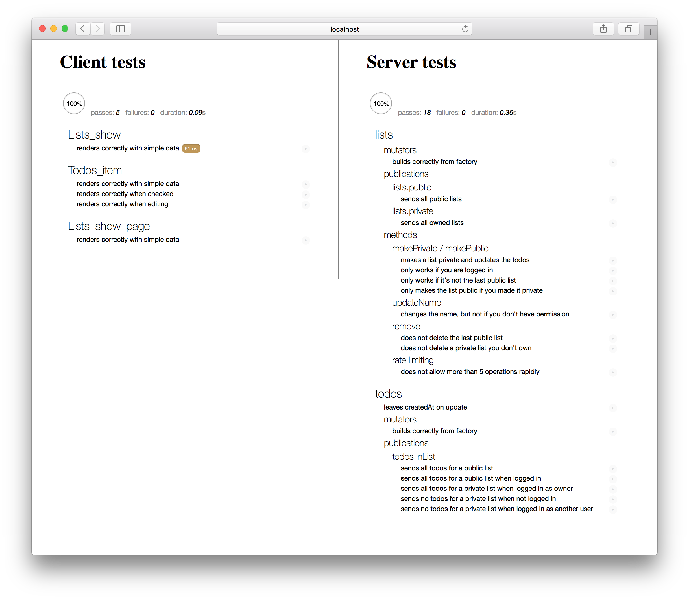

**NOTE** This is correct up to release 1.3-beta.12. Apologies that this is still a work in progress.

<h2 id="testing-applications">Testing your Application</h2>

There are many benefits of testing your application to ensure it works the way you think it does. Reasons include maintaining a high level of quality (especially over time as your codebase changes), allowing you to refactor and rewrite code with confidence, and concrete documentation of expected behavior. (Other developers can figure out what parts of your app are supposed to do by reading the tests!)

Automated testing allows you to do all of these things to a much greater degree and *run tests more often*, which means your codebase will remain in better shape and regress less. 

<h3 id="testing-concepts">Testing concepts</h3>

Entire books have been written on the subject of testing, so we will simply touch on some basics of testing here. The important thing to consider when writing a test is what part of the application you are trying to test, and how you are verifying the behaviour works.

 - If you are testing one small module of your application, you are writing a **unit test**. You'll need to take steps to *stub* and *mock* other modules that your module usually leverages in order to *isolate* each test. You'll typically also need to *spy* on actions that the module takes to verify that they occur.

 - If you are testing that multiple modules behave properly in concert, you are writing an **integration test**. Such tests are much more complex and may require running code both on the client and on the server to verify that communication across that divide is working as expected. Typically an integration test will still isolate a part of the entire application and directly verify results in code.

 - If you want to write a test that can be run against any running version of your app and verifies at the browser level that the right things happen when you push the right buttons, then you are writing an **acceptance test** (sometimes called "end to end test". Such tests typically try to hook into the application as little as possible, beyond perhaps setting up the right data to run a test against.

 - Finally you may wish to test that your application works under typical load or see how much load it can handle before it falls over. This is called a **load test** or **stress test**. Such tests can be challenging to set up and typically aren't run often but are very important for confidence before a big production launch.

<h3 id="challenges-with-meteor">Challenges of testing in Meteor</h3>

In some ways, testing a Meteor is no different to testing any other client-server, JavaScript heavy application. However, especially compared to a more backend focussed, traditional framework, the client-server divide and the reactive nature of code can add extra challenges to testing.

As Meteor's data system makes it simple to bridge the client-server gap and often allows you to create your application without thinking about how data moves around, it becomes critical to test that your code does actually work correctly across that gap. In traditional frameworks where you spend a lot of time thinking about interfaces between client and server, you can often get away with testing both sides of the interface in isolation.

The good news is that you can easily use Meteor's [full app test mode](#test-modes) to write [integration tests](#full-app-integration-test) that bridge both sides of the gap relatively easily.

Another challenge is creating test data in the client context; we'll discuss ways to do this in the [section on generating test data](#generating-test-data) below. 

As Meteor's reactivity system is "eventually consistent" in the sense that when you change an reactive input to the system, some time later you'll see the user interface change to reflect this. This is a challenge when testing, however there are some ways to wait until those changes should have happened and verify the results, as we'll see in the [Blaze unit test](XXX link) below.

<h2 id="test-modes">Test modes in Meteor</h2>

The primary way to test your application in Meteor is the `meteor test` command. 

This loads your application in a special "test mode". What this does is:

 1. *Doesn't* eagerly load *any* of our application code as Meteor normally would.
 2. *Does* eagerly load any file in our application (including in `imports/` folders) that look like `*.test[s].*`, or `*.spec[s].*`
 3. Sets the `Meteor.isTest` flag to be true.
 4. Starts up the test driver package ([see below](#driver-package)).

What this means is that you can write tests in files with a certain filename pattern and know they'll not be included in normal builds of your app. When your app runs in test mode, those files will be loaded (and nothing else will), and they can import the modules you want to test. As we'll see this is ideal for [unit tests](#unit-testing) and [simple integration tests](#simple-integration-test).

Additionally, Meteor offers a "full application" test mode. You can run this with `meteor test --full-app`.

This is similar to test mode, with key differences:

 1. It loads test files matching `*.app-test[s].*` and `*.app-spec[s].*`.
 2. It **does** eagerly load our application code as Meteor normally would.

This means that the entirety of your application (including for instance the web server and client side router) is loaded and will run as normal. This enables you to write much more [complex integration tests](#full-app-integration-test) and also load additional files for [acceptance tests](#acceptance-test).

Note that there is another test command in the Meteor tool; `meteor test-packages` is a way of testing Atmosphere packages, which we'll discuss in more detail in the [Writing Packages Article](writing-packages.html#testing).

<h3 id="driver-packages">Driver packages</h3>

When you run a `meteor test` command, you must provide a `--driver-package` argument. A test driver is a mini-application that runs in place of your app and runs each of your defined tests, whilst reporting the results in some kind of user interface.

There are two main kinds of test driver packages:

  -web-reporters which are Meteor applications and display a special test reporting web UI that you can view the test results in [include a SS]

  - console-reporters that run completely on the command-line and are primary used for automated testing like [continuous integration](#ci) (as we'll see, typically PhantomJS is used to drive such tests).

In this article, we'll use the popular [Mocha](https://mochajs.org) test runner alongside the [Chai](http://chaijs.com) assertion library to test our application. In order to write tests in Mocha, we can add the [`avital:mocha`](https://atmospherejs.com/avital/mocha) package to our app.

```bash
meteor add avital:mocha
```

This package also doesn't do anything in development or production mode (in fact it declares itself `testOnly` so it is not even included in those modes), but when our app is run in [test mode](#test-modes), it takes over, executing test code on both the client and server, and rendering results to the browser.

Test files themselves (files named `*.[app]-test[s].*` or `*.[app]-spec[s].*`) can register themselves to be run by the test driver in the usual way for that testing library. For Mocha, that's by using `describe` and `it`:

```js
describe('my module', () => {
  it('does something that should be tested', () => {
    // This code will be executed by the test driver when the app is started in the correct mode
  })
})
```

<h2 id="test-data">Test data</h2>

When your app is run in test mode, it is initialized with a clean test database.

If you are running a test that relies on using the database, and specifically the content of the database, you'll need to perform some *setup* steps in your test to ensure the database is in the state you expect. There are some tools you can use to do this.

To ensure the database is clean, the [`xolvio:cleaner`](https://atmospherejs.com/xolvio/cleaner) package is useful. You can use it to reset the database in a `beforeEach` block:

```js
import { resetDatabase } from 'meteor/xolvio:cleaner';

describe('my module', () => {
  beforeEach(() => {
    resetDatabase();
  });
});
```

This technique will only work on the server. If you need to reset the database from a client test, you can use a method to do so:

```js
import { resetDatabase } from 'meteor/xolvio:cleaner';

Meteor.methods({
  'test.resetDatabase': () => resetDatabase();
});

describe('my module', done => {
  beforeEach(() => {
    // We need to wait until the method call is done before moving on, so we
    // use Mocha's async mechanism (calling a done callback)
    Meteor.call('test.resetDatabase', done);
  });
});
```

As we've placed the code above in a test file, it *will not* load in normal development or production mode (which would a bad thing!). If you create a Atmosphere package with a similar feature, you should mark it as `testOnly` and it will similarly only load in test mode.

<h3 id="generating-test-data">Generating test data</h3>

Often it's sensible to create a set of data to run your test against. You can use standard `insert()` calls against your collections to do this, but often it's easier to create *factories* which help encode random test data. A great package to use to do this is [`dburles:factory`](https://atmospherejs.com/dburles/factory).

In the Todos example app, we define a factory to describe how to create a test todo item, using the [`faker`](https://www.npmjs.com/package/Faker) NPM package:

```js
import faker from 'faker';

Factory.define('todo', Todos, {
  listId: () => Factory.get('list'),
  text: () => faker.lorem.sentence(),
  createdAt: () => new Date(),
});
```

To use the factory in a test, we simply call `Factory.create`:

```js
// This creates a todo and a list in the database and returns the todo.
const todo = Factory.create('todo');

// If we have a list already, we can pass in the id and avoid creating another:
const list = Factory.create('list');
const todoInList = Factory.create('todo', { listId: list._id });
```

<h3 id="mocking-the-database">Mocking the database</h3>

As `Factory.create` directly inserts documents into the collection that's passed into the `Factory.define` function, it can be a problem to use it on the client. However there's a neat isolation trick that you can do to replace the server-backed `Todos` [client collection](collections.html#client-collections) with a mocked out [local collection](#collections.html#local-collections), that's encoded in the `stub-collections` package (currently a local package in the Todos example application).

```js
import { StubCollections } from 'meteor/stub-collections';
import { Todos } from 'path/to/todos.js';

StubCollections.stub(Todos);

// Now Todos is stubbed to a simple local collection mock,
//   so for instance on the client we can do:
Todos.insert({a: 'document'});

// Restore the `Todos` collection
StubCollections.restore();
```

In a Mocha test, it makes sense to use `stub-collections` in a `beforeEach`/`afterEach` block.

<h2 id="unit-testing">Unit testing</h2>

Unit testing is the process of isolating a section of code and then testing that the internals of that section work as you expect. As [we've split our code base up into ES2015 modules](structure.html) it's natural to test those modules one at a time.

By isolating a module and simply test its internal functionality, we can write tests that are *fast* and *accurate*---they can quickly tell you where a problem in your application lies. Note however that incomplete unit tests can often hide bugs because of the way they stub out dependencies. For that reason it's useful to combine unit tests with slower (and perhaps less commonly run) integration and acceptance tests.

<h3 id="simple-unit-test">A simple unit test</h3>

In the Todos example application, thanks to the fact that we've split our User Interface into [smart and resuable components](ui-ux.html#components), it's natural to want to unit test some of our reusable components (we'll see below how to [integration test](#simple-integration-test) our smart components).

To do so, we'll use a very simple test helper that renders a Blaze component off-screen with a given data context (note that the [React test utils](https://facebook.github.io/react/docs/test-utils.html) can do a similar thing for React). As we place it in `imports/ui/test-helpers.js` it won't load in our app by in normal mode (as it's not required anywhere):

```js
import { _ } from 'meteor/underscore';
import { Template } from 'meteor/templating';
import { Blaze } from 'meteor/blaze';
import { Tracker } from 'meteor/tracker';

const withDiv = function withDiv(callback) {
  const el = document.createElement('div');
  document.body.appendChild(el);
  try {
    callback(el);
  } finally {
    document.body.removeChild(el);
  }
};

export const withRenderedTemplate = function withRenderedTemplate(template, data, callback) {
  withDiv((el) => {
    const ourTemplate = _.isString(template) ? Template[template] : template;
    Blaze.renderWithData(ourTemplate, data, el);
    Tracker.flush();
    callback(el);
  });
};
```

A simple example of a reusable component to test is the `Todos_item` template. Here's what a unit test looks like (you can see some [others in the app repository](https://github.com/meteor/todos/blob/master/imports/ui/components/client/todos-item.tests.js)):

```js
/* eslint-env mocha */
/* global Todos Lists Factory chai withRenderedTemplate */

import { Factory } from 'meteor/factory';
import { chai } from 'meteor/practicalmeteor:chai';
import { Template } from 'meteor/templating';
import { $ } from 'meteor/jquery';


import { withRenderedTemplate } from '../../test-helpers.js';
import '../todos-item.js';

describe('Todos_item', () => {
  beforeEach(() => {
    Template.registerHelper('_', key => key);
  });

  afterEach(() => {
    Template.deregisterHelper('_');
  });

  it('renders correctly with simple data', () => {
    const todo = Factory.build('todo', { checked: false });
    const data = {
      todo,
      onEditingChange: () => 0,
    };

    withRenderedTemplate('Todos_item', data, el => {
      chai.assert.equal($(el).find('input[type=text]').val(), todo.text);
      chai.assert.equal($(el).find('.list-item.checked').length, 0);
      chai.assert.equal($(el).find('.list-item.editing').length, 0);
    });
  });
});
```

Of particular interest in this test is the following:

<h4 id="unit-test-importing">Importing</h4>

When we run our app in test mode, only our test files will be eagerly loaded. In particular, this means that in order to use our templates, we need to import them! In this test, we import `todos-item.js`, which itself imports 'todos.html' (yes, you do need to `import` the HTML files of your Blaze templates!)

<h4 id="unit-test-stubbing">Stubbing</h4>

To be a unit test, we must stub out the dependencies of the module. In this case, thanks to the way we've isolated our code into a reusable component, there's not much to do; principally we need to stub out the `{{_}}` helper that's created by the [`tap:i18n`](ui-ux.html#i18n) system. Note that we stub it out in a `beforeEach` and restore it the `afterEach`.

<h4 id="unit-test-data">Creating data</h4>

We can use the [Factory package's](#generating-data) `.build()` API to create a test document without inserting it into any collection. As we've been careful not to call out to any collections directly in the resuable component, we can pass the built `todo` document directly into the template, and it's simple.

<h3 id="running-unit-tests">Running unit tests</h3>

To run the tests that our app defines, we run our app in [test mode](#test-modes):

```
meteor test --driver-package avital:mocha
```

As we've defined a test file (`imports/todos/todos.tests.js`), what this means is that the file above will be eagerly loaded, adding the `'builds correctly from factory'` test to the Mocha registry. 

To run the tests, visit http://localhost:3000 in your browser. This kicks off `avital:mocha`, which runs your tests both in the browser and on the server. It displays the test results in the browser in a Mocha test reporter:



Usually, while developing an application, it make sense to run `meteor test` on a second port (say `3100`), while also running your main application in a separate process:

```bash
# in one terminal window
meteor

# in another
meteor test --driver-package avital:mocha --port 3100
```

Then you can open two browser windows to see the app in action while also ensuring that you don't break any tests as you make changes.

<h3 id="meteor-specific-isolation">Meteor specific isolation</h3>

- JS has a tradition of test isolation techniques. Notable packages include `sinon`

- Sometimes you need something Meteor specific: (XXX: should this be in unit testing section)
  - "stub collections" -- XXX: try and use sinon on the require instead?
  - "publication collector"
  - Everything with https://github.com/meteor-velocity/meteor-stubs
1. Other packages w/ sinon
    3. Collections with stub collections
    4. Publications with stub subscriptions
    5. Methods? w/ (something like https://github.com/meteor/meteor/pull/5561)
    6. Other bits of Meteor (e.g. `Meteor.userId()`) -- on an adhoc basis?

  4. Testing various kinds of things:
    1. General utilities
    2. Collections / Models
    3. Methods -- how to simulate `userId`
    4. Publications via calling the publish fuction, and collecting results (w/ something like https://github.com/stubailo/meteor-rest/blob/devel/packages/rest/http-subscription.js)
  5. UI components (see blaze guide and client side data stuff above)


<h2 id="integration-testing">Integration testing</h2>

An integration test is a test that crosses module boundaries. In the simplest case, this simply means something very similar to a unit test, where you perform your isolation around multiple modules, creating a non-singular "system under test". 

Although conceptually different to unit tests, such tests typically do not need to be run any differently to unit tests and can use the same [`meteor test` mode](#running-unit-tests) and [isolation techniques](#meteor-specific-isolation) as we use for unit tests.

However, an integration test that crosses the client-server boundary of a Meteor application (where the modules under test cross that boundary) requires a different testing infrastructure, namely Meteor's "full app" testing mode. 

Let's take a look at example of both kinds of tests

<h3 id="simple-integration-test">Simple integration test</h3>

XXX: example of this

This integration test can be run the exact same way as we ran [unit tests above](#running-unit-tests).

<h3 id="full-app-integration-test">Full-app integration test</h3>

In the Todos example application, we have a integration test which ensures that we see the full contents of a list when we route to it, which demonstrates a few techniques of integration tests:

```js
/* eslint-env mocha */

import { Meteor } from 'meteor/meteor';
import { Tracker } from 'meteor/tracker';
import { DDP } from 'meteor/ddp-client';
import { FlowRouter } from 'meteor/kadira:flow-router';
import { assert } from 'meteor/practicalmeteor:chai';
import { $ } from 'meteor/jquery';

import { generateData } from './../../api/generate-data.app-tests.js';
import { Lists } from '../../api/lists/lists.js';
import { Todos } from '../../api/todos/todos.js';

// Utility function to wait for subscriptions
const waitForSubscriptions = (done) => {
  const poll = Meteor.setInterval(() => {
    if (DDP._allSubscriptionsReady()) {
      clearInterval(poll);
      done();
    }
  }, 200);
};

// Utility to allow throwing inside callback
const catchAsync = (done, cb) => () => {
  try {
    cb();
  } catch (e) {
    done(e);
  }
};

if (Meteor.isClient) {
  describe('data available when routed', () => {
    beforeEach(done => {
      generateData()
        .then(() => FlowRouter.go('/'))
        .nodeify(done);
    });

    describe('when logged out', () => {
      it('has all public lists at homepage', () => {
        assert.equal(Lists.find().count(), 3);
      });

      it('renders the correct list when routed to', done => {
        const list = Lists.findOne();
        FlowRouter.go('Lists.show', { _id: list._id });

        // Wait for the router change to take affect
        Tracker.afterFlush(catchAsync(done, () => {
          assert.equal($('.title-wrapper').html(), list.name);

          // Wait for all subscriptions triggered by this route to complete
          waitForSubscriptions(catchAsync(done, () => {
            assert.equal(Todos.find({listId: list._id}).count(), 3);
            done();
          }));
        }));
      });
    });
  });
}
```

Of note here:

 - Before running, each test sets up the data it needs using the `generateData` helper (see [the section on creating integration test data](#creating-integration-test-data)) for more detail) then goes to the homepage.

 - Although Flow Router doesn't take a done callback, we can use `Tracker.afterFlush` to wait for all it's reactive consequences to occur.

 - Here we wrote a little utility (which could be abstracted into a general package) to wait for all the subscriptions which are created by the route change (the `todos.inList` subscription in this case) to become ready before checking their data.

 - The `catchAsync` utility is useful because otherwise we don't see the results of failures inside callbacks. XXX: perhaps this test should be rewritten with promises to avoid this?


<h3 id="running-full-app-tests">Running full-app tests</h3>

To run the [full-app tests](#test-modes) in our application, we run:

```
meteor test --full-app --driver-package avital:mocha
```

When we connect to the test instance in a browser, we want to render a testing UI rather than our app UI, so the `mocha-web-reporter` package will hide any UI of our application and overlay it with its own. However the app continues to behave as normal, so we are able to route around and check the correct data is loaded.

<h3 id="creating-integration-test-data">Creating data</h3>

To create test data in full-app test mode, it usually makes sense to create some special test methods which we can call from the client side. Similar to the way we cleared the database using a method in the `beforeEach` in the [test data](#test-data) section above, we can call that method before running our tests. 

In the case of our routing tests, we've used a file called `imports/api/generate-data.app-tests.js` which defines this method (and will only be loaded in full app test mode, so is not available in general!):

```js
// This file will be auto-imported in the app-test context, ensuring the method is always available

import { Meteor } from 'meteor/meteor';
import { Factory } from 'meteor/factory';
import { resetDatabase } from 'meteor/xolvio:cleaner';
import { Random } from 'meteor/random';
import { _ } from 'meteor/underscore';

const createList = (userId) => {
  const list = Factory.create('list', { userId });
  _.times(3, () => Factory.create('todo', { listId: list._id }));
  return list;
};

Meteor.methods({
  generateFixtures() {
    resetDatabase();

    // create 3 public lists
    _.times(3, () => createList());

    // create 3 private lists
    _.times(3, () => createList(Random.id()));
  },
});

let generateData;
if (Meteor.isClient) {
  // Create a second connection to the server to use to call test data methods
  // We do this so there's no contention w/ the currently tested user's connection
  const testConnection = Meteor.connect(Meteor.absoluteUrl());

  generateData = () => Promise.denodeify((cb) => {
    testConnection.call('generateFixtures', cb);
  })();
}

export { generateData };
```

Note that we've exported a client-side symbol `generateData` which is a promisified version of the method call, which makes it simpler to use this sequentially in tests.

XXX: is this a good idea? 

Also of note is the way we use a second DDP connection to the server in order to send these test "control" method calls.

<h2 id="acceptance-testing">Acceptance testing</h2>

Acceptance testing is the process of taking an unmodified version of our application and testing it from the "outside" to make sure it behaves in a way we expect. Typically if an app passes acceptance tests, we have done our job properly from a product perspective.

As acceptance tests test the behavior of the application in a full browser context in a generic way, there are a range of tools that you can to specify and run such tests. In this guide we'll demonstrate using [Chimp](https://chimp.readme.io), an acceptance testing tool with a few neat Meteor-specific features that makes it easy to use.

We can make Chimp a dependency of our app by installing it as an NPM development dependency:

```
npm install --save-dev chimp
```

Chimp has a variety of options for setting it up, but we can add some NPM scripts which will run the currently tests we define in Chimp's two main modes:

```json
{
  "scripts": {
    ...
    "chimp-watch": "chimp --ddp=http://localhost:3000 --watch --mocha --path=tests",
    "chimp-test": "chimp --mocha --path=tests"
  },
```
[`package.json`]

Chimp will now look in the `tests/` directory (otherwise ignored by the Meteor tool) for files in which you define acceptance tests. In the Todos example app, we define a simple test that ensures we can click the "create list" button:

```js
/* eslint-env mocha */

// These are Chimp globals
/* globals browser assert server */

const countLists = () => {
  browser.waitForExist('.list-todo');
  const elements = browser.elements('.list-todo');
  return elements.value.length;
};

describe('list ui', () => {
  beforeEach(() => {
    browser.url('http://localhost:3000');
    server.call('generateFixtures');
  });

  it('can create a list @watch', () => {
    const initialCount = countLists();

    browser.click('.js-new-list');

    assert.equal(countLists(), initialCount + 1);
  });
});
```

<h3 id="running-acceptance-tests">Running acceptance tests</h3>

To run the acceptance test, we first start our meteor server with a special test driver, `tmeasday:acceptance-test-driver`. (You'll need to `meteor add` it to your app). 

This test driver literally does nothing, but by running our app in full app test mode, we make all of our [test data creating methods](#creating-integration-test-data) available:

```
meteor test --full-app --driver-package tmeasday:acceptance-test-driver
```

To run the test, we can then run `npm run chimp-watch` in another terminal window. The `chimp-watch` command will then run the test in a browser, and continue to re-run it as we change the test or the application. (Note that the test assumes we are running the app on port `3000`).

Thus it's a good way to develop the test---this is why chimp has a feature where we mark tests with a `@watch` in the name to call out the tests we want to work on (running our entire acceptance test suite can be time consuming in a large application).

The `chimp-test` command will run all of the tests *once only* and is good for testing that our suite passes, either as a manual step, or as part of a [continuous integration](#ci) process.

<h3 id="creating-acceptance-test-data">Creating data</h3>

The advantage of running our acceptance test suite pointed at an app that runs in full app test mode is that all of the [data generating methods](#creating-integration-test-data) that we've created remain available. 

In Chimp tests, you have a DDP connection to the server available on the `server` variable. You can thus use `server.call()` (which is wrapped to be synchronous in Chimp tests) to call these methods. This is a convenient way to share data preparation code between acceptance and integration tests. 


<h2 id="ci">Continuous Integration</h2>

XXX: Note these are not yet working with the new system

Continuous integration testing is the process of running tests on every commit of your project.

There are two principal ways to do it: on the developer's machine before allowing them to push code to the central repository, and on a dedicated CI server after each push. Both techniques are useful, and both require running tests in a commandline-only fashion.

<h3 id="command-line">Command Line</h3>

We've seen one example of running tests on the command line, using our `npm run chimp-test` mode. 

XXX: write this when the tools have caught up

<h3 id="pre-push">Setting up a pre-push hook</h3>

In the Todos example app, we run our normal (non-full-app) tests before every push to the repository. To do this with Git, we can simple create the following file in `.git/pre-push`:

```bash
#!/bin/sh

## XXX: something like this
spacejam test --driver-package avital:mocha
```

<h3 id="using-circle-ci">Circle CI</h3>

[Circle](https://circleci.com) is a great continuous integration service that allows us to run (possibly time consuming) tests on every push to a repository like GitHub. To use it with the tests we've defined above, we can follow their standard [getting started tutorial](https://circleci.com/docs/getting-started) and use a `circle.yml` file similar to this:

XXX: fix up when tools catch up

```yaml
machine:
  node:
    version: 0.10.40
dependencies:
  override:
    - curl https://install.meteor.com | /bin/sh
    - npm install -g spacejam
checkout:
  post:
    - git submodule update --init
test:
  override:
    - spacejam test-packages --driver-package practicalmeteor:mocha-console-reporter
```


