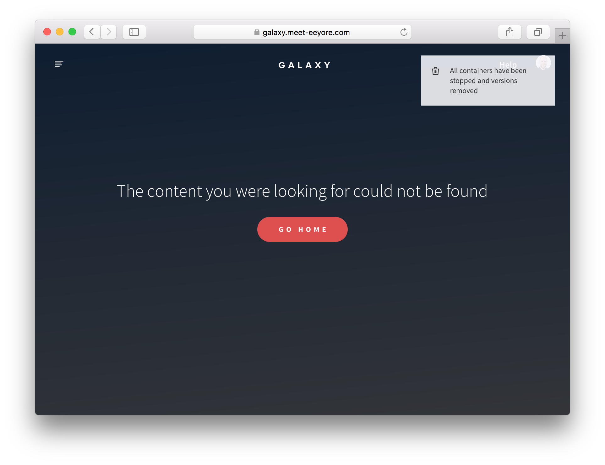

After reading this guide, you'll know:

1. How to build reusable client side components in any user interface framework.
2. How to build a style guide to allow you to visually test such reusable components.
3. Patterns for building front end components in a performant way in Meteor.
4. How to build user interfaces in a maintainable and extensible way.
5. How to build components that can cope with a variety of different data sources.
6. How to use animation to keep users informed of changes.

<h2 id="components">UI components</h2>

In Meteor, we officially support three user interface (UI) rendering libraries, [Blaze](blaze.html), [React](http://react-in-meteor.readthedocs.org/en/latest/) and [Angular](http://www.angular-meteor.com).

Regardless of the rendering library that you are using, there are some patterns in how you build your User Interface (UI) that will help make your app's code easier to understand, test, and maintain. These patterns, much like general patterns of modularity, revolve around making the interfaces to your UI elements very clear, and avoiding using techniques that bypass these known interfaces.

In this article, we'll refer to the elements in your user interface as "components". Although in some systems, you may refer to them as "templates", it can be a good idea to think of them as something more like a component which has an API and internal logic, rather than a template which is just a bit of HTML.

To begin with, let's consider two categories of UI components that are useful to think about, "smart" and "reusable":

<h3 id="reusable-components">Reusable components</h3>

A "reusable" component is a component which doesn't rely on anything from the environment it renders in. It renders purely based on its direct inputs (its *template arguments* in Blaze, or *props* in React) and internal state.

In Meteor specifically, this means a component which does not access data from any global sources---Collections, Stores, routers, user data, or similar. For instance, in the Todos example app, the `Lists_show` template takes in the list it is rendering and the set of todos for that list, and does not ever look directly in the `Todos` or `Lists` collections.

Reusable components have many advantages:

 1. They are easy to reason about---you don't need to understand how the data in the global store changes, simply how the arguments to the component change.

 2. They are easy to test---you don't need to be careful about the environment you render them in, all you need to do is provide the right arguments.

 3. They are easy to add to component style guides---as we'll see in the section about [component style guides](#styleguides), when creating a style guide, a clean environment makes things much easier to work with.

 4. You know exactly what dependencies you need to provide for them to work in different environments.

 There's also an even more restricted type of reusable component, a "pure" component, which does not have any internal state. For instance in the Todos app, the `Todos_item` template decides what to render solely based on its arguments. Pure components are even easier to reason about and test than reusable ones and so should be preferred wherever possible.

<h3 id="global-stores">Global data stores</h3>

So which are the global data stores that you should be avoiding in reusable components? There are a few. Meteor is built to optimize speed of development, which means you can access a lot of things globally. Although this is convenient when building "smart" components (see below), you'll need to avoid these data sources in reusable components:

- Your collections, as well as the `Meteor.users` collection,
- Accounts information, like `Meteor.user()` and `Meteor.loggingIn()`
- Current route information
- Any other client-side data stores (read more in the [Data Loading article](data-loading.html#stores))

<h3 id="smart-components">Smart components</h3>

While most of the components in your app should be reusable, they need to get their data passed in from somewhere. This is where "smart" components come in. Such components typically do the following things:

1. Subscribe to data
2. Fetch data from those subscriptions
3. Fetch global client-side state from stores such as the Router, Accounts, and your own stores

Ideally, once a smart component has assembled such a set of data, it passes it off to a reusable component child to render with. Smart components usually don't render anything apart from one or more reusable children. This makes it easy to separate rendering and data loading in your tests.

A typical use case for a smart component is the "page" component that the router points you to when you access a URL. Such a component typically needs to do the three things above and then can pass the resulting arguments into child components. In the Todos example app, the `listShowPage` does exactly this, resulting in a template with very simple HTML:

```html
<template name="Lists_show_page">
  {{#each listId in listIdArray}}
    {{> Lists_show (listArgs listId)}}
  {{else}}
    {{> App_notFound}}
  {{/each}}
</template>
```

The JavaScript of this component is responsible for subscribing and fetching the data that's used by the `Lists_show` template itself:

```js
Template.Lists_show_page.onCreated(function() {
  this.getListId = () => FlowRouter.getParam('_id');

  this.autorun(() => {
    this.subscribe('Todos.inList', this.getListId());
  });
});

Template.Lists_show_page.helpers({
  // We use #each on an array of one item so that the "list" template is
  // removed and a new copy is added when changing lists, which is
  // important for animation purposes.
  listIdArray() {
    const instance = Template.instance();
    const listId = instance.getListId();
    return Lists.findOne(listId) ? [listId] : [];
  },
  listArgs(listId) {
    const instance = Template.instance();
    return {
      todosReady: instance.subscriptionsReady(),
      // We pass `list` (which contains the full list, with all fields, as a function
      // because we want to control reactivity. When you check a todo item, the
      // `list.incompleteCount` changes. If we didn't do this the entire list would
      // re-render whenever you checked an item. By isolating the reactiviy on the list
      // to the area that cares about it, we stop it from happening.
      list() {
        return Lists.findOne(listId);
      },
      // By finding the list with only the `_id` field set, we don't create a dependency on the
      // `list.incompleteCount`, and avoid re-rendering the todos when it changes
      todos: Lists.findOne(listId, {fields: {_id: true}}).todos()
    };
  }
});
```

<h2 id="styleguides">Visually testing reusable components</h2>

A useful property of reusable components is that you can render them anywhere because they don't rely on complicated environments. One very useful thing that this enables is a component _style guide_ or harness.

To use a style guide, you need to add two things to your app:

1. A list of "entries", where each entry is a component with a list of specifications. Each specification is a list of arguments which trigger different behavior when passed to the component.

2. A special route in the development version of the application that renders each of the components for each specification.

For instance, in Galaxy, we have a component style guide that renders each reusable component either one specification at a time, or with all specifications at once.


Such rendering enables very quick development of visual aspects of the component in all possible states. Typically in a complex application, it can be quite difficult to achieve certain states of components purely by "using" the application. For example, in Galaxy, the component screen enters a very complex state if two deploys to the same application are happening simultaneously. It would be hard to test this component by using the application and trying to get it into that state.

You can learn more about this technique from [this talk](https://www.youtube.com/watch?v=bTQOvYy_Z3w&app=desktop) by Phil Cockfield from Respondly.

<h2 id="ui-patterns">User interface patterns</h2>

Here are some patterns that are useful to keep in mind when building the user interface of your Meteor application.

<h3 id="i18n">Internationalization with tap:i18n</h3>

Internationalization (i18n) is the process of generalizing the UI of your app in such a way that it's easy to render all text in a different language. In Meteor, [the excellent `tap:i18n` package](https://atmospherejs.com/tap/i18n) provides an API for building translations and using them in your components and frontend code.

<h4 id="places-to-i18n">Places to translate</h4>

It's useful to consider the various places in the system that user-readable strings exist and make sure that you are properly using the i18n system to generate those strings in each case. We'll go over the implementation for each case in the section about [`tap:i18n`](#tap-i18n) below.

1. **HTML templates.** This is the most obvious place---in the content of UI components that the user sees.
2. **Client JavaScript messages.** Alerts or other messages that are generated on the client side are shown to the user, and should also be translated.
3. **Server JavaScript messages and emails.** Messages or errors generated by the server can often be user visible. An obvious place is emails and any other server generated messages, such as mobile push notifications, but more subtle places are return values and error messages on method calls. Errors should be sent over the wire in a generic form and translated on the client.
4. **Data in the database.** A final place where you may want to translate is actual user-generated data in your database. For example, if you are running a wiki, you might want to have a mechanism for the wiki pages to be translated to different languages. How you go about this will likely be unique to your application.

<h4 id="tap-i18n">Using `tap:i18n`</h4>

XXX: We're going to leave out this section until there is more clarity around modules in Meteor 1.3. Right now i18n is a bit complicated in the all-packages approach we have taken for the Todos example app.

<h3 id="event-handling">Event handling</h3>

A large part of your UI involves responding to events initated by the user, and there are some steps that you should take to make sure your application performs well in the face of rapid input. An application lagging in response to user actions is one of the most noticeable performance problems.

<h4 id="throttling-method-calls">Throttling method calls on user action</h4>

It's typical to make some kind of change to the database when a user takes an action. However it's important to make sure you don't do this too rapidly. For instance, if you wish to save the user's text as they type in a text box, you should take steps to make sure that you don't send method calls to your server more than every few hundred milliseconds.

If you do not, you'll see performance problems across the board: you'll be flooding the user's network connection with a lot of small changes, the UI will update on every keystroke, potentially causing poor performance, and your database will suffer with a lot of writes.

To throttle writes, a typical approach is to use underscore's [`.throttle()`](http://underscorejs.org/#throttle) or [`.debounce()`](http://underscorejs.org/#debounce) functions. For instance, in the Todos example app, we throttle writes on user input to 300ms:

```js
Template.Todos_item.events({
  // update the text of the item on keypress but throttle the event to ensure
  // we don't flood the server with updates (handles the event at most once
  // every 300ms)
  'keyup input[type=text]': _.throttle(function(event) {
    Todos.methods.updateText.call({
      todoId: this.todo._id,
      newText: event.target.value
    }, (err) => {
      err && alert(err.error);
    });
  }, 300)
});
```

Typically, you use `.throttle()` if you are OK with the event happening during the user series of actions (i.e. you don't mind the multiple, throttled events happening over time, as in this case), whereas you use `.debounce()` if you want the events to happen whenever (in this example) the user stops typing for 300ms or longer.


<h4 id="limiting-re-rendering">Limiting re-rendering</h4>

Even if you aren't saving data over the wire to the database on every user input, sometimes you still may wish to update in-memory data stores on every user change. If updating that data store triggers a lot of UI changes, you can see poor performance and missed keystrokes when you update it too often. In such cases you can limit re-rendering by throttling in a similar way how we throttled the method call above. You could also use `.debounce()` to ensure the changes happen only after the user has stopped typing.

<h2 id="ux-patterns">User experience patterns</h2>

User experience, or UX, describes the experience of a user as they interact with your application.  There are several UX patterns that are typical to most Meteor apps which are worth exploring here. Many of these patterns are tied to the way data is loaded as the user interacts with your app, so there are similar sections in the [data loading article](data-loading.html#patterns) talking about how to implement these patterns using Meteor's publications and subscriptions.

<h3 id="subscription-readiness">Subscription readiness</h3>

When you subscribe to data in Meteor, it does not become instantly available on the client. Typically the user will need to wait for a few hundred milliseconds, or as long as a few seconds (depending on the connection speed), for the data to arrive. This is especially noticeable when the app is first starting up or you move between screens that are displaying completely new data.

There are a few UX techniques for dealing with this waiting period. The simplest is simply to switch out the page you are rendering with a generic "loading" page while you wait for all the data (typically a page may open several subscriptions) to load. As an example, in the Todos example app, we wait until all the public lists and the user's private lists have loaded before we try to render the actual page:

```html
{{#if Template.subscriptionsReady}}
  {{> Template.dynamic template=main}}
{{else}}
  {{> App_loading}}
{{/if}}
```

We do this with Blaze's `Template.subscriptionsReady` which is perfect for this purpose, as it waits for all the subscriptions that the current component has asked for to become ready.

<h4 id="per-component-loading">Per-component loading state</h4>

Usually it makes for a better UX to show as much of the screen as possible as quickly as possible and to only show loading state for the parts of the screen that are still waiting on data. So a nice pattern to follow is "per-component loading". We do this in the Todos app when you visit the list page---we instantly render the list metadata, such as its title and privacy settings, and render a loading state for the list of todos while we wait for them to appear.


We achieve this by passing the readiness of the todos list down from the smart component which is subscribing (the `listShowPage`) into the reusable component which renders the data:

```html
{{> Lists_show todosReady=Template.subscriptionsReady list=list}}
```

And then we use that state to determine what to render in the reusable component (`listShow`):

```html
{{#if todosReady}}
  {{#with list._id}}
    {{#each todo in (todos this)}}
      {{> Todos_item (todoArgs todo)}}
    {{else}}
      <div class="wrapper-message">
        <div class="title-message">No tasks here</div>
        <div class="subtitle-message">Add new tasks using the field above</div>
      </div>
    {{/each}}
  {{/with}}
{{else}}
    <div class="wrapper-message">
      <div class="title-message">Loading tasks...</div>
    </div>
{{/if}}
```

<h4 id="loading-placeholders">Showing placeholders</h4>

You can take the above UI a step further by showing placeholders whilst you wait for the data to load. This is a UX pattern that has been pioneered by Facebook which gives the user a more solid impression of what data is coming down the wire. It also prevents parts of the UI from moving around when data loads, if you can make the placeholder have the same dimensions as the final element.

For example, in Galaxy, while you wait for your app's log to load, you see a loading state indicating what you might see:


<h4 id="styleguide-and-loading">Using the style guide to prototype loading state</h4>

Loading states are notoriously difficult to work on visually as they are by definition transient and often are barely noticeable in a development environment where subscriptions load almost instantly.

This is one reason why being able to achieve any state at will in the [component style guide](#styleguides) is so useful. As our reusable component `Lists_show` simply chooses to render based on its `todosReady` argument and does not concern itself with a subscription, it is trivial to render its loading state in a style guide.

<h3 id="pagination">Pagination</h3>

In the [Data Loading article](data-loading.html#pagination) we discuss a pattern of paging through an "infinite scroll" type subscription which loads one page of data at a time as a user scrolls down the page. It's interesting to consider UX patterns to consume that data and indicate what's happening to the user.

<h4 id="list-component">A list component</h4>

Let's consider any generic item-listing component. To focus on a concrete example, we could consider the todo list in the Todos example app. Although it does not in our current example app, in a future version it could paginate through the todos for a given list.

There are a variety of states that such a list can be in:

 1. Initially loading, no data available yet.
 2. Showing a subset of the items with more available.
 3. Showing a subset of the items with more loading.
 4. Showing *all* the items - no more available.
 5. Showing *no* items because none exist.

It's instructive to think about what arguments such a component would need to differentiate between those five states. Let's consider a generic pattern that would work in all cases where we provide the following information:

 - A `count` of the total number of items.
 - A `countReady` boolean that indicates if we know that count yet (remember we need to load even that information).
 - A number of items that we have `requested`.
 - A list of `items` that we currently know about.

We can now distinguish between the 5 states above based on these conditions:

1. `countReady` is false, or `count > 0` and `items` is still empty. (These are actually two different states, but it doesn't seem important to visually separate them).
2. `items.length === requested && requested < count`
3. `0 < items.length < requested`
4. `items.length === requested && count > 0`
5. `count === 0`

You can see that although the situation is a little complex, it's also completely determined by the arguments and thus very much testable. A component style guide helps immeasurably in seeing all these states easily! In Galaxy we have each state in our style guide for each of the lists of our app and we can ensure all work as expected and appear correctly:

<image src="images/galaxy-styleguide-list.png">

<h4 id="pagination-controller">A pagination "controller" pattern</h4>

A list is also a good opportunity to understand the benefits of the smart vs reusable component split. We've seen above that correctly rendering and visualizing all the possible states of a list is non-trivial and is made much easier by having a reusable list component that takes all the required information in as arguments.

However, we still need to subscribe to the list of items and the count, and collect that data somewhere. To do this, it's sensible to use a smart wrapper component (analogous to an MVC "controller") whose job it is to subscribe and fetch the relevant data.

In the Todos example app, we already have a wrapping component for the list that talks to the router and sets up subscriptions. This component could easily be extended to understand pagination:

```js
const PAGE_SIZE = 10;

Template.Lists_show_page.onCreated(function() {
  // We use internal state to store the number of items we've requested
  this.state = new ReactiveDict();

  this.getListId = () => FlowRouter.getParam('_id');

  this.autorun(() => {
    // As the `requested` state increases, we re-subscribe to a greater number of todos
    this.subscribe('List.todos', this.getListId(), this.state.get('requested'));
    this.countSub = this.subscribe('Lists.todoCount', this.getListId());
  });

  // The `onNextPage` function is used to increment the `requested` state variable. It's passed
  // into the listShow subcomponent to be triggered when the user reaches the end of the visible todos
  this.onNextPage = () => {
    this.state.set('requested', this.state.get('requested') + PAGE_SIZE);
  };
});

Template.Lists_show_page.helpers({
  listArgs(listId) {
    const instance = Template.instance();
    const list = Lists.findOne(listId);
    const requested = instance.state.get('requested');
    return {
      list,
      todos: list.todos({}, {limit: requested}),
      requested,
      countReady: instance.countSub.ready(),
      count: Counts.get(`list/todoCount${listId}`),
      onNextPage: instance.onNextPage
    };
  }
});
```

<h4 id="patterns-for-new-data">UX patterns for displaying new data</h4>

An interesting UX challenge in a realtime system like Meteor involves how to bring new information (like changing data in a list) to the user's attention. As [Dominic](http://blog.percolatestudio.com/design/design-for-realtime/) points out, it's not always a good idea to simply update the contents of a list as quickly as possible, as it's easy to miss changes or get confused about what's happened.

One solution to this problem is to *animate* list changes (which we'll look at in the [animation section](#animation)), but this isn't always the best approach. For instance, if a user is reading a list of comments, they may not want to see any changes until they are done with the current comment thread.

An option in this case is to call out that there are changes to the data the user is looking at without actually making UI updates. In a system like Meteor which is reactive by default, it isn't necessarily easy to stop such changes from happening!

However, it is possible to do this thanks to our split between smart and reusable components. The reusable component simply renders what it's given, so we use our smart component to control that information. We can use a [*local collection*](collections.html#local-collections) to store the rendered data, and then push data into it when the user requests an update:

```js
Template.Lists_show_page.onCreated(function() {
  // ...

  // The visible todos are the todos that the user can actually see on the screen
  // (whereas Todos are the todos that actually exist)
  this.visibleTodos = new Mongo.Collection();

  this.getTodos = () => {
    const list = Lists.findOne(this.this.getListId());
    return list.todos({}, {limit: instance.state.get('requested')});
  };
  // When the user requests it, we should sync the visible todos to reflect the true state of the world
  this.syncTodos = (todos) => {
    todos.forEach(todo => this.visibleTodos.insert(todo));
    this.state.set('hasChanges', false);
  };
  this.onShowChanges = () => {
    this.syncTodos(this.getTodos());
  };

  this.autorun((computation) => {
    const todos = this.getTodos();

    // If this autorun re-runs, the list id or set of todos must have changed, so we should
    // flag it to the user so they know there are changes to be seen.
    if (!computation.firstRun) {
      this.state.set('hasChanges', true);
    } else {
      this.syncTodos(todos);
    }
  });
});

Template.Lists_show_page.helpers({
  listArgs(listId) {
    const instance = Template.instance();
    const list = Lists.findOne(listId);
    const requested = instance.state.get('requested');
    return {
      list,
      // we pass the *visible* todos through here
      todos: instance.visibleTodos.find({}, {limit: requested}),
      requested,
      countReady: instance.countSub.ready(),
      count: Counts.get(`list/todoCount${listId}`),
      onNextPage: instance.onNextPage,
      // These two properties allow the user to know that there are changes to be viewed
      // and allow them to view them
      hasChanges: instance.state.get('hasChanges'),
      onShowChanges:instance.onShowChanges
    };
  }
});
```

The reusable sub-component can then use the `hasChanges` argument to determine if it show some kind of callout to the user to indicate changes are available, and then use the `onShowChanges` callback to trigger them to be shown.

<h3 id="optimistic-ui">Optimistic UI</h3>

One nice UX pattern which Meteor makes much easier than other frameworks is Optimistic UI. Optimistic UI is the process of showing user-generated changes in the UI without waiting for the server to acknowledge that the change has succeeded, resulting in a user experience that seems faster than is physically possible, since you don't need to wait for any server roundtrips. Since most user actions in a well-designed app will be successful, it makes sense for almost all parts of an app to be optimistic in this way.

However, it's not *always* necessarily a good idea to be optimistic. Sometimes we may actually want to wait for the server's response. For instance, when a user is logging in, you *have* to wait for the server to check the password is correct before you can start allowing them into the site.

So when should you wait for the server and when not? It basically comes down to how optimistic you are; how likely it is that something will go wrong. In the case of a password, you really can't tell on the client, so you need to be conservative. In other cases, you can be pretty confident that the Method call will succeed, and so you can move on.

For instance, in the Todos example app, when creating a new list, the list creation will basically always succeed, so we write:

```js
Template.App_body.events({
  'click .js-new-list'() {
    const listId = Lists.methods.insert.call((err) => {
      if (err) {
        // At this point, we have already redirected to the new list page, but
        // for some reason the list didn't get created. This should almost never
        // happen, but it's good to handle it anyway.
        FlowRouter.go('App.home');
        alert('Could not create list.');
      }
    });

    FlowRouter.go('Lists.show', { _id: listId });
  }
});
```

We place the `FlowRouter.go('Lists.show')` outside of the callback of the Method call, so that it runs right away. First we *simulate* the method (which creates a list locally in Minimongo), then route to it. Eventually the server returns, usually creating the exact same list (which the user will not even notice). In the unlikely event that the server call fails, we show an error and redirect back to the homepage.

Note that the `listId` returned by the list method (which is the one generated by the client stub) is guaranteed to be the same as the one generated on the server, due to [the way that Meteor generates IDs](methods.html#consistent-id-generation) and ensures they are the same between client and server.

<h3 id="writes-in-progress">Indicating when a write is in progress</h3>

Sometimes the user may be interested in knowing when the update has hit the server. For instance, in a chat application, it's a typical pattern to optimistically display the message in the chat log, but indicate that it is "pending" until the server has acknowledged the write. We can do this easily in Meteor by simply modifying the Method to act differently on the client:

```js
Messages.methods.insert = new Method({
  name: 'Messages.methods.insert',
  schema: new SimpleSchema({
    text: {type: String}
  }),
  run(message) {
    // In the simulation (on the client), we add an extra pending field.
    // It will be removed when the server comes back with the "true" data.
    if (this.isSimulation) {
      message.pending = true;
    }

    Messages.insert(message);
  }
})
```

Of course in this scenario, you also need to be prepared for the server to fail, and again, indicate it to the user somehow.

<h3 id="unexpected-failures">Unexpected failures</h3>

We've seen examples above of failures which you don't really anticipate will happen. It's difficult and inefficient to defend against every possible error, however unlikely. However, there are some catch-all patterns that you can use for unexpected failures.

Thanks to Meteor's automatic handling of optimistic UI, if a method unexpectedly fails the optimistic changes will roll back and the Minimongo database will end up in a consistent state. If you are rendering directly from Minimongo, the user will see something that is consistent, even if it's not what they anticipated of course. In some cases when you have state you are keeping outside of Minimongo, you may need to make changes to it manually to reflect this. You can see this in the example above where we had to update the router manually after an operation failed.

However, it's terrible UX to simply jump the user to an unexpected state without explaining what's happened. We used a `alert()` above, which is a pretty poor option, but gets the job done. One better approach is to indicate changes via a "flash notification", which is a UI element that's displayed "out-of-band", typically in the top right of the screen, given the user *some* indication of what's happened. Here's an example of a flash notification in Galaxy, at the top right of the page:



<h2 id="animation">Animation</h2>

Animation is the process of indicating changes in the UI smoothly *over time* rather than *instantly*. Although animation is often seen as "window dressing" or purely aesthetic, in fact it serves a very important purpose, highlighted by the example of the changing list above. In a connected-client world where changes in the UI aren't always initiated by user action (i.e. sometimes they happen as a result of the server pushing changes made by other users), instant changes can result in a user experience where it's difficult to understand what is happening.

<h3 id="animating-visiblity">Animating changes in visiblity</h3>

Probably the most fundamental type of UI change that requires animation is when items appear or disappear. In Blaze, we can use the [`percolate:momentum` package](https://atmospherejs.com/percolate/momentum) to plug a standard set of animations from the [`velocity animation library`](http://julian.com/research/velocity/) into such state changes.

A good example of this is the editing state of the list from the Todos example app:

```html
{{#momentum plugin="fade"}}
  {{#if instance.state.get 'editing'}}
    <form class="js-edit-form list-edit-form">...</form>
  {{else}}
    <div class="nav-group">...</div>
  {{/if}}
{{/momentum}}
```

Momentum works by overriding the way that child HTML elements appear and disappear. In this case, when the list component goes into the `editing` state, the `.nav-group` disappears, and the `form` appears. Momentum takes care of the job of making sure that both items fade, making the change a lot clearer.

<h3 id="animating-attributes">Animating changes to attributes</h3>

Another common type of animation is when an attribute of an element changes. For instance, a button may change color when you click on it. These type of animations are most easily achieved with [CSS transitions](https://developer.mozilla.org/en-US/docs/Web/CSS/CSS_Transitions/Using_CSS_transitions). For example, we use a CSS transition for the hover state of links in the Todos example app:

```less
a {
  transition: all 200ms ease-in;
  color: @color-secondary;
  cursor: pointer;
  text-decoration: none;

  &:hover { color: darken(@color-primary, 10%); }
  &:active { color: @color-well; }
  &:focus { outline:none; } //removes FF dotted outline
}
```

<h3 id="animating-page-changes">Animating page changes</h3>

Finally, it's common to animate when the user switches between routes of the application. Especially on mobile, this adds a sense of navigation to the app via positioning pages relative to each other. This can be done in a similar way to animating things appearing and disappearing (after all one page is appearing and other is disappearing), but there are some tricks that are worth being aware of.

Let's consider the case of the Todos example app. Here we do a similar thing to achieve animation between pages, by using Momentum in the main layout template:

```html
{{#momentum plugin="fade"}}
  {{#if Template.subscriptionsReady}}
    {{> Template.dynamic template=main}}
  {{else}}
    {{> App_loading}}
  {{/if}}
{{/momentum}}
```

This looks like it should just work, but there's one problem: Sometimes the rendering system will prefer to simply change an existing component rather than switching it out and triggering the animation system. For example in the Todos example app, when you navigate between lists, by default Blaze will try to simply re-render the `Lists_show` component with a new `listId` (a changed argument) rather than pull the old list out and put in a new one. This is an optimization that is nice in principle, but that we want to avoid here for animation purposes. More specifically, we want to make sure the animation *only* happens when the `listId` changes and not on other reactive changes.

To do so in this case, we can use a little trick (that is specific to Blaze, although similar techniques apply to other rendering engines) of using the fact that the `{{#each}}` helper diffs arrays of strings, and completely re-renders elements when they change.

```html
<template name="Lists_show_page">
  {{#each listId in listIdArray}}
    {{> Lists_show (listArgs listId)}}
  {{else}}
    {{> App_notFound}}
  {{/each}}
</template>
```

```js
Template.Lists_show_page.helpers({
  // We use #each on an array of one item so that the "list" template is
  // removed and a new copy is added when changing lists, which is
  // important for animation purposes.
  listIdArray() {
    const instance = Template.instance();
    const listId = instance.getListId();
    return Lists.findOne(listId) ? [listId] : [];
  }
});
```
