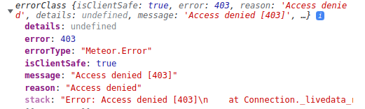

Meteor `2.8` introduce the new MongoDB Package Async API. For a complete breakdown of the changes, please refer to the [changelog](http://docs.meteor.com/changelog.html).

For this new async API, we have new methods like `findOneAsync`, which behaves exactly like the `findOne` method, but now returns a promise that needs to be resolved to get the data.

<h3 id="why-like-this">Why is this new API important?</h3>

You may know that on Meteor we use a package called [Fibers](https://github.com/laverdet/node-fibers). This package is what makes it possible to call an async function, like `db.findOne()`, inside Meteor in a sync way (without having to wait for the promise to resolve).  

But starting from Node 16, Fibers will stop working, so Meteor needs to move away from Fibers, otherwise, we'll be stuck on Node 14.

If you want to know more about the plan, you can check this [discussion](https://github.com/meteor/meteor/discussions/11505).

<h3 id="why-now">Why doing this change now?</h3>

This will be a considerable change for older Meteor applications, and some parts of the code of any Meteor app will have to be adjusted eventually. So it's important to start the migration process now.

With this version, you'll be able to start preparing your app for the future by replacing your current MongoDB methods with the new async ones.

<h3 id="should-i-update">Can I update to this version without changing my app?</h3>

Yes. You can update to this version without changing your app.

<h3 id="what-is-new">What's new?</h3>

Here are the newly added methods (you can see this description and the code [here](https://github.com/meteor/meteor/pull/12028)):

**Added async methods on collections.**
 - All async methods have an Async suffix to their names. These are: `createCappedCollectionAsync`, `createIndexAsync`, `dropCollectionAsync`, `dropIndexAsync`, `findOneAsync`, `insertAsync`, `removeAsync`, `updateAsync`, and `upsertAsync`.

**Added async methods on cursors.**
 - All async methods have an Async suffix to their names. These are: `countAsync`, `fetchAsync`, `forEachAsync`, and `mapAsync`.
 - There's also `[Symbol.asyncIterator]`, so this code should work:
    ```js
    for await (const document of collection.find(query, options)) /* ... */
    ```

There is also a new Meteor method called `callAsync`. It should be used to call async methods.

<h3 id="how-do-i-update">How can I start using these new features?</h3>

We got a few examples to make these new features easier to use, you can see the code snippet below:

```js
// SERVER

// Before 2.8, we would use something like this
export const removeByID = ({ id }) => {
  SomeCollection.remove({ _id: id });
};

// Now we can also do like this
export const removeByIDAsync = async ({ id }) => {
  await SomeCollection.removeAsync({ _id: id });
};

Meteor.methods({
   //...
   removeByID,
   removeByIDAsync,
});

// CLIENT

const result = Meteor.call('removeByID', { id });

// For the async, you call it like this:

const result = await Meteor.callAsync('removeByIDAsync', { id });

// or even like this:

Meteor.callAsync('removeByIDAsync', { id }).then(result => {
   console.log(result);
});
```

<h2 id="callasync">The new callAsync </h2>

As said before, the `callAsync` should be used to call async methods.

We do not consider this version of the `callAsync` as the final product. It has its limitations when your methods have a [stub](https://docs.meteor.com/api/methods.html#:~:text=was%20received%20on.-,Calling,and%20you%E2%80%99ll%20have%20to%20wait%20for%20the%20results%20from%20the%20server.,-If%20you%20do), and it should be used where you know it won't affect other parts of your application. 

>  We will revisit these limitations soon and try to find a solution where these limitations do not exist.

<h3 id="the-limitations">The callAsync limitations</h3>

If you have two methods with a [stub](https://docs.meteor.com/api/methods.html#:~:text=was%20received%20on.-,Calling,and%20you%E2%80%99ll%20have%20to%20wait%20for%20the%20results%20from%20the%20server.,-If%20you%20do), you should never call the second method if the stub of the first one is still running. You need to be sure that only one stub is running each time. So, for example:

```js
// This is ok, because methodWithoutStubAsync and methodWithoutStub 
// does not have a stub inside them:
Meteor.callAsync('methodWithoutStubAsync', { id }).then(result => {
   // do something
});

Meteor.call('methodWithoutStub', { id }, (error, result) => {
   // do something
})

// This is ok as well, because even though removeByIDAsync has a stub,
// methodWithoutStub does not have one, so both methods can run 
// at the same time:
Meteor.callAsync('removeByIDAsync', { id }).then(result => {
   // do something
});
Meteor.call('methodWithoutStub', { id }, (error, result) => {
   // do something
})

// This is also ok, because even though removeByID has a stub
// (SomeCollection.remove({ _id: id })), it is a sync method, 
// so by the time removeByIDAsync runs, no stub will be running:

Meteor.call('removeByID', { id }, (error, result) => {
   // do something
});
Meteor.callAsync('removeByIDAsync', { id }).then(result => {
   // do something
});


// But, this is NOT ok, because you would have 2 stubs running at the same time:
Meteor.callAsync('removeByIDAsync', { id }).then(result => {
   // do something
});
Meteor.call('removeByID', { id }, (error, result) => {
  // do something
});

// instead, do it like this:

await Meteor.callAsync('removeByIDAsync', { id });
Meteor.call('removeByID', { id }, (error, result) => {
   // do something
});

// or this

Meteor.callAsync('removeByIDAsync', { id }).then(result => {
   // do something
   Meteor.call('removeByID', { id }, (error, result) => {
      // do something
   });
});
```

As `callAsync` returns a promise, it'll be solved in the future. So you need to wait until it finishes before calling another method (async or not), if the other method has a stub.

> If you wish to understand why this limitation exist, you can read [this comment](https://github.com/meteor/meteor/pull/12196#issue-1386273927) in the PR that created the `callAsync`.

<h3 id="async-method-call">Calling an async method with Meteor.call and vice versa</h3>

It's also important to understand what will happen if you call an async method with `Meteor.call`, and vice versa.

If you call an async method with `Meteor.call` in the client, and you don't have the package `insecure` on your project, an error like this will be thrown:



This error is thrown because when `Meteor.call` execute your async method, the method will return a promise. Then, when your method run in the future, it won't have the [global contexts](https://github.com/meteor/meteor/blob/662eee3bf9635b135e81b672d1415f1ae673053b/packages/meteor/dynamics_browser.js#L24-L33) anymore. Meaning that if you have some MongoDB method, for example, inside your async method, it will run outside a stub. 

It would the equivalent of running something like this directly on the client: `SomeCollection.remove({ _id: id })`. Hence, the error. If you have the `insecure` package on your project, this error won't show up because `insecure` allows your app to run write methods from the client.

In the server it's fine to call an async method using `Meteor.call()`.

About `Meteor.callAsync()`, it is fine to call it with a sync method either from the client or server.


<h3 id="different-components">Methods in different components</h3>

It can be hard to narrow down where in your app two methods could be called at the same time in an app. Meteor can be used in many ways. But one case we can see will be pretty common, it's when you have two different components that call two methods, like so:

```jsx
// this is a React example
const MyComponent1 = () => {
  ...
   // If the user do not type anything in 5 seconds
   // set its status to offile
   useEffect(() => {
      const interval = setInterval(() => {
         const now = new Date();
         const timeWithoutTexting = now.getTime() - lastType.getTime();
         if (isUserOn && timeWithoutTexting >= 5000) {
            Meteor.callAsync("changeUserStatus", 'OFFLINE');
         }
      }, 1000);
      return () => clearInterval(interval);
   }, [isUserOn, lastTyped]);
  
  return <div>
        <input onChange={async ({ target: { value }}) => {
           // Every time the use type something, save the value in database,
           // change the user status to online, and set a new lastTyped:
           await Meteor.callAsync("updateText", value);
           if (userStatus === 'OFFLINE') {
              Meteor.callAsync("changeUserStatus", 'ONLINE'); 
           }
           setLastTyped(new Date());
        }}/>
     </div>
}
```

To summarize this example, every time the user types something, a method is called to save the new value in the database, and change another one to change their status if they were offline. A job will also check every second if the user didn't type anything in the last 5 seconds.

In this example, depending on how fast the user types, you could end up calling both methods at the same time or calling one of them while the stub of another is still alive. Meaning that your code won't work property. 

One strategy here to avoid this could be to change the user status to ONLINE inside the method `updateText`, instead of calling a method to do it.

The same goes for the job that updates the user status to OFFLINE. You could create this job in the server side, leaving on the client just the call for the method `updateText`.

<h3 id="recommendation-for-future">Our recommendation for the future</h3>

We recommend that you start to write new methods and publications using async from this version forward, forcing internal APIs to also be async with time. And, of course, also updating your current ones. As soon you start, the better.

But do it with caution, and keeping in mind the cases mentioned above.

<h2 id="older-versions">Migrating from a version older than 2.8?</h2>

If you're migrating from a version of Meteor older than Meteor 2.8, there may be important considerations not listed in this guide. Please review the older migration guides for details:

* [Migrating to Meteor 2.7](2.7-migration.html) (from 2.6)
* [Migrating to Meteor 2.6](2.6-migration.html) (from 2.5)
* [Migrating to Meteor 2.5](2.5-migration.html) (from 2.4)
* [Migrating to Meteor 2.4](2.4-migration.html) (from 2.3)
* [Migrating to Meteor 2.3](2.3-migration.html) (from 2.2)
* [Migrating to Meteor 2.2](2.2-migration.html) (from 2.0)
* [Migrating to Meteor 2.0](2.0-migration.html) (from 1.12)
* [Migrating to Meteor 1.12](1.12-migration.html) (from 1.11)
* [Migrating to Meteor 1.11](1.11-migration.html) (from 1.10.2)
* [Migrating to Meteor 1.10.2](1.10.2-migration.html) (from 1.10)
* [Migrating to Meteor 1.10](1.10-migration.html) (from 1.9.3)
* [Migrating to Meteor 1.9.3](1.9.3-migration.html) (from 1.9)
* [Migrating to Meteor 1.9](1.9-migration.html) (from 1.8.3)
* [Migrating to Meteor 1.8.3](1.8.3-migration.html) (from 1.8.2)
* [Migrating to Meteor 1.8.2](1.8.2-migration.html) (from 1.8)
* [Migrating to Meteor 1.8](1.8-migration.html) (from 1.7)
* [Migrating to Meteor 1.7](1.7-migration.html) (from 1.6)
* [Migrating to Meteor 1.6](1.6-migration.html) (from 1.5)
* [Migrating to Meteor 1.5](1.5-migration.html) (from 1.4)
* [Migrating to Meteor 1.4](1.4-migration.html) (from 1.3)
* [Migrating to Meteor 1.3](1.3-migration.html) (from 1.2)
