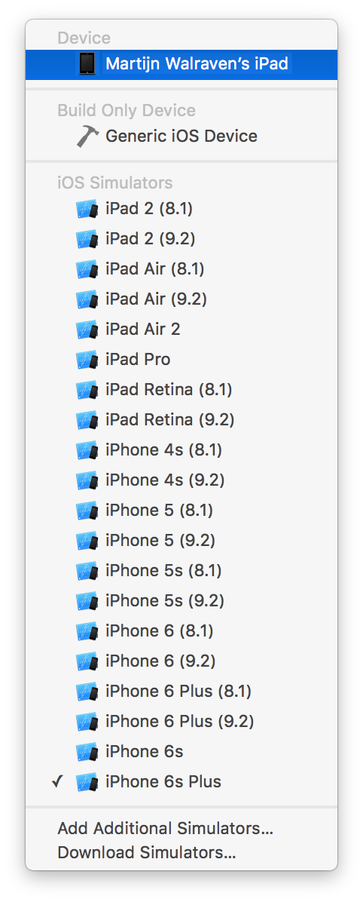
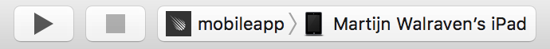
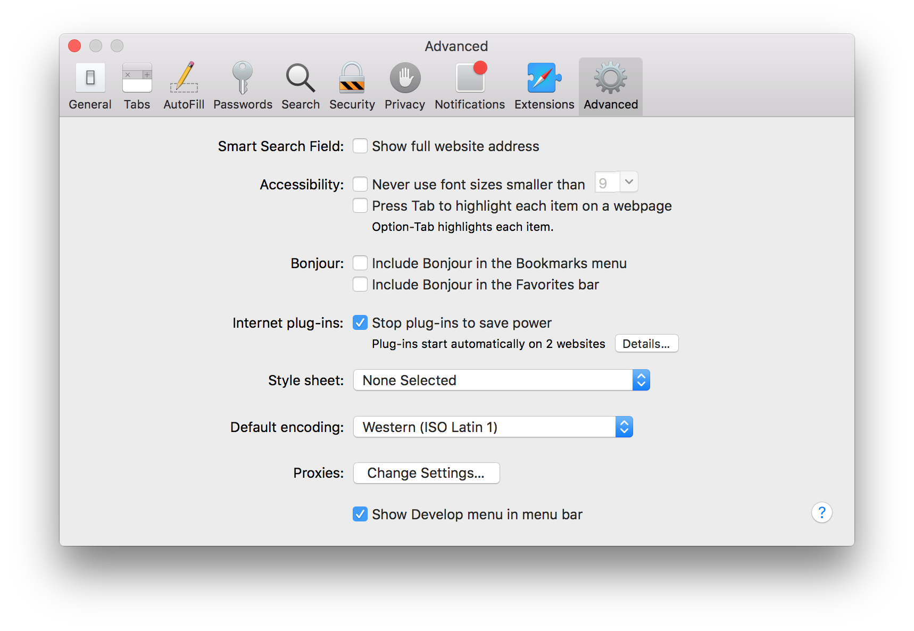
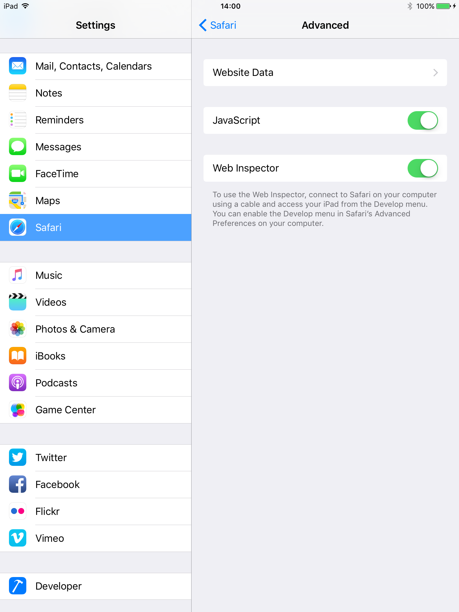

After reading this guide, you'll know:

1. What Cordova is, and how Meteor integrates with it to build mobile apps from a single codebase
1. How to set up your local machine for mobile development
1. How to run and debug your app on a mobile device or simulator/emulator
1. How hot code push allows you to update your mobile app's code without reinstalling the app on your device or submitting a new version to the store
1. How to use Cordova plugins to take advantage of native device features
1. How to access local files and remote resources from your app
1. What you can do to create a good mobile user experience for your app
1. How to configure your app to use your own app icon, launch screen, and set other preferences
1. How to build your project and submit your mobile app to the store

<h2 id="introduction">Meteor Cordova integration</h2>

Meteor integrates with [Cordova](https://cordova.apache.org), a well-known Apache open source project, to build mobile apps from the same codebase you use to create regular web apps. With the Cordova integration in Meteor, you can take your existing app and run it on an iOS or Android device with a few commands.

A Cordova app is a web app written using HTML, CSS, and JavaScript as usual, but it runs in a [web view](#what-environment) embedded in a native app instead of in a stand-alone mobile browser. An important benefit of packaging up your web app as a Cordova app is that all your assets are bundled with the app. This ensures your app will load faster than a web app running on a remote server could, which can make a huge difference for users on slow mobile connections. Another feature of the Cordova integration in Meteor is support for [hot code push](#hot-code-push), which allows you to update your app on users' devices without going through the usual app store review process.

Cordova also opens up access to certain native device features through a [plugin architecture](#cordova-plugins). Plugins allow you to use features not usually available to web apps, such as accessing the device camera or the local file system, interact with barcode or NFC readers, etc.

Because a Cordova app is  a web app, this means you use standard web elements to create your user interface instead of relying on platform-specific native UI components. Creating a good mobile user experience is an art in itself, but is fortunately helped by the availability of various frameworks and libraries.

> <h4 id="what-about-phonegap">What about PhoneGap?</h4>

> You may have heard of PhoneGap, and wonder how it relates to Cordova. PhoneGap is a product name used by Adobe since 2011, when they acquired a company called Nitobi, the original creators of what is now the Cordova project. When Adobe donated the code to Apache in 2012 to ensure a more open governance model, the open source project was rebranded as Cordova. PhoneGap is now one of the distributions of Cordova, on a par with other distributions like Ionic, Telerik, Monaca, or Intel XDK. These distributions mainly differ in tooling and integration with cloud services, but they share the underlying platform and plugins. Meteor could also be considered a Cordova distribution.

<h3 id="cordova-integration-in-meteor">How does it work?</h3>

With Meteor, there is no need to install Cordova yourself, or use the `cordova` command directly. Cordova project creation happens as part of the Meteor run and build commands, and the project itself is considered a build artifact (stored in `.meteor/local/cordova-build` in your app directory) that can be deleted and recreated at any time. Instead of having you modify Cordova's `config.xml` file, Meteor reads a [`mobile-config.js`](http://docs.meteor.com/api/mobile-config.html) file in the root of your app directory and uses the settings specified there to configure the generated project.

Cordova apps don’t load web content over the network, but rely on locally stored HTML, CSS, JavaScript code and other assets. While Cordova by default uses `file://` URLs to load the app, Meteor includes an integrated file serving mechanism on the device to support both bundling the initial assets and incrementally updating your app through [hot code push](#hot-code-push). This means your app will be served from `http://localhost:<port>`, which also has the benefit that web views consider it a [secure origin](https://www.chromium.org/Home/chromium-security/prefer-secure-origins-for-powerful-new-features) and won't block any sensitive features (which they increasingly do for `file://` URLs).

The port mentioned above will be generated based on your app ID stored in the `.meteor/.id` file in your application. If you need to run multiple apps on the same device using the same source code, you should specify a different port for each running app, by using the `--cordova-server-port <port>` option when running the Cordova `run` and `build` commands. Otherwise you will not be able to run multiple apps simultaneously on iOS. One common symptom of this problem is the error `Failed binding IPv4 listening socket: Address already in use (48)` in the XCode console.

> <h4 id="what-port">What port will your app be served from?</h4>

> While Meteor uses a built-in request interception mechanism on Android, supporting `WKWebView` on iOS requires running a real embedded web server instead. That means the local web server needs a port to bind to, and we can’t simply use a fixed port because that might lead to conflicts when running multiple Meteor Cordova apps on the same device. The easiest solution may seem to use a randomized port, but this has a serious drawback: if the port changes each time you run the app, web features that depend on the origin (like caching, localStorage, IndexedDB) won’t persist between runs, and you also wouldn't be able to specify a stable OAuth redirect URL. So instead we now pick a port from a predetermined range (12000-13000), calculated based on the `appId`, a unique identifier that is part of every Meteor project. That ensures the same app will always use the same port, but it hopefully avoids collisions betweens apps as much as possible. (There is still a theoretical possibility of the selected port being in use. Currently, starting the local server will fail in that case.)

<h3 id="what-environment">The runtime environment</h3>

Cordova apps run in a web view. A web view is basically a browser without the browser UI. Browser engines differ in their underlying implementation and in what web standards they support. As a result, what web view your app runs on can have a huge impact on your app's performance and on the features you get to use. (If you want to know what features are supported on what browsers and versions, [caniuse.com](http://caniuse.com) is a great resource.)

<h4 id="what-environment-ios">iOS</h4>

The browser on iOS is Safari, which is based on the open source WebKit project, but tends to be somewhat slow in enabling new features. Because they use the same underlying framework, the features available to a web view match the features supported by Safari on the iOS release you're running on.

Meteor uses WKWebView by default, on both iOS 8 and iOS 9. WKWebView is part of the modern WebKit API introduced in iOS 8, and replaces UIWebView, which has been in iOS from the beginning. Its main benefit is that it runs in a separate process, allowing for much higher JavaScript performance (3–4x in some benchmarks!) because it can take advantage of Just-In-Time compilation (which UIWebView, running in the same process as your app, cannot do for security reasons).

> You may be aware that WKWebView on iOS 8 doesn't allow files to be loaded from the local filesystem. This is problematic for standard Cordova apps, because these use `file://` URLs to load the app. But because the Meteor integration serves assets from `localhost`, WKWebView works fine on both iOS 8 and iOS 9.

<h4 id="what-environment-android">Android</h4>

Android 5.0 and above come with a web view based on Chromium known as the [Android System Web View](https://play.google.com/store/apps/details?id=com.google.android.webview&hl=en), which can be automatically updated through the Play Store. This means updates to the web view can happen regularly and are independent of OS updates.

<h3 id="adding-platforms">Adding Cordova platforms</h3>

Every Meteor project targets a set of platforms. Platforms can be added to a Meteor project with `meteor add-platform`.

- `meteor add-platform ios` adds the iOS platform to a project.
- `meteor add-platform android` adds the Android platform to a project.
- `meteor remove-platform ios android` will remove the iOS and Android platforms from a project.
- `meteor list-platforms` lists the platforms targeted by your project.

If your local machine does not (yet) fulfill the [prerequisites](#installing-prerequisites) for building apps for a mobile platform, an error message with a list of missing requirements is printed (but the platform is still added). You will have to make sure these requirements are fulfilled before you're able to build and run mobile apps from your machine.

<h2 id="installing-prerequisites">Installing prerequisites</h2>

In order to build and run mobile apps, you will need to install some prerequisites on your local machine.

<h3 id="installing-prerequisites-ios">iOS</h3>

In order to build and run iOS apps, you will need a Mac with [Apple Xcode](https://developer.apple.com/xcode/) developer tools installed. We recommend installing the latest version, but you should also check the [Meteor history](https://docs.meteor.com/changelog.html) for any specific version dependencies.  NOTE: To build with Xcode 10.2+, your webapp package must be v1.7.4 or higher.

<h4>Installing Xcode from the App Store</h4>

`meteor add-platform ios` will open a dialog asking you whether you want to install the 'command line developer tools'. Do not select 'Install' here, because a full Xcode installation is required to build and run iOS apps. Instead, selecting 'Get Xcode' will open the Mac App Store page for Xcode and you can click install there. (Alternatively, you can open the Mac App Store and search for 'Xcode' to get to that same page.)

<h4>Accepting the license agreement</h4>

After the download and installation completes, you will need to accept the license agreement. If you start Xcode for the first time, a dialog will pop up where you can read the license agreement and accept it. You can close Xcode directly afterwards.

A shortcut is to run `sudo xcodebuild -license accept` from the command line. (You will still be expected to have read and understood the [Xcode and Apple SDKs Agreement](https://www.apple.com/legal/sla/docs/xcode.pdf)).

> As of [Cordova iOS 4.3.0](https://cordova.apache.org/announcements/2016/10/24/ios-release.html) you may also need to `sudo gem install cocoapods` to resolve a dependency with [PhoneGap Push Plugin](https://github.com/phonegap/phonegap-plugin-push/blob/master/docs/INSTALLATION.md).

<h4>Enabling Xcode command line tools</h4>

After installing Xcode from the Mac App Store, it is still necessary to enable those tools in the terminal environment.  This can be accomplished by running the following from the command prompt:
```
    sudo xcode-select -s /Applications/Xcode.app/Contents/Developer
```
<h3 id="installing-prerequisites-android">Android</h3>



> For Mac OSX Intel and Linux architectures, follow the following instructions. Mac M1 users, keep scrolling to the next section.
> Note: if you want to target the SDK 31 of Android, you will need to use Java 11 or higher and also have the latest cmdline-tools installed.

In order to build and run Android apps, you will need to:

- Install a Java Development Kit (JDK)
- Install the Android SDK and download the required tools, platforms, and other components (which is done most easily by installing Android Studio)
- Set `ANDROID_HOME` and add the tools directories to your `PATH`
- Optionally: Create an Android Virtual Device to run apps on an emulator
- If Gradle cannot be found: try using a package manager such as [Homebrew](https://brew.sh/), `apt-get`, or `yum` to install a system-wide, standalone version of `gradle`:
  ```sh
  # On Mac OSX:
  brew install gradle

  # On Debian/Ubuntu:
  sudo apt-get install gradle
  ```
  More information about installing Gradle can be found [here](https://gradle.org/install/#install).

<h4>Installing the Java Development Kit (JDK)</h4>

> On Linux, you may want to use your distribution's package manager to install a JDK; on Ubuntu, you can even use [Ubuntu Make](#ubuntu-make) to install Android Studio and all dependencies at the same time.

1. Open the [Oracle Java website](http://www.oracle.com/technetwork/java/javase/downloads/index.html), and select the Java Platform (JDK)
1. Check the box to accept the license agreement, and select the correct download for your platform
1. After it has downloaded, launch the installer, and complete the installation steps

<h4>Installing Android Studio</h4>

The easiest way to get a working Android development environment is by installing [Android Studio](https://developer.android.com/studio), which offers a setup wizard on first launch that installs the Android SDK for you, and downloads a default set of tools, platforms, and other components that you will need to start developing.

Please refer to [the Android Studio installation instructions](https://developer.android.com/studio/install) for more details on the exact steps to follow.

> There is no need to use Android Studio if you prefer a stand-alone install. Just make sure you install the most recent versions of the [Android Command Line Tools](https://developer.android.com/studio#command-tools).

Make sure to select the correct version of the [Android Studio SDK Tools](https://developer.android.com/studio/intro/update):

 * Meteor 1.4.3.1 onward: Android SDK Tools v.25.**2**.x ([mac](https://dl.google.com/android/repository/tools_r25.2.3-macosx.zip), [linux](https://dl.google.com/android/repository/tools_r25.2.3-linux.zip), [windows](https://dl.google.com/android/repository/tools_r25.2.3-windows.zip)) or v.26.0.0 or later
 * v.25.**3.0** **will not work** due to [extensive changes](https://developer.android.com/studio/releases/sdk-tools.html).  See [issue #8464](https://github.com/meteor/meteor/issues/8464) for more information.
 * Meteor 1.4.2.x or before: Android SDK Tools v.23 ([mac](https://dl.google.com/android/repository/tools_r23.0.1-macosx.zip), [linux](https://dl.google.com/android/repository/tools_r23.0.1-linux.zip), [windows](https://dl.google.com/android/repository/tools_r23.0.1-windows.zip))

To install an older version of SDK tools:

* Download the version that you need from the above links
* Replace the `tools/` folder in `~/Library/Android/sdk/`

> Note: If you're using older version of Meteor, you may also need to install an older version of Android SDK, for example with the Android SDK Manager that comes with Android Studio.

<h4 id="ubuntu-make">Using Ubuntu Make</h4>

If you're running Ubuntu, one way to install both a Java Development Kit and Android Studio is by using [Ubuntu Make](https://wiki.ubuntu.com/ubuntu-make), a command line tool that sets up development environments and dependencies for you.

On Ubuntu you will have to install Snap version of `ubuntu-make`:
* `snap install ubuntu-make --classic`

> If you're on Ubuntu 17.10 or earlier, you'll have to add the Ubuntu Make ppa first:
> * `sudo add-apt-repository ppa:ubuntu-desktop/ubuntu-make`
> * `sudo apt-get update`
> 
> Then, you can install Ubuntu Make itself:
> * `sudo apt-get install ubuntu-make`

And finally you use Ubuntu Make to install Android Studio and all dependencies:
* `umake android`

<h4>Setting `ANDROID_HOME` and adding the tools directories to your `PATH`</h4>

Cordova will detect an Android SDK installed in various standard locations automatically, but in order to use tools like `android` or `adb` from the terminal, you will have to make some changes to your environment.

<h5>Mac</h5>

- Set the `ANDROID_HOME` environment variable to the location of the Android SDK. If you've used the Android Studio setup wizard, it should be installed in `~/Library/Android/sdk` by default.
- Add `$ANDROID_HOME/tools`, and `$ANDROID_HOME/platform-tools` to your `PATH`

You can do this by adding these lines to your `~/.bash_profile` file (or the equivalent file for your shell environment, like `~/.zshrc`):
```
# Android
export ANDROID_HOME="$HOME/Library/Android/sdk"
export PATH=$PATH:$ANDROID_HOME/tools:$ANDROID_HOME/platform-tools
```

You will then have to reload `.bash_profile` (by executing `source ~/.bash_profile`) or open a new terminal session to apply the new environment.

<h4>Optionally: Creating an Android Virtual Device (AVD) to run apps on an emulator</h4>

The current Android emulator tends to be rather slow and can be unstable, so our recommendation is to run your app on a physical device instead.

If you do want to run on an emulator however, you will have to create an Android Virtual Device (AVD) using the [AVD Manager](http://developer.android.com/tools/devices/managing-avds.html). Make sure to configure an AVD with an API level that is supported by the version of [Cordova Android](https://github.com/apache/cordova-android/blob/master/RELEASENOTES.md) you are using.

<h4>Mac M1</h4>
In order to make Android run on m1 machines:

- Install Java Development Kit (JDK) 8 from [here](https://cdn.azul.com/zulu/bin/zulu8.62.0.19-ca-jdk8.0.332-macosx_aarch64.dmg) 
- Install the Android SDK and download the required tools, platforms, and other components (which is done most easily by installing Android Studio) from the [official website](https://developer.android.com/studio#downloads) and for the ARM architecture.
- Create a Virtual Device on Android Studio, add any model (e.g. Pixel 4) with Android 11 (API 30)
- Set up the following PATHs in your `.bashrc` or `.zshrc` file:
```
export ANDROID_HOME=$HOME/Library/Android/sdk
export ANDROID_SDK_ROOT=${ANDROID_HOME}
export PATH=${PATH}:${ANDROID_HOME}/emulator
export PATH=$PATH:$ANDROID_HOME/tools:$ANDROID_HOME/platform-tools
```
> Remember to reload your configuration using `source ~/.zshrc` or `source ~/.bashrc`
- Install `gradle` using `brew install gradle`

<h4>Ubuntu</h4>

In order to run on Ubuntu you will have to do the following:

* Make sure that you have Java JDK installed
* Have Android Studio or the Android tools installed
* Set `ANDROID_HOME`, which with the above should satisfy Gradle as well. Most often this should be enough:
```
export ANDROID_HOME="/usr/lib/android-sdk/"
export PATH=${PATH}:${ANDROID_HOME}/tools
export PATH=${PATH}:${ANDROID_HOME}/platform-tools
```

If you have Android Studio, the `ANDROID_HOME` folder will be in your home folder under `~/Android/Sdk`.

* Ensure that you have [KVM](https://help.ubuntu.com/community/KVM/Installation) setup

<h2 id ="running-your-app">Developing on a device</h2>

During development, the Meteor [build tool](build-tool.html) integrates with Cordova to run your app on a physical device or the iOS Simulator/Android emulator. In addition to starting a development server and MongoDB instance as usual, `meteor run` accepts arguments to run the app on one or more mobile targets:

- `ios`: Runs the app on the iOS Simulator
> This will run your app on a default simulated iOS device. You can open Xcode to install and select another simulated device.
- `ios-device`: Opens Xcode, where you can run the app on a connected iOS device or simulator
- `android`: Runs the app on the Android emulator
> The current Android emulator tends to be rather slow and can be unstable. Our recommendation is to run on a physical device or to use an alternative emulator like [Genymotion](https://www.genymotion.com).
- `android-device`: Runs the app on a connected Android device

You can specify multiple targets, so `meteor run ios android-device` will run the app on both the iOS Simulator and an Android device for example.

<h4 id="connecting-to-the-server">Connecting to the server</h4>

A Meteor app should be able to connect to a server in order to load data and to enable [hot code push](#hot-code-push), which automatically updates a running app when you make changes to its files. During development, this means the device and the computer you run `meteor` on will have to be part of the same WiFi network, and the network configuration shouldn't prevent the device from reaching the server. You may have to change your firewall or router settings to allow for this (no client isolation).

`meteor run` will try to detect the local IP address of the computer running the command automatically. If this fails, or if you would like your mobile app to connect to a different server, you can specify an address using the `--mobile-server` option.

<h3 id="running-on-ios">On iOS</h3>

> Note: If you haven't previously developed iOS apps, or haven't used the connected device for development, a series of dialogs and warnings may appear as Xcode resolves code signing issues. It may also prompt you for permission to access the key in your keychain. See [Apple's instructions](https://developer.apple.com/library/mac/documentation/IDEs/Conceptual/AppDistributionGuide/LaunchingYourApponDevices/LaunchingYourApponDevices.html#//apple_ref/doc/uid/TP40012582-CH27-SW4) for more information. You will also need to join the [Apple Developer Program](https://developer.apple.com/programs/) to deploy your app on the Apple iOS App Store.

1. Make sure the device is connected to your computer via a USB cable.
1. Connect the device to a WiFi network that allows for communication with the server.
1. Run `meteor run ios-device` to open your project in Xcode.
1. In the project navigator, choose your device from the Scheme toolbar menu:

1. Click the Run button:

1. Xcode builds the app, installs it on the device, and launches it.

<h3 id="running-on-android">On Android</h3>

1. Make sure the device is connected to your computer via a USB cable.
1. Connect the device to a WiFi network that allows for communication with the server.
1. Make sure your device is set up for development [as explained here](http://developer.android.com/tools/device.html#setting-up).
1. You may also need to click 'Allow' on the `Allow USB debugging?` prompt on the device.
1. Run `meteor run android-device` to build the app, install it on the device, and launch it.

> To check if your device has been connected and set up correctly, you can run `adb devices` to get a list of devices.

<h2 id="logging-and-remote-debugging">Logging and debugging</h2>

A full-stack mobile app consists of many moving parts, and this can make it difficult to diagnose issues. Logging is indispensable in keeping track of what's going on in your app, and may show warnings and errors that you would otherwise miss. Even more powerful is remote debugging, which is the ability to interact with a mobile app running on a remote device from a debugging interface in Safari (for iOS) or Chrome (for Android).

<h3 id="understanding=logs">Different types of logs</h3>

You will encounter three types of logs in a Meteor Cordova app:

- **Server-side logs** - Messages printed by the Meteor build system, and the result of `console` logging calls from server-side code.
- **Client-side web logs** - Warnings and errors from the web view, and the result of `console` logging calls from client-side code.
- **Client-side native logs** - Messages from system components and Cordova plugins. This also includes more detailed logging from the Meteor plugin used for [hot code push](#hot-code-push).

When using `meteor run`, server-side logs will be printed in the terminal as usual. In addition, running on an Android device or emulator will print a subset of the logs to that same terminal (these logs also include `console` logging calls made from client-side code).

Running on iOS will not show client-side logs in the terminal, but Xcode will show native logs as usual in the [debug console](https://developer.apple.com/library/tvos/documentation/DeveloperTools/Conceptual/debugging_with_xcode/chapters/debugging_tools.html). You can add [cordova-plugin-console](https://github.com/apache/cordova-plugin-console) to your project to output  `console` logging calls to the native logs (which Android does by default), but this isn't recommended because it has a substantial performance impact, and remote debugging gives you much nicer and more complete console output.

Although having client-side logs in the terminal can be useful, in most cases remote debugging is a much better option. This allows you to use the debugging tools built into Safari (for iOS apps) or Chrome (for Android apps) to investigate an app running on a remote device or a simulator/emulator. Here, you can not only view the logs, but also interact with running JavaScript code and the DOM, monitor network access, etc.

<h3 id="remote-debugging-ios">Debugging on iOS with Safari</h3>

1. To use remote debugging in Safari, you'll first need to enable the Developer menu. Go to *Safari > Preferences* and make sure 'Show Develop menu in menu bar' is checked:


1. You'll also need to enable the Web Inspector on your iOS device. Go to *Settings > Safari > Advanced* and enable 'Web Inspector':


1. Launch the app on your device and open remote debugger by choosing *Develop > &lt;Your device&gt; > &lt;Your app&gt;/localhost*.

1. Because you can only connect to your app after it has started up, you sometimes miss startup warnings and errors. You can invoke `location.reload()` in the Web Inspector console to reload a running app, this time with the remote debugger connected.

You can find more information about remote debugging in the [Safari Developer Guide](https://developer.apple.com/library/safari/documentation/AppleApplications/Conceptual/Safari_Developer_Guide/).

<h3 id="remote-debugging-android">Debugging on Android with Chrome</h3>

See [this article](https://developers.google.com/web/tools/chrome-devtools/debug/remote-debugging/remote-debugging#remote-debugging-on-android-with-chrome-devtools) for instructions on how to remote debug your Android app with the Chrome DevTools.

- Because you can only connect to your app after it has started up, you sometimes miss startup warnings and errors. You can invoke `location.reload()` in the DevTools console to reload a running app, this time with the remote debugger connected.

- An .apk built by `meteor build` cannot be remotely debugged unless you make a debug build via `meteor build --debug`.

<h2 id="hot-code-push">Hot code push on mobile</h2>

During development, the Meteor [build tool](build-tool.html) detects any relevant file changes, recompiles the necessary files, and notifies all connected clients a new version is available. Clients can then automatically reload the app, switching over to the new version of the code. This is referred to as *hot code push*.

Meteor supports hot code push on both browser and mobile clients, but the process on mobile is a bit different. In a browser, reloading the app will re-request assets from the server, and the server will respond with the most recent versions. Because Cordova apps rely on locally stored assets however, hot code push on mobile is a two step process:

1. Updated assets are downloaded from the server using native downloading mechanisms, and stored on the device
1. The page is reloaded and the web view re-requests the assets from the local web server

An important benefit of this is that while downloading may be slow over mobile connections, this is done in the background, and we won't attempt to reload the app until all assets have been downloaded to the device.

Downloading updates is done incrementally, so we only download assets that have actually changed (based on a content hash). In addition, if we haven't been able to download all changed assets in one go, because of a network failure or because the app was closed before we finished, we will reuse the ones that have already completed downloading the next time the app starts up or the network connection is restored.

If Hot Code Push is not working reliably in your app, and this section doesn't help, see our [guide on diagnosing Hot Code Push issues](/hot-code-push).

<h3 id="updating-production-apps">In production</h3>

Hot code push greatly improves the development experience, but on mobile, it is also a really useful feature for production apps, because it allows you to quickly push updates to devices without having users update the app through the store and without going through a possibly lengthy review process to get your update accepted.

However, it is important to realize that hot code push can only be used to update the HTML, CSS, JavaScript code and other assets making up your web app. Changes to native code will still require you [to submit a new version of your app to the store](#building-and-submitting).

In order to avoid a situation where JavaScript code that relies on changed native code is pushed to a client, we calculate a compatibility version hash from the Cordova platform and plugin versions, and only download a new version to a device when there is an exact match. This means any change to the list of plugins, or updating to a Meteor release which contains a new platform version, will block hot code push to existing mobile clients until the app has been updated from the store.

Something else to keep in mind is that your server-side code should be prepared to handle requests from older client versions, which may not yet have been updated. As you make changes to your data schema or publication functions for example, you may want to reflect on how this will impact backwards compatibility.

<h3 id="controlling-compatibility-version">Controlling compatibility version</h3>

The compatibility version can be found in the `cordovaCompatibilityVersions` attribute of the JSON file served at `ROOT_URL/__cordova/manifest.json` during `meteor run [ios/android]`.


You may want to override the compatibility version if you want hot code push to reach older apps that don't have the latest version of your native code from the app store. Let's say you're developing an iOS app, you have the plugin `cordova-plugin-camera@2.4.0`, and your app has the compatibility version pictured above, `3ed5b9318b2916b595f7721759ead4d708dfbd46`. If you were to update to version `2.4.1` of `cordova-plugin-camera`, your server would generate a new compatibility version and your users' apps would stop receiving hot code pushes. However, you can tell your server to use the old compatilibity version:

```sh
METEOR_CORDOVA_COMPAT_VERSION_IOS=3ed5b9318b2916b595f7721759ead4d708dfbd46 meteor run ios-device
# or
METEOR_CORDOVA_COMPAT_VERSION_IOS=3ed5b9318b2916b595f7721759ead4d708dfbd46 meteor build ../build --server=127.0.0.1:3000
```

Now your users' apps will continue receiving hot code pushes. However, they won't get the new version of the Cordova plugin until they update from the app store. In this case, that's okay, because we only updated a patch version, so the `cordova-plugin-camera` API didn't change. But if you had added a new plugin, like `cordova-plugin-gyroscope`, and changed your Javascript to call `navigator.gyroscope.getCurrent()`, then when the old apps get the new JS code, they will throw the error: `Uncaught TypeError: Cannot read property 'getCurrent' of undefined`.

Another option is using the `METEOR_CORDOVA_COMPAT_VERSION_EXCLUDE` environment variable. If you were to do this:

```sh
meteor add cordova:cordova-plugin-camera@4.1.0
meteor add cordova:cordova-plugin-gyroscope@0.1.4
METEOR_CORDOVA_COMPAT_VERSION_EXCLUDE='cordova-plugin-camera,cordova-plugin-gyroscope' meteor run ios-device
```

your compatibility version would not change.

The `METEOR_CORDOVA_COMPAT_VERSION_*` env vars must be present __while building__ your app through `run`, `build` or `deploy`.

<h4 id="access-versions-inside-app">Access compatibility versions inside your app</h4>

The `version` attribute of `manifest.json`, which reflects the version of only your JS bundle, is accessible from JS at `__meteor_runtime_config__.autoupdateVersionCordova`.

The `cordovaCompatibilityVersions.*` attributes can be read from the manifest file with `cordova-plugin-file`.

<h3 id="configuring-server-for-hot-code-push">Configuring your server</h3>

As mentioned before, mobile apps need to be able to [connect to a server](#connecting-to-the-server) to support hot code push. In production, you will need to specify which server to connect to [when building the app](#building-for-production) using the `--server` option. The specified server address is used to set `ROOT_URL` in `__meteor_runtime_config__`, which is defined as part of the generated `index.html` in the app bundle.

In addition, you will need to configure the server with the right connection address. This happens automatically if you're using `meteor deploy` to deploy to Galaxy, but when deploying to your own server you'll have to make sure to define the `ROOT_URL` environment variable there. (For Meteor Up, you can configure this in `mup.json`.)

The reason this is needed is because updates delivered through hot code push replace the initially bundled `index.html` with a freshly generated one. If the `ROOT_URL` on your server hasn't been set, it defaults to `localhost:3000`, and this would leave the app unable to connect to the server, both for data loading and for receiving further hot code pushes. In Meteor 1.3, we protect against this by blocking updates that would change the `ROOT_URL` to `localhost`, but the consequence of this is that hot code push is disabled until you configure `ROOT_URL` correctly.

<h3 id="recovering-from-faulty-versions">Recovering from faulty versions</h3>

Hot code pushing new JavaScript code to a device could accidentally push code containing errors, which might leave users with a broken app (a "white screen of death" in the worst case), and could even disable hot code push (because the code that makes a connection to the server may no longer run).

To avoid this, we try to detect faulty versions and revert to the last known good version when this happens. The way detection works is that we expect all `Meteor.startup()` callbacks to complete within a set period of time. If this doesn't happen we consider the version faulty and will rollback the update. Unless the version on the server has been updated in the meantime, the server will try to hot code push the faulty version again. Therefore, we blacklist faulty versions on the device so we know not to retry.

By default, the startup timeout is set to 20 seconds. If your app needs more time to startup (or considerably less), you can use [`App.setPreference`](http://docs.meteor.com/api/mobile-config.html#App-setPreference) to set `WebAppStartupTimeout` to another value.

```js
// The timeout is specified in milliseconds!
App.setPreference('WebAppStartupTimeout', 30000);
```

<h2 id="cordova-plugins">Native features with Cordova plugins</h2>

Cordova comes with a plugin architecture that opens up access to features not usually available to web apps. Plugins are installable add-ons that contain both JavaScript and native code, which allows them to translate calls from your web app to platform-specific APIs.

The Apache Cordova project maintains a set of [core plugins](https://cordova.apache.org/docs/en/dev/guide/support/index.html#core-plugin-apis) that provide access to various native device features such as the camera, contacts, or access to the file system. But anyone can write a Cordova plugin to do basically anything that can be done from native code, and many third-party plugins are available. You can [search for plugins on the Cordova website](https://cordova.apache.org/plugins/) or directly on [npm](https://www.npmjs.com/search?q=ecosystem%3Acordova).

Be warned however, that although the core plugins are generally well maintained and up to date with the rest of Cordova, the quality of third-party plugins can be a bit of a gamble. You also have to make sure the plugin you want to use is [compatible with the Cordova platform versions Meteor bundles](#plugin-compatibility).

<h3 id="installing-plugins">Installing plugins</h3>

Plugins are identified by a name, which is generally the same as their npm package name. The current convention is for plugin names to start with `cordova-plugin-`, but not all third-party plugins adhere to this.

You can add Cordova plugins to your project either directly, or as a dependency of a Meteor package.

If you want to add a plugin to your project directly, you use the same `meteor add` command you use for Meteor packages, but with a `cordova:` prefix:

```sh
meteor add cordova:cordova-plugin-camera@1.2.0
```

In contrast to Meteor packages, you'll have to specify the exact version of the plugin. This can be a bit of a pain because you first need to look up what the most recent [(compatible)](#plugin-compatibility) version of a plugin is before you can add it.

A Meteor package can register a dependency on a Cordova plugin with the `Cordova.depends()` syntax. For example, a Meteor package that depends on the Cordova camera plugin would add the following to its `package.js`:

```js
Cordova.depends({
    'cordova-plugin-camera': '1.2.0'
});
```

This means adding the Meteor package to your project would also install the specified Cordova plugin.

> Note: If multiple Meteor packages add the same Cordova plugin but at different versions, there is no clear way of telling which version will end up being installed. Plugins added to your project directly however, will always override versions of the same plugin added as a dependency of packages.

Because installing plugins into a Cordova project already containing plugins can lead to indeterminate results, Meteor will remove and add back all plugins whenever a change to any of the plugins in your project is made.

Cordova downloads plugins from npm, and caches them (in `~/.cordova/lib/npm_cache`) so they don't have to be downloaded repeatedly if you rebuild or use them again in another project.

> <h4 id="plugin-compatibility">Making sure a plugin is compatible with the bundled Cordova platform versions</h4>

> Because there is a tight coupling between plugin versions and Cordova platform versions, you may encounter build time or runtime errors as a result of incompatible plugins. If this happens, you will have to install a different plugin version, or it may turn out a plugin is not (yet) compatible with the Cordova platform versions we bundle.

> In order to help with this, we pin core plugins to a minimum version known to work with the Cordova versions we bundle. This mechanism doesn't apply to third-party plugins however, so you'll have to assess compatibility for these yourself.

> There is ongoing work in the Cordova project that will improve this situation and make it easier for plugins to specify their platform dependencies, so Cordova can determine compatible versions.

<h4>Setting plugin parameters</h4>

Some Cordova plugins require certain parameters to be set as part of the build process. For example, `com-phonegap-plugins-facebookconnect` requires you to specify an `APP_ID` and `APP_NAME`. You can set these using `App.configurePlugin` in your [mobile-config.js](http://docs.meteor.com/api/mobile-config.html).

<h4>Installing a plugin from Git</h4>

Alternatively, if unreleased changes have been made to a plugin you'd like to use, you can also have Cordova download plugin code from a Git repository. Note that this will clone the plugin repository on every rebuild however, so this can be rather slow and should be avoided where possible. In contrast to default Cordova, Meteor requires you to specify the exact SHA hash for a commit, rather than allow you to refer to a branch or tag. This is done to guarantee repeatable builds and also avoids unnecessary reinstallation of all plugins because as long as the SHA is the same we know nothing has changed.

The syntax to add a plugin from Git is kind of awkward. The name (the part before the `@`) is the plugin ID and will have to match what is specified in the plugin's `plugin.xml`. Instead of a version, you specify a URL to a Git repository with the SHA hash as an anchor (the part after the `#`):

```sh
meteor add cordova:com.phonegap.plugins.facebookconnect@https://github.com/Wizcorp/phonegap-facebook-plugin.git#5dbb1583168558b4447a13235283803151cb04ec
```

Meteor packages can also depend on plugins downloaded from Git:

```js
Cordova.depends({
    'com.phonegap.plugins.facebookconnect': 'https://github.com/Wizcorp/phonegap-facebook-plugin.git#5dbb1583168558b4447a13235283803151cb04ec'
});
```

<h4>Installing a plugin from the local file system</h4>

Finally, especially if you're developing your own plugin, installing it from the local filesystem can be a convenient way to keep up with changes you make to plugin code. The downside of this is that Meteor will reinstall all plugins on every build however, so this could really slow things down. We do add local plugins with the `--link` option however, so Cordova will try to install the plugin's files using symlinks instead of copying them, which means changes to files will be reflected in the generated native project (e.g. an Xcode project) and may not require a rebuild.

You install plugins from the local file system by specifying a `file://` URL, which gets interpreted relative to the project directory:

```sh
meteor add cordova:cordova-plugin-underdevelopment@file://../plugins/cordova-plugin-underdevelopment
```

Meteor packages can also depend on plugins installed from the local file system, although this probably only makes sense for local packages:

```js
Cordova.depends({
    'cordova-plugin-underdevelopment': 'file://../plugins/cordova-plugin-underdevelopment'
});
```

<h4>Removing directly installed plugins</h4>

You can remove a previously added plugin using `meteor remove`:

```sh
meteor remove cordova:cordova-plugin-camera
meteor remove cordova:com.phonegap.plugins.facebookconnect
meteor remove cordova:cordova-plugin-underdevelopment
```

<h3 id="using-plugins">Using plugins</h3>

You should wrap any functionality which relies on a Cordova plugin in a `Meteor.startup()` block to make sure the plugin has been fully initialized (by listening to the `deviceready` event). For example, when using the Cordova geolocation plugin:

```js
// The plugin may not have been initialized here
navigator.geolocation.getCurrentPosition(success);

Meteor.startup(function() {
    // Here we can be sure the plugin has been initialized
    navigator.geolocation.getCurrentPosition(success);
});
```

<h3 id="cordova-specific-javascript">Detecting Cordova in your JavaScript code</h3>

Just as you can use `Meteor.isServer` and `Meteor.isClient` to separate your client-side and server-side code, you can use `Meteor.isCordova` to separate your Cordova-specific code from the rest of your code.

```js
if (Meteor.isServer) {
  console.log("Printed on the server");
}

if (Meteor.isClient) {
  console.log("Printed in browsers and mobile apps");
}

if (Meteor.isCordova) {
  console.log("Printed only in mobile Cordova apps");
}
```

In addition, packages can include a different set of files for Cordova builds and browser builds with `addFiles`:

- `api.addFiles('foo.js', 'web.cordova')`: includes `foo.js` in only Cordova builds.
- `api.addFiles('bar.js', 'web.browser')`: includes `bar.js` in only browser builds.
- `api.addFiles('baz.js', 'web')`: includes `baz.js` in all client builds.

The same syntax can be used for `api.use`, `api.imply`, and `api.export`.

<h2 id="accessing-local-files-and-remote-resources">Accessing local files and remote resources</h2>

As a web app, Cordova apps are subject to various security mechanisms designed to protect the integrity of your code and to avoid certain types of attacks. Which security mechanisms are in use may depend on the type and version of the web view your app runs in. In addition, Cordova itself, and in some cases the OS, adds different levels of access control that may also affect what content can and cannot be loaded. All this can make it fairly confusing to understand why something is not working, and even harder to understand the security implications of the various ways of configuring these mechanisms.

<h3 id="accessing-local-files">Local files</h3>

Because the Cordova integration in Meteor does not serve your app from `file://` URLs, access to local files through `file://` URLs is not allowed either due to the [same-origin policy](https://developer.mozilla.org/en-US/docs/Web/Security/Same-origin_policy).

The file serving mechanism used in Meteor allows for local file access through URLs of the form `http://localhost:<port>/local-filesystem/<path>`) however. You can construct these file system URLs manually, or use `WebAppLocalServer.localFileSystemUrl()` to convert `file://` URLs. You can use this to convert URLs received from plugins like `cordova-plugin-file` and `cordova-plugin-camera` for example.

<h3 id="domain-whitelisting">Domain whitelisting</h3>

Cordova controls access to external domains through a whitelisting mechanism, which is implemented as [`cordova-plugin-whitelist`](https://github.com/apache/cordova-plugin-whitelist) in the version of Cordova we bundle.

In Meteor, you use [`App.accessRule`](http://docs.meteor.com/api/mobile-config.html#App-accessRule) in [`mobile-config.js`](http://docs.meteor.com/api/mobile-config.html) to set additional rules. (These correspond to `<access>`, `<allow-navigation>` and `<allow-intent>` tags in the generated `config.xml`.)

> On iOS, these settings also control [Application Transport Security (ATS)](https://developer.apple.com/library/prerelease/ios/documentation/General/Reference/InfoPlistKeyReference/Articles/CocoaKeys.html#//apple_ref/doc/uid/TP40009251-SW33), which is an OS level mechanism to enforce security best practices new to iOS 9. If the server you're connecting to does not (yet) fulfill these requirements, you can use additional options to override them for specific domains:
> ```js
App.accessRule('https://domain.com', {
  'minimum-tls-version': 'TLSv1.0',
  'requires-forward-secrecy': false,
});
```

By default, Cordova apps in Meteor are only allowed access to `localhost` (the device itself, to serve the app from) and the server your app connects to for data loading and hot code push (either an automatically detected IP address an explicitly configured mobile server domain). These restrictions also apply to loading files in iframes and to opening files in other apps (including the mobile browser).

> Note that these restrictions mean you will have to explicitly allow loading `data:` URLs. For example, to allow loading `data:` URLs in iframes you would add:
> ```js
App.accessRule('data:*', { type: 'navigation' });
```

<h3 id="csp">Content Security Policy (CSP)</h3>

In addition to the domain whitelisting mechanism Cordova implements, the web view itself may also enforce access rules through [Content Security Policy (CSP)](https://developer.mozilla.org/en-US/docs/Web/Security/CSP). For now, Meteor adds a permissive `<meta http-equiv="Content-Security-Policy" content="..."` header to the generated index page. If users want more fine grained control, Meteor recommends Helmet. See the [`guide`](https://guide.meteor.com/security.html#httpheaders) for more details.

<h3 id="cors">Cross-Origin Resource Sharing (CORS)</h3>

What is often confusing to people is that setting `App.accessRule` is not enough to allow access to remote resources. While domain whitelisting allows the client to control which domains it can connect to, additional restrictions based on the [same-origin policy](https://developer.mozilla.org/en-US/docs/Web/Security/Same-origin_policy) also apply. By default, web views will not allow  cross-origin HTTP requests initiated from JavaScript for instance, so you will likely run into this when using [`XMLHttpRequest`](https://developer.mozilla.org/en-US/docs/Web/API/XMLHttpRequest).

To get around these restrictions, you'll have to use what is known as [Cross-Origin Resource Sharing (CORS)](https://developer.mozilla.org/en-US/docs/Web/HTTP/Access_control_CORS). In contrast to the whitelisting mechanism configured on the client, CORS relies on headers set by the server. In other words, in order to allow access to a remote resource, you may have to make configuration changes on the server, such as setting a `Access-Control-Allow-Origin` header.

<h3 id="system-permissions">System Permissions</h3>
Since the release of iOS 8.0 and Android 6.0 (Android Marshmallow), certain system features (e.g. camera, microphone, location, photos, etc.) typically require additional permissions in order to access them, and for iOS 10+ you must also provide a customized privacy usage notification prompt. These values for Android are specified in your app's `AndroidManifest.xml` file and are **also requested at runtime**. For iOS they are specified in your apps `Info.plist` file.

To request them at runtime, consider using the [`cordova.plugins.diagnostic`](https://github.com/dpa99c/cordova-diagnostic-plugin) plugin.

For example, here we prepare our Android and iOS hardware permissions for a WebRTC session.

```sh
meteor add cordova:cordova.plugins.diagnostic@3.0.2
```

```js
if (Meteor.isCordova) {
  cordova.plugins.diagnostic.isCameraAuthorized(
    authorized => {
      if (!authorized) {
        cordova.plugins.diagnostic.requestCameraAuthorization(
          granted => {
            console.log( "Authorization request for camera use was " +
              (granted ? "granted" : "denied"));
          },
          error => { console.error(error); }
        );
      }
    },
    error => { console.error(error); }
  );
}
```

Alternatively for iOS you can specify the required privacy usage notification prompts in your `mobile-config.js` by using [`App.appendToConfig`](https://docs.meteor.com/api/mobile-config.html#App-appendToConfig) along with the correct [Cocoa Keys](https://developer.apple.com/library/content/documentation/General/Reference/InfoPlistKeyReference/Articles/CocoaKeys.html).

Here is an example to access iOS geolocation data:
```
App.appendToConfig(`
  <edit-config target="NSLocationWhenInUseUsageDescription" file="*-Info.plist" mode="merge">
    <string>My app needs access to your location for navigation purposes</string>
  </edit-config>
`);
```

<h2 id="configuring-your-app">Configuring your app</h2>

Meteor reads a [`mobile-config.js`](http://docs.meteor.com/api/mobile-config.html) file in the root of your app directory during build and uses the settings specified there to generate Cordova's [`config.xml`](https://cordova.apache.org/docs/en/dev/config_ref/index.html) file.

<h3 id="configuring-metadata">Metadata</h3>

```js
App.info({
  id: 'com.meteor.examples.todos',
  name: 'Todos',
  version: "0.0.1"
});
```

<h3 id="configuring-preferences">Preferences</h3>

```
App.setPreference('BackgroundColor', '0xff0000ff');
App.setPreference('Orientation', 'default');
App.setPreference('Orientation', 'all', 'ios');
```

Refer to [Meteor's Mobile Configuration](http://docs.meteor.com/api/mobile-config.html) documentation and the [preferences section](https://cordova.apache.org/docs/en/dev/config_ref/index.html#preference) of the Cordova documentation for more information on Meteor's Cordova configuration API and the supported options.

<h3 id="configuring-app-icons-and-launch-screens">App icons and launch screens</h3>

Although Meteor includes a standard set of app icons and launch screens, you will want to configure your own images to match your app's branding in your `mobile-config.js` file.

You can configure the icon and splash screen image sizes using the specific supported settings in [`App.icons`](http://docs.meteor.com/api/mobile-config.html#App-icons) and [`App.launchScreens`](http://docs.meteor.com/api/mobile-config.html#App-launchScreens).

In addition, Cordova on iOS supports using [launch story board images](https://cordova.apache.org/docs/en/latest/reference/cordova-plugin-splashscreen/#launch-storyboard-images), which is now Apple's recommended approach for providing launch screens. This has the benefit of not requiring you to provide an image for every possible device screen size. Remove all the iOS `App.launchScreens` directives from your `mobile-config.js` and use [`App.appendToConfig`](http://docs.meteor.com/api/mobile-config.html#App-appendToConfig) to add the paths to your universal images.

```
App.appendToConfig(`
  <splash src="../../../app/path/to/Default@2x~universal~anyany.png" />
  <splash src="../../../app/path/to/Default@3x~universal~anyany.png" />
`);
```

See the [iOS Human Interface Guidelines for icon and image sizes](https://developer.apple.com/ios/human-interface-guidelines/icons-and-images/image-size-and-resolution/) for more information.

> On [iPhone X](https://developer.apple.com/ios/human-interface-guidelines/overview/iphone-x/) it is likely required that you use launch story board images if you want the launch image to cover the entire screen. There are also other app layout issues that need to be adresssed such as "safe areas" and "rounded corners", see [Apple's iOS app updates for iPhone X](https://developer.apple.com/ios/update-apps-for-iphone-x/).

<h3 id="advanced-build">Advanced build customization</h3>

There is a special top-level directory named `cordova-build-override/` that allows you to override, in an ad-hoc way, parts of your Cordova project that Meteor generates for you in the `.meteor/local/cordova-build` directory. The entire file tree of this directory will be `cp -R` (copied overwriting existing files) to the Cordova project right before the build and compilation step.

The problem with this mechanism is that it overrides complete files, so it is not a good solution for customizing `config.xml`. Replacing the generated version with your own file means you lose all configuration information set by the build process and by installed plugins, which will likely break your app.

If you need to customize configuration files, a workaround is to create a dummy Cordova plugin. In its `plugin.xml`, you can specify a [`config-file` element](https://cordova.apache.org/docs/en/dev/plugin_ref/spec.html#config-file) to selectively change parts of configuration files, including `config.xml`.

> We recommend using these approaches only if absolutely required and if your customizations can not be handled by standard configuration options.

<h2 id="building-and-submitting">Deploying to production</h2>

<h3 id="building-for-production">Building for production</h3>

Use `meteor build <build-output-directory> --server=<host>:<port>` to build your app for production.

The `<host>` and `<port>` should be the address of the server you want your app to connect to.

This will generate a directory at `<build-output-directory>`, which includes a server bundle tarball and the project source for each targeted mobile platform in the `/ios` and `/android` directories.

If you pass `--debug`, the bundles will be compiled in Cordova's debug mode instead of release mode.  On Android, this produces a `<build-output-directory>/android/debug.apk` file that can be installed without signing.

You can pass `--server-only` to only build the server bundle. This allows you to build your app without installing the mobile SDKs on the build machine. This is useful if you use an automated deployment setup for instance. (If you remove the mobile platforms before building instead, hot code push will be disabled because the assets for Cordova included in the server bundle will not be generated.)

<h3 id="submitting-ios">iOS App Store</h3>

In order to build your app for iOS, you will need to [configure your app](#configuring-your-app) with at least a version number, and the required set of app icons and launch screens.

After running `meteor build` you can open the generated Xcode project in Xcode:
```sh
cd <build-output-directory>/ios/project
open MyApp.xcodeproj
```

From this point on, the process for building the app archive and submitting it to the App Store is the same as it would be for any other iOS app. Please refer to [Apple's documentation](https://developer.apple.com/library/ios/documentation/IDEs/Conceptual/AppDistributionGuide/SubmittingYourApp/SubmittingYourApp.html) for further details.

<h3 id="submitting-android">Android Play Store</h3>

In order to build your app for Android, you will need to [configure your app](#configuring-your-app) with at least a version number, and the required set of app icons and launch screens.

After running `meteor build` the generated APK will be copied from the `<build-output-directory>/android/project/build/outputs/apk/release` directory to `<build-output-directory>/android/release-unsigned.apk`.
> If you have installed [Crosswalk](https://atmospherejs.com/meteor/crosswalk), you will need to manually copy the APK file `cp ~/build-output-directory/android/project/build/outputs/apk/android-armv7-release-unsigned.apk ~/build-output-directory/android/release-unsigned.apk`

Before submitting the APK(s) to the Play Store, you will need to sign the APK and run [`zipalign`](http://developer.android.com/tools/help/zipalign.html) on it to optimize the archive.

(See the [Android developer documentation](http://developer.android.com/tools/publishing/app-signing.html) for more details about the app signing procedure.)

To sign your app, you'll need a private key. This key lets you publish and update your app. If you haven't made a key for this app yet, run:
```sh
keytool -genkey -alias your-app-name -keyalg RSA -keysize 2048 -validity 10000
```
Optionally, you can specify `--keystore` to use a different keystore. Don't forget to specify the same keystore when signing the APK.
> Note: Ensure that you have secure backups of your keystore (`~/.keystore` is the default). If you publish an app to the Play Store and then lose the key with which you signed your app, you will not be able to publish any updates to your app, since you must always sign all versions of your app with the same key.

Now, you can sign the APK:
```sh
cd ~/build-output-directory/android/
jarsigner -verbose -sigalg SHA1withRSA -digestalg SHA1 release-unsigned.apk your-app-name
```
Next, you can run zipalign on it to optimize the APK:
```sh
$ANDROID_HOME/build-tools/<build-tools-version>/zipalign 4 release-unsigned.apk <your-app-name>.apk
```

From this point on, the process for submitting the app to the Play Store is the same as it would be for any other Android app. `<your-app-name>.apk` is the APK to upload to the store. Learn more by visiting https://play.google.com/apps/publish.

<h4>Submitting an app using Crosswalk to to Play Store</h4>

Because Crosswalk bundles native code for Chromium, you will end up with APKs for both ARM and x86. You can find the generated APKs in the `<build-output-directory>/android/project/build/outputs/apk` directory.

You will have to sign and `zipalign` both APKs. You will also have to submit both to the Play Store, see  [submitting multiple APKs](http://developer.android.com/google/play/publishing/multiple-apks.html) for more information.
