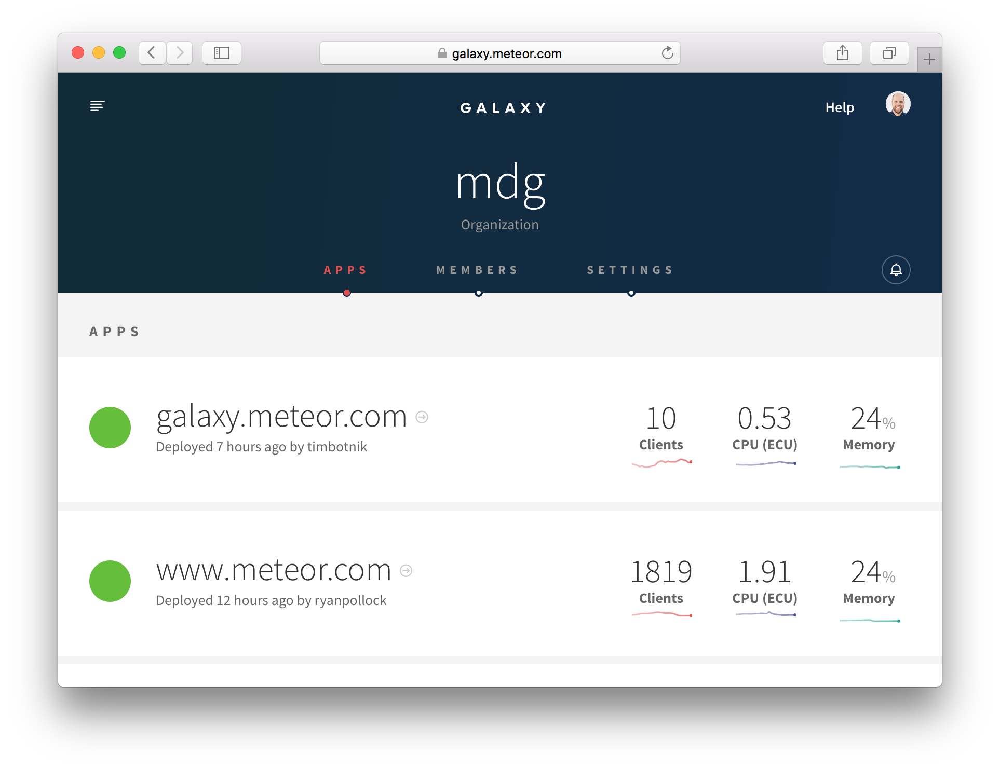
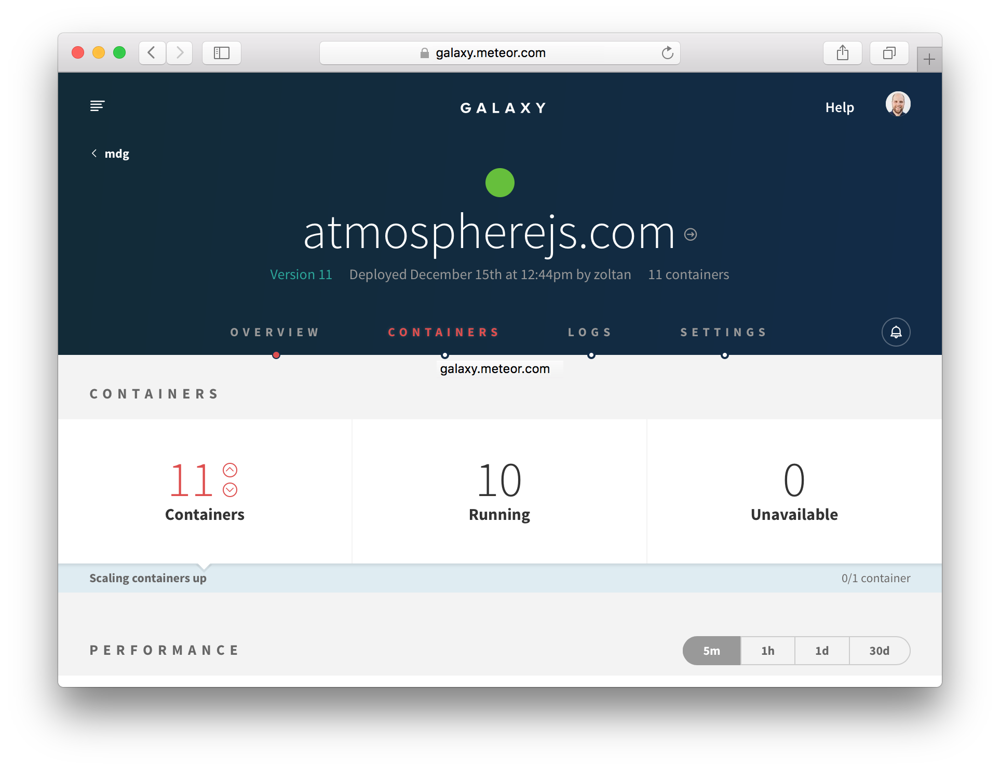
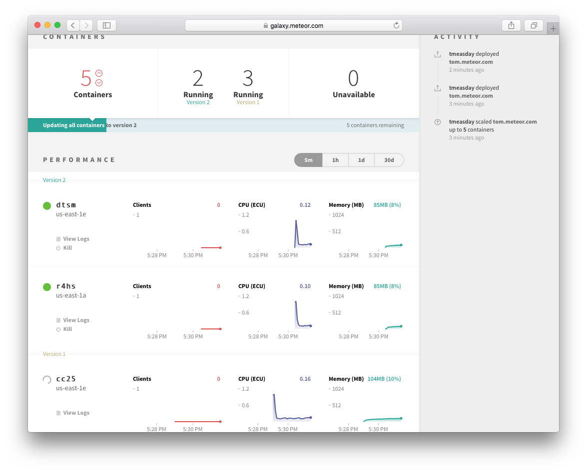
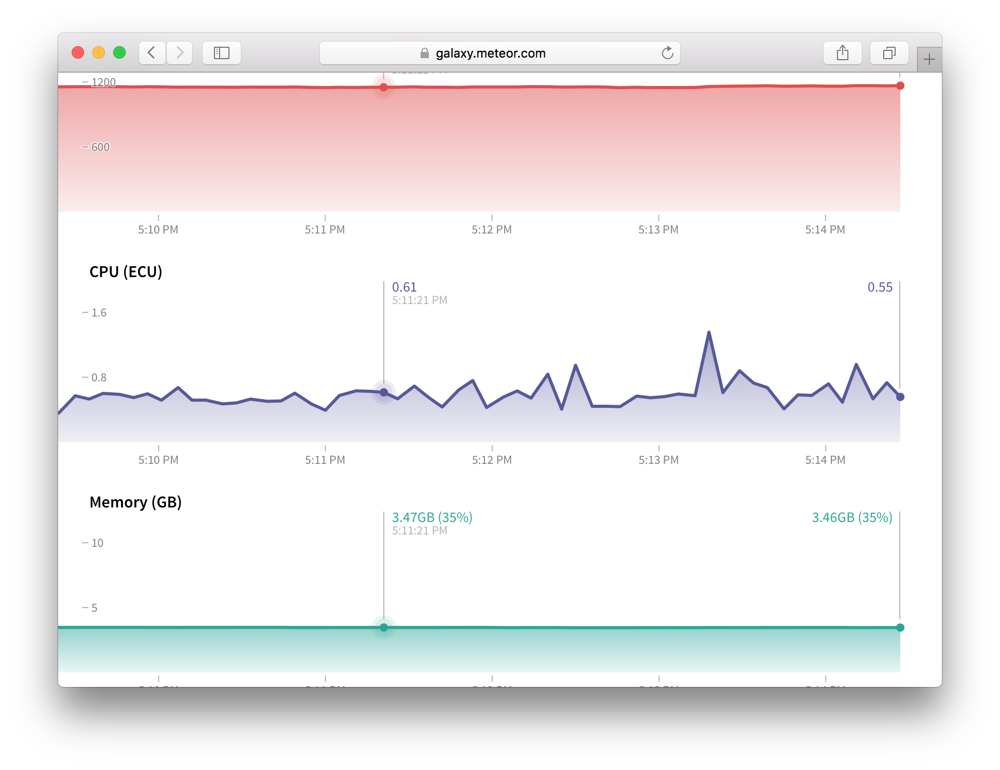
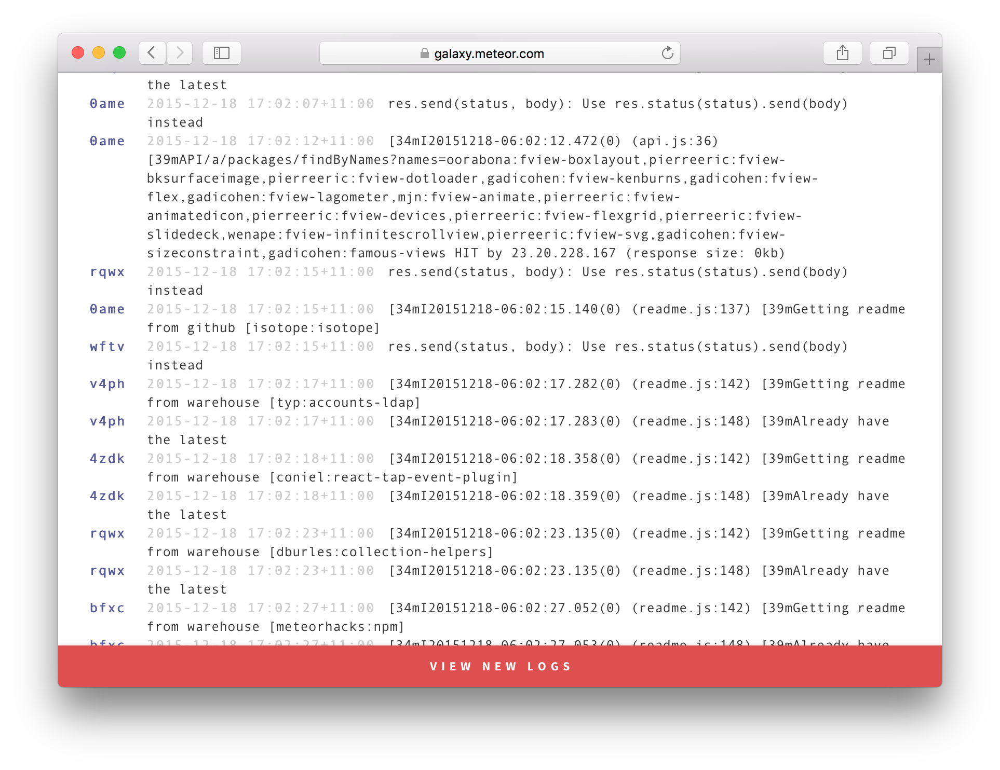
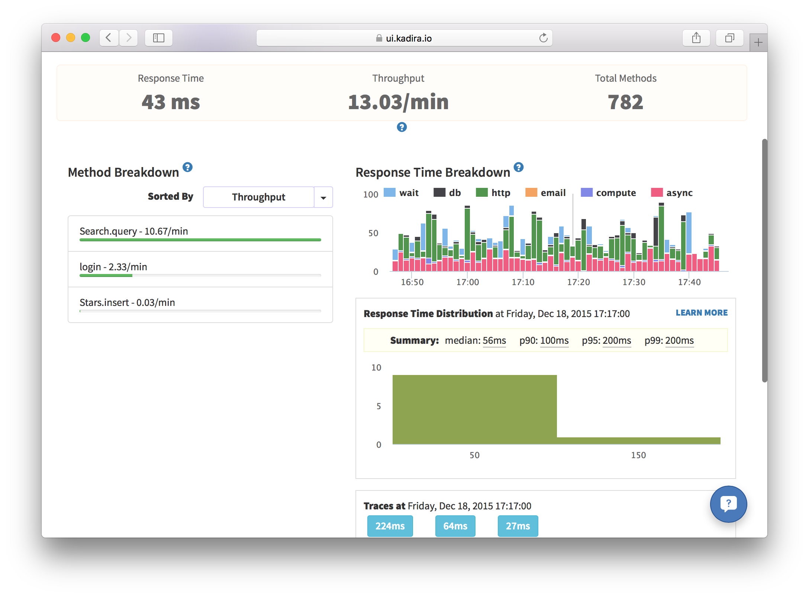
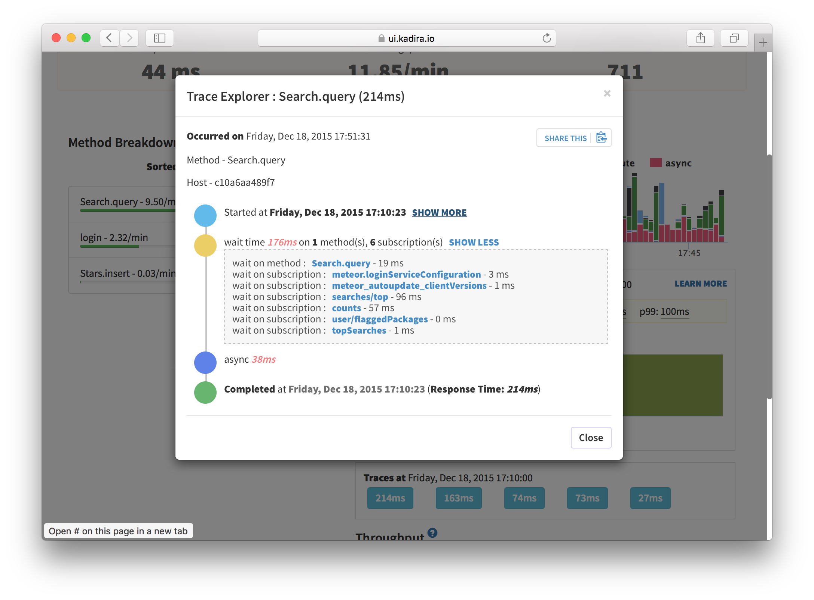

After reading this guide, you'll know:

1. What to consider before you deploy a Meteor application.
2. How to deploy to some common Meteor hosting environments.
3. How to design a deployment process to make sure your application's quality is maintained.
4. How to monitor user behavior with analytics tools.
5. How to monitor your application.
6. How to make sure your site is discoverable by search engines.

<h2 id="deploying">Deploying Meteor Applications</h2>

Once you've built and tested your Meteor application, you need to put it online to show it to the world. Deploying a Meteor application is similar to deploying any other websocket-based Node.js app, but is different in some of the specifics.

Deploying a web application is fundamentally different to releasing most other kinds of software, in that you can deploy as often as you'd like to. You don't need to wait for users to do something to get the new version of your software because the server will push it right at them.

However, it's still important to test your changes throughly with a good process of Quality Assurance (QA). Although it's easy to push out fixes to bugs, those bugs can still cause major problems to users and even potentially data corruption!

> <h3 id="never-use-production-flag">Never use `--production` flag to deploy!</h3>
>
> `--production` flag is purely meant to simulate production minification, but does almost nothing else. This still watches source code files, exchanges data with package server and does a lot more than just running the app, leading to unnecessary computing resource wasting and security issues. Please don't use `--production` flag to deploy!

<h3 id="environments">Deployment environments</h3>

In web application deployment it's common to refer to three runtime environments:

1. **Development.** This refers to your machine where you develop new features and run local tests.
2. **Staging.** An intermediate environment that is similar to production, but not visible to users of the application. Can be used for testing and QA.
3. **Production.** The real deployment of your app that your customers are currently using.

The idea of the staging environment is to provide a non-user-visible test environment that is as close as possible to production in terms of infrastructure. It's common for issues to appear with new code on the production infrastructure that don't happen in a development environment. A very simple example is issues that involve latency between the client and server---connecting to a local development server with tiny latencies, you just may never see such an issue.

For this reason, developers tend to try and get staging as close as possible to production. This means that all the steps we outline below about production deployment, should, if possible, also be followed for your staging server.

<h3 id="environment">Environment variables and settings</h3>

There are two main ways to configure your application outside of the code of the app itself:

1. **Environment variables.** This is the set of `ENV_VARS` that are set on the running process.
2. **Settings.** These are in a JSON object set via either the `--settings` Meteor command-line flag or stringified into the `METEOR_SETTINGS` environment variable.

Settings should be used to set environment (i.e. staging vs production) specific things, like the access token and secret used to connect to Google. These settings will not change between any given process running your application in the given environment.

Environment variables are used to set process-specific things, which could conceivably change for different instances of your application's processes. A list of environment variables can be found [here](https://docs.meteor.com/environment-variables.html).

A final note on storing these settings: It's not a good idea to store settings the same repository where you keep your app code. Read about good places to put your settings in the [Security article](security.html#api-keys).

<h2 id="other-considerations">Other considerations</h2>

There are some other considerations that you should make before you deploy your application to a production host. Remember that you should if possible do these steps for both your production *and* staging environments.

<h3 id="domain-name">Domain name</h3>

What URL will users use to access your site? You'll probably need to register a domain name with a domain registrar, and setup DNS entries to point to the site (this will depend on how you deploy, see below). If you deploy to Galaxy, you can use a `x.meteorapp.com` or `x.eu.meteorapp.com` domain while you are testing the app. [Learn more about Galaxy domains »](http://galaxy-guide.meteor.com/custom-domains.html#meteorapp-subdomain)

<h3 id="ssl">SSL Certificate</h3>

It's always a good idea to use SSL for Meteor applications (see the [Security Article](security.html#ssl) to find out why). Once you have a registered domain name, you'll need to generate an SSL certificate with a certificate authority for your domain. If you deploy to Galaxy, you can [generate a free SSL certificate with a single click](http://galaxy-guide.meteor.com/encryption.html#lets-encrypt) (courtesy of Let's Encrypt!).

<h3 id="cdn">CDN</h3>

It's not strictly required, but often a good idea to set up a Content Delivery Network (CDN) for your site. A CDN is a network of servers that hosts the static assets of your site (such as JavaScript, CSS, and images) in numerous locations around the world and uses the server closest to your user to provide those files in order to speed up their delivery. For example, if the actual web server for your application is on the east coast of the USA and your user is in Australia, a CDN could host a copy of the JavaScript of the site within Australia or even in the city the user is in. This has huge benefits for the initial loading time of your site.

The basic way to use a CDN is to upload your files to the CDN and change your URLs to point at the CDN (for instance if your Meteor app is at `http://myapp.com`, changing your image URL from `` to ``). However, this would be hard to do with Meteor, since the largest file – your Javascript bundle – changes every time you edit your app.

For Meteor, we recommend using a CDN with "origin" support (like [CloudFront](http://joshowens.me/using-a-cdn-with-your-production-meteor-app/)), which means that instead of uploading your files in advance, the CDN automatically fetches them from your server. You put your files in `public/` (in this case `public/cats.gif`), and when your Australian user asks the CDN for `http://mycdn.com/cats.gif`, the CDN, behind the scenes, fetches `http://myapp.com/cats.gif` and then delivers it to the user. While this is slightly slower than getting `http://myapp.com/cats.gif` directly, it only happens one time, because the CDN saves the file, and all subsequent Australians who ask for the file get it quickly.

To get Meteor to use the CDN for your Javascript and CSS bundles, call `WebAppInternals.setBundledJsCssPrefix("http://mycdn.com")` on the server. This will also take care of relative image URLs inside your CSS files. If you need to use a dynamic prefix, you can return the prefix from a function passed to `WebAppInternals.setBundledJsCssUrlRewriteHook()`.

For all your files in `public/`, change their URLs to point at the CDN. You can use a helper like `assetUrl`.

Before:

```html

```

After:

```js
Template.registerHelper("assetUrl", (asset) => {
  return "http://mycdn.com/" + asset
});
```

```html

```

<h4 id="cdn-webfonts">CDNs and webfonts</h4>

If you are hosting a webfont as part of your application and serving it via a CDN, you may need to configure the served headers for the font to allow cross-origin resource sharing (as the webfont is now served from a different origin to your site itself). You can do this in Meteor by adding a handler (you'll need to ensure your CDN is passing the header through):

```js
import { WebApp } from 'meteor/webapp';

WebApp.rawConnectHandlers.use(function(req, res, next) {
  if (req._parsedUrl.pathname.match(/\.(ttf|ttc|otf|eot|woff|woff2|font\.css|css)$/)) {
    res.setHeader('Access-Control-Allow-Origin', /* your hostname, or just '*' */);
  }
  next();
});
```

And then for example with Cloudfront, you would:

- Select your distribution
- Behavior tab
- Select your app origin
- Edit button
- Under "Whitelist Headers", scroll down to select "Origin"
- Add button
- "Yes, Edit" button

<h2 id="deployment-options">Deployment options</h2>

Meteor is an open source platform, and you can run the apps that you make with Meteor anywhere just like regular Node.js applications. But operating Meteor apps *correctly*, so that your apps work for everyone, can be tricky if you are managing your infrastructure manually. This is why we recommend running production Meteor apps on Galaxy.

<h3 id="galaxy">Galaxy (recommended)</h3>

The easiest way to operate your app with confidence is to use Galaxy, the service built by Meteor Development Group specifically to run Meteor apps.

Galaxy is a distributed system that runs on Amazon AWS. If you understand what it takes to run Meteor apps correctly and how Galaxy works, you’ll come to appreciate Galaxy’s value, and that it will save you a lot of time and trouble. Most large Meteor apps run on Galaxy today, and many of them have switched from custom solutions they used prior to Galaxy’s launch.

In order to deploy to Galaxy, you'll need to [sign up for an account](https://www.meteor.com/galaxy/signup), and separately provision a MongoDB database (see below).

Once you've done that, it's easy to [deploy to Galaxy](https://galaxy-guide.meteor.com/deploy-to-galaxy.html). You need to [add some environment variables to your settings file](http://galaxy-guide.meteor.com/environment-variables.html) to point it at your MongoDB, and you can deploy with:

```bash
DEPLOY_HOSTNAME=galaxy.meteor.com meteor deploy your-app.com --settings production-settings.json
```

To deploy to the EU region, set DEPLOY_HOSTNAME to eu-west-1.galaxy.meteor.com.

In order for Galaxy to work with your custom domain (`your-app.com` in this case), you need to [set up your DNS to point at Galaxy](http://galaxy-guide.meteor.com/dns.html). Once you've done this, you should be able to reach your site from a browser.

You can also log into the Galaxy UI at https://galaxy.meteor.com. Once there you can manage your applications, monitor the number of connections and resource usage, view logs, and change settings.



If you are following [our advice](security.html#ssl), you'll probably want to [set up SSL](http://galaxy-guide.meteor.com/encryption.html) on your Galaxy application with the certificate and key for your domain. You should also read the [Security](security.html#ssl) section of this guide for information on how to forcibly redirect HTTP to HTTPS.

Once you are setup with Galaxy, deployment is simple (just re-run the `meteor deploy` command above), as is scaling --- log into galaxy.meteor.com, and scale instantly from there.



<h3 id="mup">Meteor Up</h3>

[Meteor Up](https://meteor-up.com), often referred to as "mup", is a third-party, open-source tool that can be used to deploy Meteor applications to any online server over SSH. It's essentially a way to automate the manual steps of using `meteor build` and putting that bundle on your server. It also handles setting up the servers, including installing any dependencies, and setting up load balancing and SSL. Although it takes care of many of the details, it can be more work than using a hosting provider.

You can obtain a server running Ubuntu or Debian from many generic hosting providers and Meteor Up can SSH into your server with the keys you provide in the config. You can get started with the [tutorial](https://meteor-up.com/getting-started.html).

One of its plugins, [mup-aws-beanstalk](https://github.com/zodern/mup-aws-beanstalk/) deploys Meteor Apps to [AWS Elastic Beanstalk](https://aws.amazon.com/elasticbeanstalk/) instead of a server. It supports autoscaling, load balancing, and zero downtime deploys while taking care of many of the challenges with using Meteor and Elastic Beanstalk.

<h3 id="docker">Docker</h3>

To orchestrate your own container-based deployment there are existing base images to consider before rolling your own:

 - [tozd/docker-meteor](https://github.com/tozd/docker-meteor) with Mongo and Nginx images
 - [jshimko/meteor-launchpad](https://github.com/jshimko/meteor-launchpad)
 - [disney/meteor-base](https://github.com/disney/meteor-base)

_The recommendation above is primarily based on current state of maintenance to address upstream security vulnerabilities. Review the Dockerfiles and build scripts to make your own assessment._

<h3 id="custom-deployment">Custom deployment</h3>

If you want to figure out your hosting solution completely from scratch, the Meteor tool has a command `meteor build` that creates a deployment bundle that contains a plain Node.js application. Any npm dependencies must be installed before issuing the `meteor build` command to be included in the bundle. You can host this application wherever you like and there are many options in terms of how you set it up and configure it.

**NOTE** it's important that you build your bundle for the correct architecture. If you are building on your development machine, there's a good chance you are deploying to a different server architecture. You'll want to specify the correct architecture with `--architecture`:

```bash
# for example if deploying to a Ubuntu linux server:
npm install --production
meteor build /path/to/build --architecture os.linux.x86_64
```

This will provide you with a bundled application `.tar.gz` which you can extract and run without the `meteor` tool.  The environment you choose will need the correct version of Node.js and connectivity to a MongoDB server.

Depending on the version of Meteor you are using, you should install the proper version of `node` using the appropriate installation process for your platform. To find out which version of `node` you should use, run `meteor node -v` in the development environment, or check the `.node_version.txt` file within the bundle generated by `meteor build`. For example, if you are using Meteor 1.6, the version of `node` you should use is 8.8.1.

> If you use a mis-matched version of Node when deploying your application, you will encounter errors!

You can then run the application by invoking `node` with a `ROOT_URL`, `PORT`, and `MONGO_URL`.  These instructions are also available in the `README` file found in the root of the bundle you built above.

```bash
cd my_build_bundle_directory
(cd programs/server && npm install)
MONGO_URL=mongodb://localhost:27017/myapp ROOT_URL=http://my-app.com PORT=3000 node main.js
```

* `ROOT_URL` is the base URL for your Meteor project
* `PORT` is the port at which the application is running 
* `MONGO_URL` is a [Mongo connection string URI](https://docs.mongodb.com/manual/reference/connection-string/) supplied by the MongoDB provider.


Unless you have a specific need to roll your own hosting environment, the other options here are definitely easier, and probably make for a better setup than doing everything from scratch. Operating a Meteor app in a way that it works correctly for everyone can be complex, and [Galaxy](#galaxy) handles a lot of the specifics like routing clients to the right containers and handling coordinated version updates for you.

<h2 id="galaxy-mongo">MongoDB options</h2>

When you deploy your Meteor server, you need a `MONGO_URL` that points to your MongoDB database. You can either use a hosted MongoDB service or set up and run your own MongoDB server. We recommend using a hosted service, as the time saved and peace of mind are usually worth the higher monthly cost. In either case, the database should be hosted in the same region as the Meteor server (for lower latency). For example if your app is hosted on Galaxy in `us-east-1` (on AWS), then you could create a database on [Compose](https://www.compose.io) in `AWS us-east-1` or on [Amazon Lightsail](https://amazonlightsail.com/) in `us-east-1`.

<h3 id="hosted-service">Hosted service (recommended)</h3>

There are a variety of services out there, and we recommend that you select one of the below services depending on your requirements:

* [Compose](https://www.compose.io)
* [MongoDB Atlas](https://www.mongodb.com/cloud/atlas)

When selecting a hosted MongoDB service for production it is important to assess the features that the service provides. Below is a nonexhaustive list of features to consider when selecting a service:

* Supports the MongoDB version you wish to run
* Storage Engine Support (MMAPv1 or WiredTiger) – Since Meteor 1.4 WiredTiger is the default storage engine
* Support for Replica Sets & Oplog tailing
* Monitoring & Automated alerting
* Continuous backups & Automated snapshots
* Access Control, IP whitelisting, and AWS VPC Peering
* Encryption of data in-flight and at-rest
* Cost and pricing granularity
* Instance size & options
* Instance configurability – Independently configure your CPU, memory, storage and disk I/O speed.

You can read this [detailed guide](https://www.okgrow.com/posts/mongodb-atlas-setup) by OK GROW! for step-by-step instructions to deploying a production ready MongoDB database on MongoDB Atlas.

<h3 id="own-server">Own server</h3>

You can install MongoDB on your own server—one you own, rent, or a VPS (recommended) like [DigitalOcean](https://www.digitalocean.com/) or [Lightsail](https://amazonlightsail.com/). As you can see from the above section, there are many aspects of database setup and maintenance that you have to take care of. For example, to get the best performance, you should choose a server with an [SSD](https://docs.mongodb.com/manual/administration/production-notes/#use-solid-state-disks-ssds) large enough to fit your data and with enough RAM to fit the working set (indexes + active documents) in memory.

<h2 id="process">Deployment process</h2>

Although it's much easier to deploy a web application than release most other types of software, that doesn't mean you should be cavalier with your deployment. It's important to properly QA and test your releases before you push them live, to ensure that users don't have a bad experience, or even worse, data get corrupted.

It's a good idea to have a release process that you follow in releasing your application. Typically that process looks something like:

1. Deploy the new version of the application to your staging server.
2. QA the application on the staging server.
3. Fix any bugs found in step 2. and repeat.
4. Once you are satisfied with the staging release, release the *exact same* version to production.
5. Run final QA on production.

Steps 2. and 5. can be quite time-consuming, especially if you are aiming to maintain a high level of quality in your application. That's why it's a great idea to develop a suite of acceptance tests (see our [Testing Article](https://guide.meteor.com/testing.html) for more on this). To take things even further, you could run a load/stress test against your staging server on every release.

<h3 id="continuous-deployment">Continuous deployment</h3>

Continuous deployment refers to the process of deploying an application via a continuous integration tool, usually when some condition is reached (such as a git push to the `master` branch). You can use CD to deploy to Galaxy, as Nate Strauser explains in a [blog post on the subject](https://medium.com/@natestrauser/migrating-meteor-apps-from-modulus-to-galaxy-with-continuous-deployment-from-codeship-aed2044cabd9#.lvio4sh4a).

<h3 id="rolling-updates-and-data">Rolling deployments and data versions</h3>

It's important to understand what happens during a deployment, especially if your deployment involves changes in data format (and potentially data migrations, see the [Collections Article](collections.html#migrations)).

When you are running your app on multiple servers or containers, it's not a good idea to shut down all of the servers at once and then start them all back up again. This will result in more downtime than necessary, and will cause a huge spike in CPU usage when all of your clients reconnect again at the same time. To alleviate this, Galaxy stops and re-starts containers one by one during deployment. There will be a time period during which some containers are running the old version and some the new version, as users are migrated incrementally to the new version of your app.



If the new version involves different data formats in the database, then you need to be a little more careful about how you step through versions to ensure that all the versions that are running simultaneously can work together. You can read more about how to do this in the [collections article](collections.html#migrations).

<h2 id="analytics">Monitoring users via analytics</h2>

It's common to want to know which pages of your app are most commonly visited, and where users are coming from. Here's a setup that will get you URL tracking using Google Analytics. We'll be using the [`okgrow:analytics`](https://atmospherejs.com/okgrow/analytics) package.

```
meteor add okgrow:analytics
```
Now, we need to configure the package with our Google Analytics key (the package also supports a large variety of other providers, check out the [documentation on Atmosphere](https://atmospherejs.com/okgrow/analytics)). Pass it in as part of [_Meteor settings_](#environment):

```js
{
  "public": {
    "analyticsSettings": {
      // Add your analytics tracking id's here
      "Google Analytics" : {"trackingId": "Your tracking ID"}
    }
  }
}
```

The analytics package hooks into Flow Router (see the [routing article](routing.html) for more) and records all of the page events for you.

You may want to track non-page change related events (for instance publication subscription, or method calls) also. To do so you can use the custom event tracking functionality:

```js
export const updateText = new ValidatedMethod({
  ...
  run({ todoId, newText }) {
    // We use `isClient` here because we only want to track
    // attempted method calls from the client, not server to
    // server method calls
    if (Meteor.isClient) {
      analytics.track('todos.updateText', { todoId, newText });
    }

    // ...
  }
});
```

To achieve a similar abstraction for subscriptions/publications, you may want to write a wrapper for `Meteor.subscribe()`.

<h2 id="apm">Monitoring your application</h2>

When you are running an app in production, it's vitally important that you keep tabs on the performance of your application and ensure it is running smoothly.

<h3 id="meteor-performance">Understanding Meteor performance</h3>

Although a host of tools exist to monitor the performance of HTTP, request-response based applications, the insights they give aren't necessarily useful for a connected client system like a Meteor application. Although it's true that slow HTTP response times would be a problem for your app, and so using a tool like [Pingdom](https://www.pingdom.com) can serve a purpose, there are many kinds of issues with your app that won't be surfaced by such tools.

<h3 id="galaxy-apm">Monitoring with Galaxy</h3>

[Galaxy](#galaxy) offers turnkey Meteor hosting and provides tools that are useful to debug the current and past state of your application. CPU and Memory load graphs in combination with connected user counts can be vital to determining if your setup is handling the current load (or if you need more containers), or if there's some specific user action that's causing disproportionate load (if they don't seem to be correlated):



Galaxy's UI provides a detailed logging system, which can be invaluable to determine which action it is causing that extra load, or to generally debug other application issues:



<h3 id="meteor-apm">APM</h3>

If you really want to understand the ins and outs of running your Meteor application, you should use an Application Performance Monitoring (APM) service. There are multiple services designed for Meteor apps:

- [Meteor APM](https://www.meteor.com/cloud)
- [Monti APM](https://montiapm.com/)
- [Meteor Elastic APM](https://github.com/Meteor-Community-Packages/meteor-elastic-apm)

These APM's operate by taking regular client and server side observations of your application's performance as it conducts various activities and reporting them back to a master server.

When you visit the APM, you can view current and past behavior of your application over various useful metrics. The APM's have documentation on how to fully use the data to improve your app, but we'll discuss a few key areas here. The screenshots are similar to what you would see in Meteor APM or Monti APM.

<h4 id="apm-method-pub">Method and Publication Latency</h4>

Rather than monitoring HTTP response times, in a Meteor app it makes far more sense to consider DDP response times. The two actions your client will wait for in terms of DDP are *method calls* and *publication subscriptions*. APM's include tools to help you discover which of your methods and publications are slow and resource intensive.



In the above screenshot you can see the response time breakdown of the various methods commonly called by the Atmosphere application. The median time of 56ms and 99th percentile time of 200ms seems pretty reasonable, and doesn't seem like too much of a concern

You can also use the "traces" section to discover particular cases of the method call that are particular slow:



In the above screenshot we're looking at a slower example of a method call (which takes 214ms), which, when we drill in further we see is mostly taken up waiting on other actions on the user's connection (principally waiting on the `searches/top` and `counts` publications). So we could consider looking to speed up the initial time of those subscriptions as they are slowing down searches a little in some cases.


<h4 id="apm-livequery">Livequery Monitoring</h4>

A key performance characteristic of Meteor is driven by the behavior of livequery, the key technology that allows your publications to push changing data automatically in realtime. In order to achieve this, livequery needs to monitor your MongoDB instance for changes (by tailing the oplog) and decide if a given change is relevant for the given publication.

If the publication is used by a lot of users, or there are a lot of changes to be compared, then these livequery observers can do a lot of work. So it's immensely useful that Kadira can tell you some statistics about your livequery usage:


In this screenshot we can see that observers are fairly steadily created and destroyed, with a pretty low amount of reuse over time, although in general they don't survive for all that long. This would be consistent with the fact that we are looking at the `package` publication of Atmosphere which is started everytime a user visits a particular package's page. The behavior is more or less what we would expect so we probably wouldn't be too concerned by this information.

<h2 id="seo">Enabling SEO</h2>

If your application contains a lot of publicly accessible content, then you probably want it to rank well in Google and other search engines' indexes. As most webcrawlers do not support client-side rendering (or if they do, have spotty support for websockets), it's better to render the site on the server and deliver it as HTML in this special case.

If you’re using [Galaxy to host your meteor apps](https://www.meteor.com/galaxy/signup), you can take advantage of built-in automatic [Prerender.io](https://prerender.io) integration. Add [`mdg:seo`](https://atmospherejs.com/mdg/seo) to your app and Galaxy will take care of the rest: loading the code and configuring it with Galaxy-provided credentials.

If you're not using Galaxy, you can still use `mdg:seo`. You will need to sign up for your own Prerender.io account and provide your token to the `mdg:seo` package in `Meteor.settings`. You can also do this if you use Galaxy but would prefer to use your own Prerender.io account with more frequent cache changes.  You can also use the [`prerender-node` NPM package](https://www.npmjs.com/package/prerender-node) directly, mimicing the small amount of [client](https://github.com/meteor/galaxy-seo-package/blob/master/client/prerender.html) and [server](https://github.com/meteor/galaxy-seo-package/blob/master/server/prerender.js) code in the Atmosphere package; do this if you need to use a newer version of the NPM package than the one in `mdg:seo`.

Chances are you also want to set `<title>` tags and other `<head>` content to make your site appear nicer in search results. The best way to do so is to use the [`kadira:dochead`](https://atmospherejs.com/kadira/dochead) package. The sensible place to call out to `DocHead` is from the `onCreated` callbacks of your page-level components.
